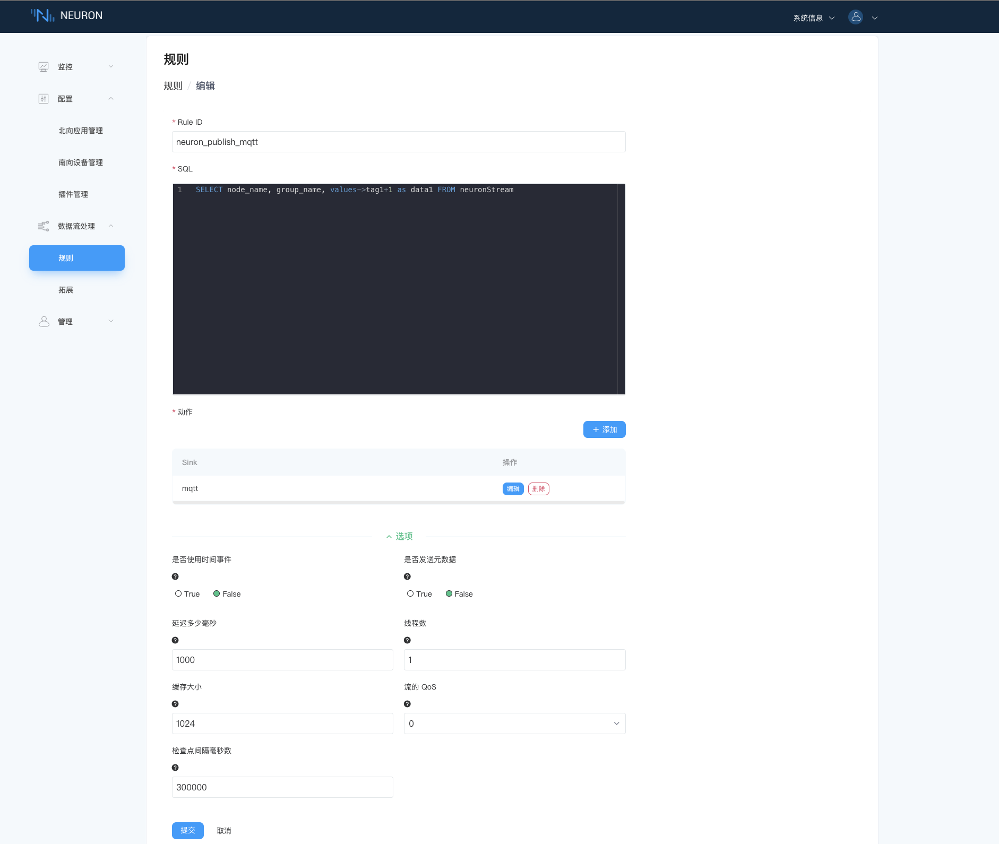
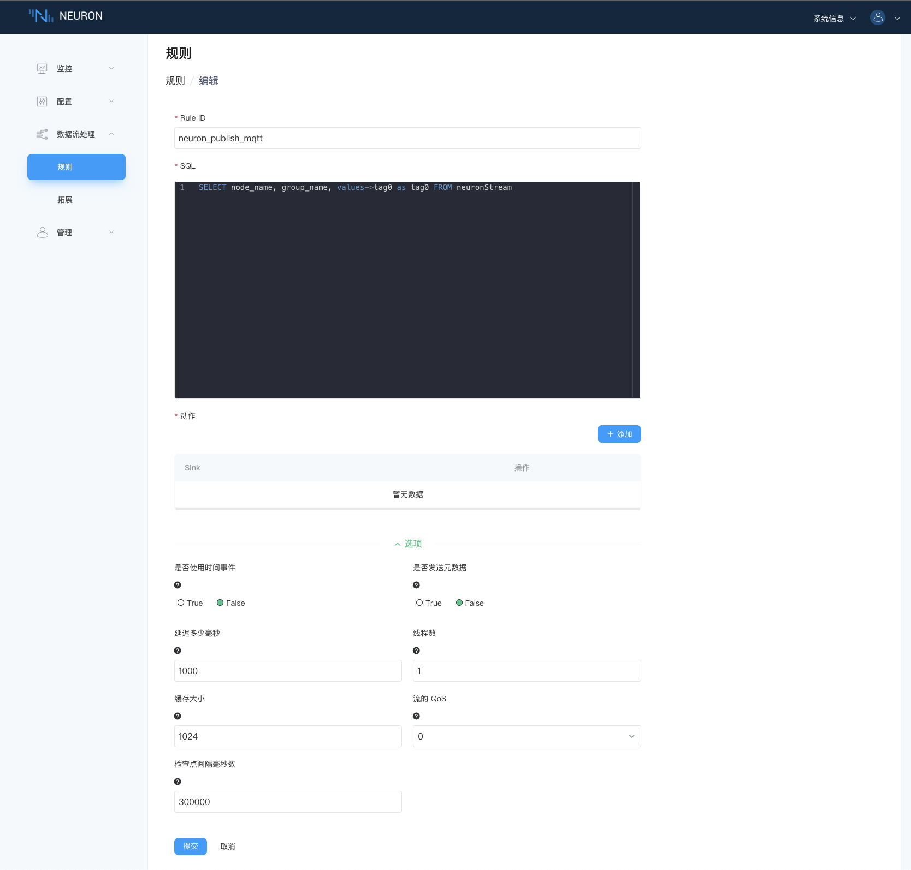

# 数据流处理

本文只对界面做较为详细的介绍，使用用例请参考[快速开始中数据流处理部分](../getting-started/quick_start.md)。

## 规则

每个规则代表一个在流引擎中运行的计算作业。订阅的数据流节点组将被视为连续流数据源。该规则将在启动后连续运行，并且只在用户操作发送停止命令时才会停止。该规则也可能因错误而异常停止。

同时运行多个规则是很常见的。由于流引擎是单实例进程，因此规则运行在相同的内存空间中。但是，运行时是分开的，一个规则中的错误不应该影响其他规则。关于工作负载，所有规则共享相同的硬件资源。每个规则都可以指定缓冲区来限制处理速率以避免占用所有资源。

多个规则可以通过在 sink/source 中指定一个联合点来形成一个处理管道。例如，第一条规则将结果生成到内存接收器中的主题，而另一条规则订阅其内存源中的该主题。除了内存 sink/source 对之外，用户还可以使用 mqtt 或其他 sink/source 对来连接规则。

## 拓展

### 插件

原生插件扩展利用原生 golang 插件系统在运行时动态加载自定义扩展。 安装后，原生插件实际上就像原生代码一样运行，可以与主程序共享或传输内存中的数据，从而保证最佳性能。

因此，原生插件扩展适用于用户仅在支持的操作系统和环境中运行，具有在更新期间重建插件的能力或基础架构，不需要在运行时卸载插件并且仅使用 golang 的场景。

### 外部服务

便携式插件扩展利用基于 IPC 通信的插件系统。它将支持所有编程语言。 目前支持 golang 和 python。 与原生插件相比，它是可移植的，因为插件将在单独的进程中运行，并且没有那些苛刻的构建/部署要求。

### 外部函数列表

提供了一种配置方法，eKuiper 可以使用 SQL 直接以函数方式调用外部服务，包括各种 rpc 服务和 http 服务等。 这种方法将大大提高 eKuiper 扩展的易用性。 外部函数将作为插件系统的补充，仅推荐用于高性能要求的插件。

### 便捷插件

