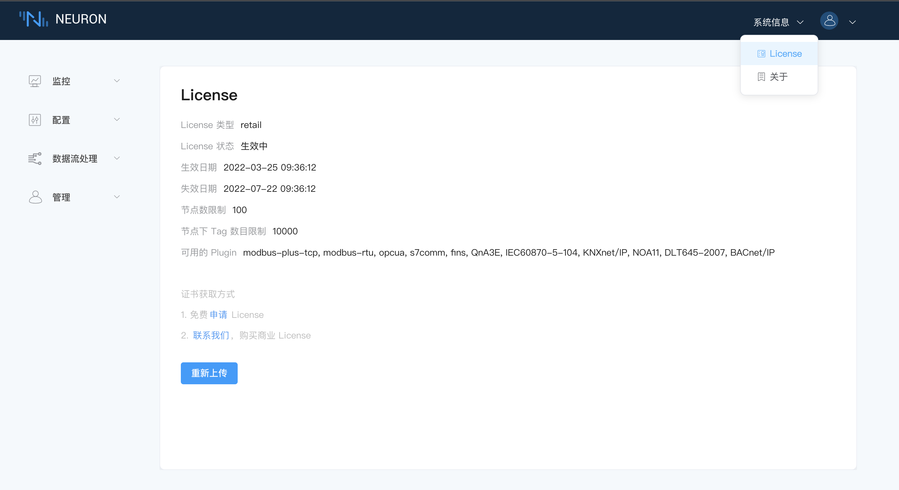

# 系统信息

## License

点击页面右上角的`关于`下拉框，选择 License，如下图所示。

在 License 界面可以申请和上传 License，我们提供免费试用和正式使用 License 两种申请方式，点击对应的链接，进入到对应的申请的页面，在收到 License 文件之后，上传 .lic 文件即可，如下图所示。

License 上传成功之后，如下图所示，展示 License 的基本信息。用户可以再次上传 License。

## 关于

