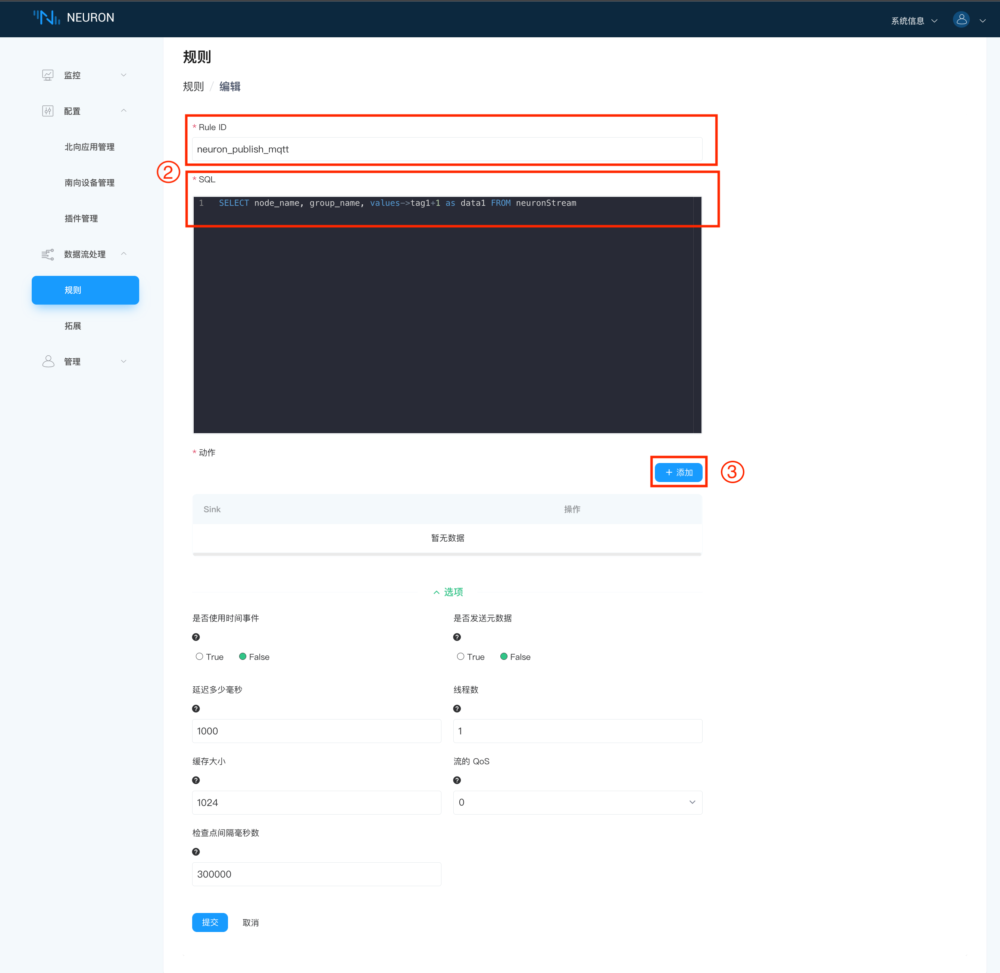
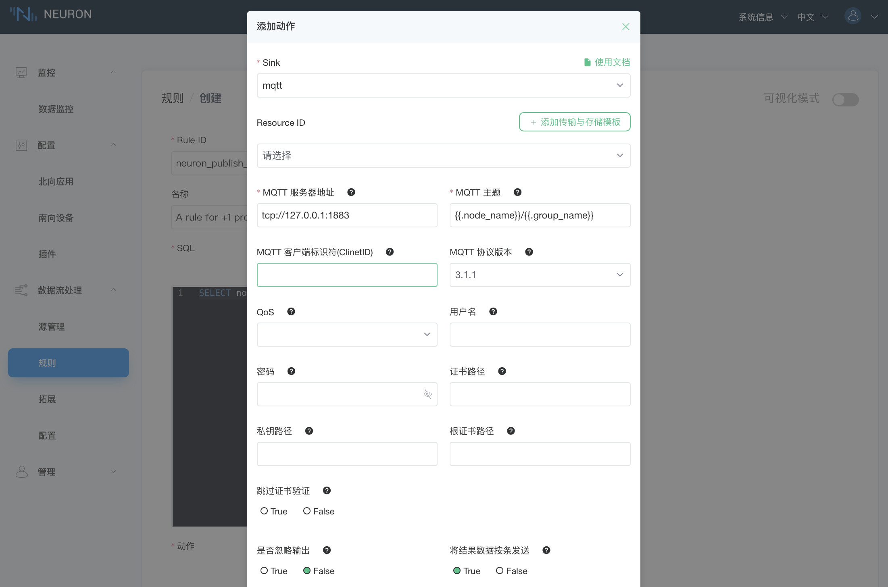
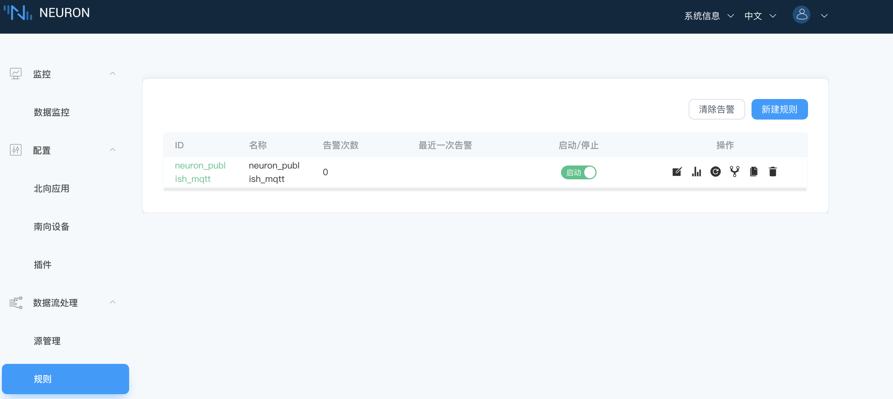

# 清洗数据

本模块实现将 neuron 从设备采集到的数据进行 +1 处理，并重命名为有意义的名字后，将结果发送到云端的 MQTT 动态 topic `${node_name}/${group_name}`中。

## 第一步，添加新的规则

在**规则**界面点击`新建规则` 按键添加规则。

## 第二步，设置规则详细信息

在**规则->创建**界面，填写规则信息，如下图所示。

* 填写 `Rule ID` 和`SQL` 的描述；
* 点击`添加` ，为规则添加 sink 动作，每条规则可添加多条 sink 动作，详见第三步；
* 点击`提交` 完成规则的定义。

## 第三步，设置 sink 详细信息

在添加动作的弹窗里设置 sink 的详细信息， 如下图所示。

::: v-pre

1. 下拉选择 Sink，例如选择 mqtt；
2. 填写 MQTT 服务器地址；
3. 填写 MQTT 主题，本例中使用 `{{.node_name}}/{{.group_name}}`；
4. 选择 `True` 以将结果数据按条发送；
5. 选择 `提交` 完成 sink 动作的添加。
:::

动作添加完成后，如下图所示。

## 第四步，开始执行规则

在**规则**界面启动新创建的规则。

## 第五步，检查 MQTT 代理中的有效负载

::: v-pre
启动 MQTTX ，订阅主题 `{{.node_name}}/{{.group_name}}`，结果如下图所示。
:::

::: tip
此例中使用的 node_name 为 **modbus-tcp-1**，group_name 为 **group-1**，即，订阅主题为 modbus-tcp-1/group-1。
:::

