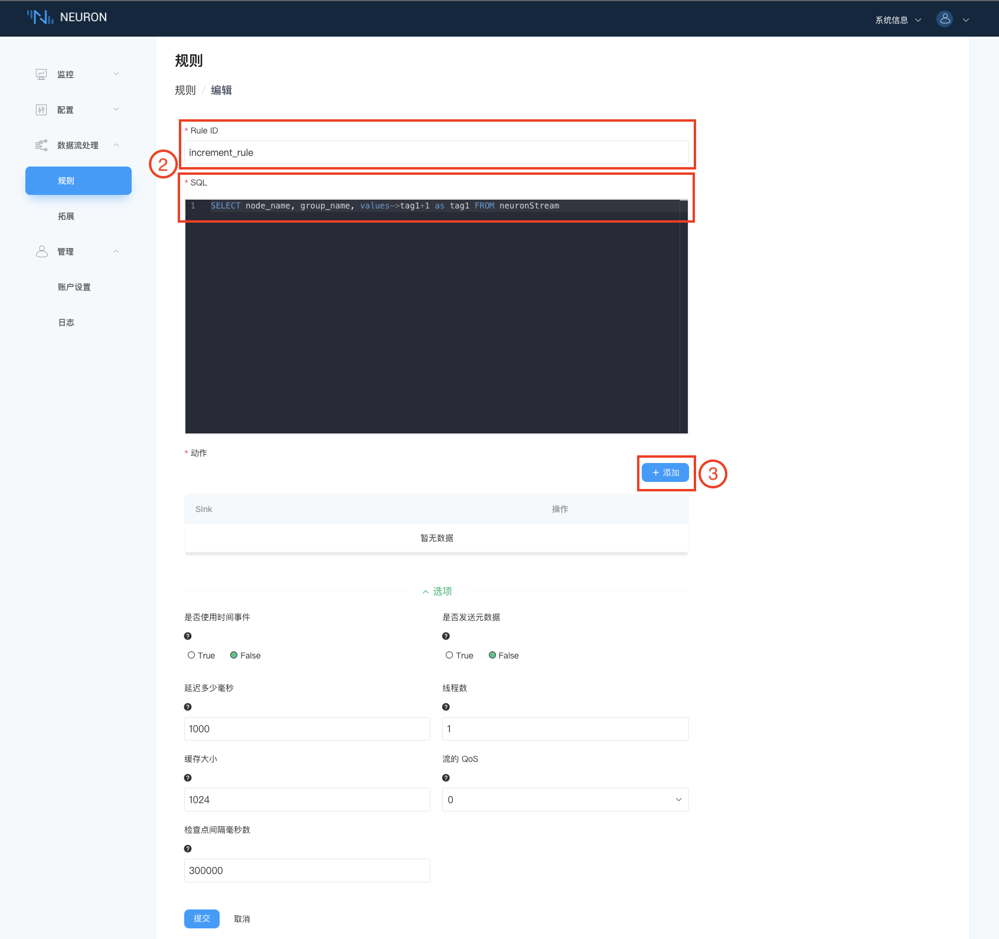
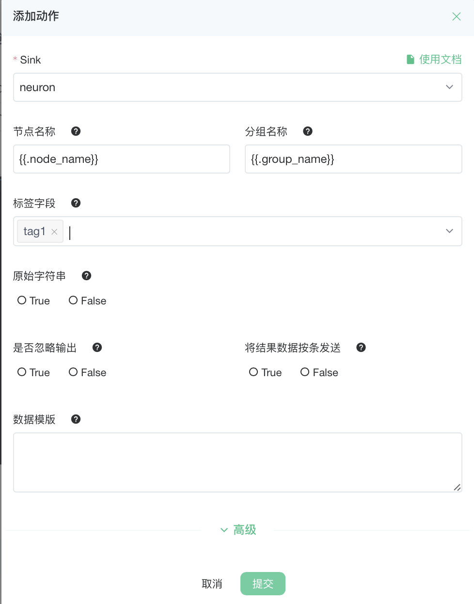
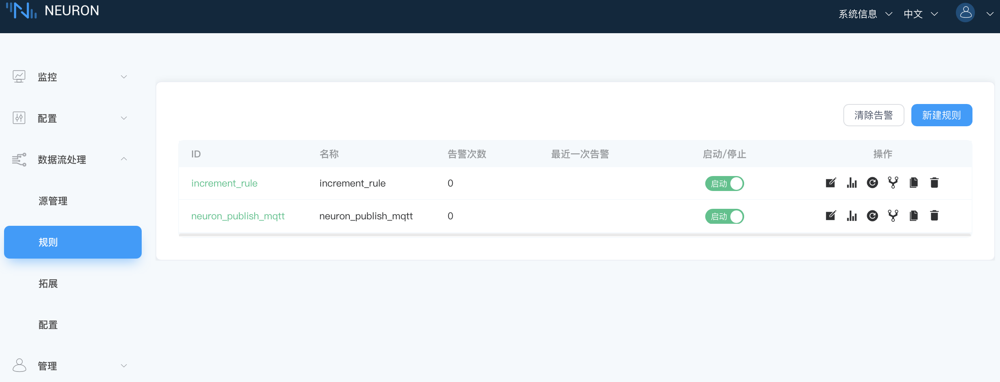

# 反控设备

本模块实现将 neuron 从设备采集到的数据进行 +1 处理，neuron 将结果写到设备中，此时 tag 属性需要有写属性，否则无法写成功。

## 第一步，添加新的规则

在**数据流处理->规则**界面点击 `新建规则` 按键添加规则。

## 第二步，设置规则详细信息

在**规则->创建**界面，填写规则信息，如下图所示。

* 填写 `Rule ID` 和`SQL` 的描述；
* 点击`添加` ，为规则添加 sink 动作，每条规则可添加多条 sink 动作，详见第三步；
* 点击`提交` 完成规则的定义。

### 第三步，设置 sink 详细信息

在添加动作的弹窗里设置 sink 的详细信息， 如下图所示。

1. 下拉选择 Sink；
2. 填写节点名称；
3. 填写分组名称；
4. 填写标签字段；
5. 选择 `提交` 完成 sink 动作的添加。

动作添加完成后，如下图所示。

### 第四步，开始执行规则

在**规则**界面启动新创建的规则。

### 第五步，检查 Modbus 模拟器中的数据

打开 neuron 数据监控，查看数据。
