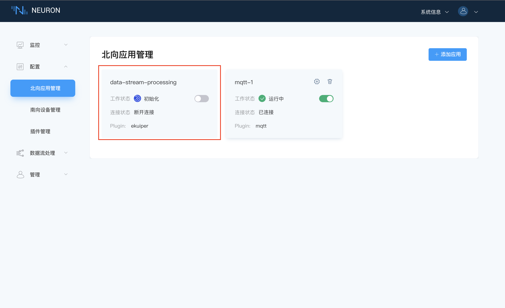
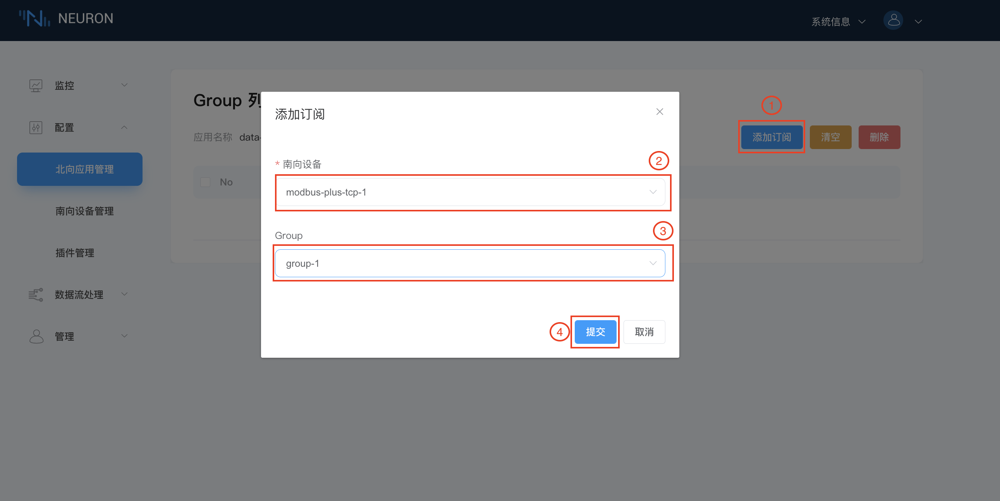

# 设置先决条件

Neuron-plus 版本中集成了 eKuiper，页面增加数据流处理板块。

数据流引擎中预先定义了一个名为 `neuronStream` 的数据流，其属性为`neuron`。用户需要订阅所需的南向设备数据组。订阅的数据组将成为流引擎的数据流。流引擎中的所有规则都将共享此数据流。

## 第一步，查看数据流处理应用节点

当用户安装 .deb 或 .rpm Neuron 包时，北向应用管理界面中将有一个默认的`data-stream-processing`节点卡片，如下图所示。

这个数据流处理节点包含以下信息：

* 应用程序名称 - **data-stream-processing**
* 节点状态 - **初始化**
* 状态切换按键 - 关闭
* 连接状态 - **断开连接**
* 插件模块名称 - **ekuiper**

## 第二步，订阅南向标签组

点击 `data-stream-processing` 应用节点任意空白处，进入订阅 Group 的界面，如下图所示。

订阅南向设备的数据组：

1. 点击右上角`添加订阅`；
2. 点击下拉框，选择南向设备，本例中选择已构建的**modbus-tcp-1**；
3. 点击下拉框，选择要订阅的 Group，本例中选择已构建的 **group-1**；
4. 点击`提交`按键完成订阅。
