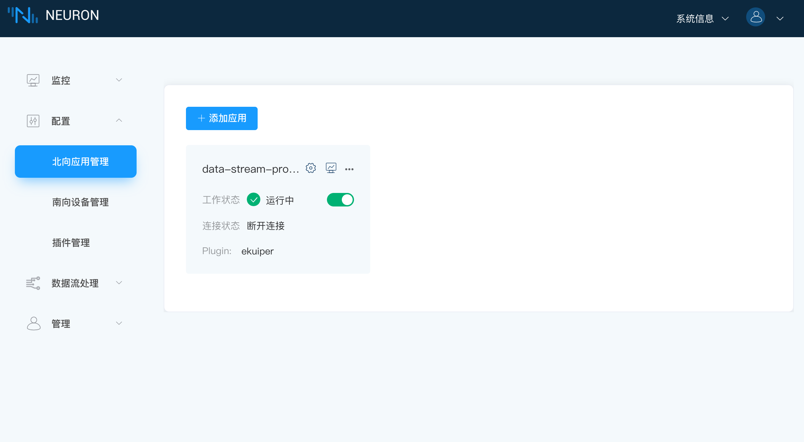

# 设置先决条件

## 安装

### 分别安装 Neuron 和 eKuiper

用户可以选择将 Neuorn 和 eKuiper 分开安装，可用 docker-compose 直接安装及配置，docker-compose.yml 示例如下所示，安装的版本可根据需求自行选择。

```python
version: '3.4'

services:

  ekuiper-manager:
    image: emqx/ekuiper-manager:1.5.0
    container_name: ekuiper-manager
    ports:
      - "9082:9082"

  ekuiper:
    image: lfedge/ekuiper:1.5.1-slim
    hostname: ekuiper
    container_name: ekuiper
    ports:
      - "9081:9081"
      - "127.0.0.1:20498:20498"
    environment:
      MQTT_SOURCE__DEFAULT__SERVER: tcp://broker.emqx.io:1883
      KUIPER__BASIC__CONSOLELOG: "true"
      KUIPER__BASIC__IGNORECASE: "false"
    volumes:
      - nng-ipc:/tmp

  neuron:
    image: emqx/neuron:2.3.0
    hostname: neuron
    container_name: neuron
    ports:
      - "7000:7000"
    volumes:
      - nng-ipc:/tmp

  source:
    image: alpine/httpie
    container_name: httpie
    command:
      - --ignore-stdin
      - --check-status
      - ekuiper:9081/streams
      - sql=CREATE STREAM neuronStream() WITH (TYPE="neuron",FORMAT="json",SHARED="true");
    depends_on:
      - ekuiper
      - neuron

volumes:
  nng-ipc:
```

执行成功后 Neuron 和 eKuiper 已分别启动。

登录 kuiper-manager。

* 地址： `http://$yourhost:9082`
* 用户名：admin
* 密码：public

添加服务，如图所示。


:::tip
Endpoint 中的地址应填写启动 eKuiper 的本机地址。

添加服务完成后，因为 docker-compose 已经创建了一个数据流，所以在刚创建的服务中应当有一条 **neuronStream** 的流。

eKuiper 的具体使用操作可参考 [ekuiper 控制台使用](https://ekuiper.org/docs/zh/latest/operation/manager-ui/overview.html#%E5%BC%80%E5%A7%8B%E4%BD%BF%E7%94%A8)
:::

## 页面操作

数据流引擎中预先定义了一个名为 `neuronStream` 的数据流，其属性为`neuron`。用户需要订阅所需的南向设备数据组。订阅的数据组将成为流引擎的数据流。流引擎中的所有规则都将共享此数据流。

### 第一步，查看数据流处理应用节点

当用户安装 .deb 或 .rpm Neuron 包时，北向应用管理界面中将有一个默认的`data-stream-processing`节点卡片，如下图所示。



这个数据流处理节点包含以下信息：

* 应用程序名称 - **data-stream-processing**
* 工作状态 - **运行中**
* 状态切换按键 - 打开
* 连接状态 - **断开连接**
* 插件模块名称 - **ekuiper**

### 第二步，订阅南向标签组

点击 `data-stream-processing` 应用节点任意空白处，进入订阅 Group 的界面，如下图所示。


订阅南向设备的数据组：

* 点击右上角`添加订阅`；
* 点击下拉框，选择已构建的南向设备；
* 点击下拉框，选择要订阅的 Group；
* 点击`提交`按键完成订阅。
