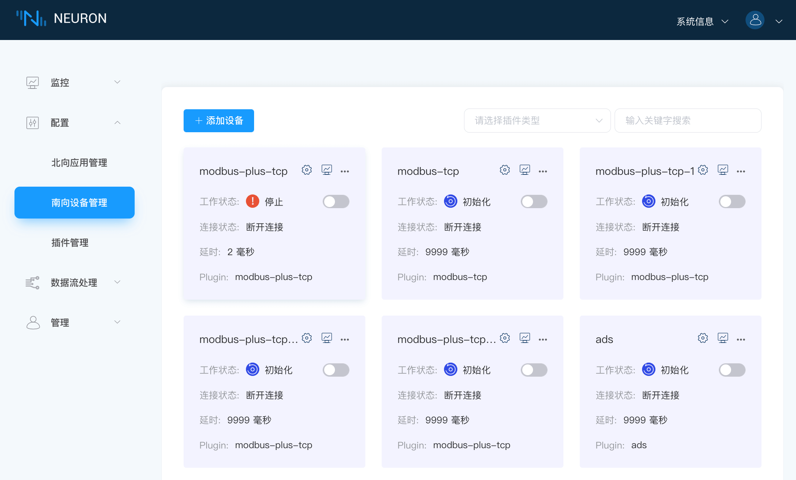
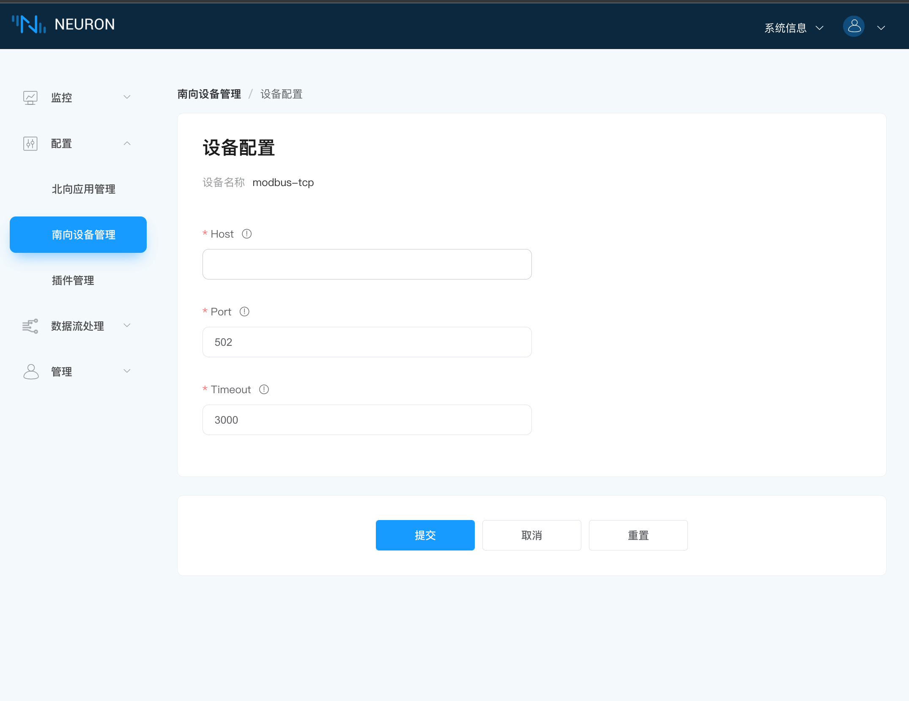

# Modbus 插件开发示例

南向驱动开发主要包含以下几个部分，最底层的是协议层开发，最外层的是驱动层开发。
| 模块         | 文件                                       | 说明                                        |
| ----------- | ------------------------------------------ | ------------------------------------------ |
| 协议层开发    | modbus.c modbus.h                          | 插件对接的设备协议报文的组包与解包              |
| 协议栈解析    | modbus_stack.c modbus_stack.h              | 主要用于协议栈的解析                           |
| 点位处理      | modbus_point.c modbus_point.h              | Neuron 中 tag 类型转换为插件所需要的更具体的类型 |
| 驱动层开发    | modbus_tcp.c modbus_req.c modbus_req.h     | 插件主题框架的实现                            |
| 插件设置文件   | modbus-tcp.json                            | 插件设置文件的定义                            |

## 常量说明

头文件 <define.h> 中定义了 Neuron 中主要的常量。

| 常量                               | 说明                       |
| --------------------------------- | -------------------------- |
| NEU_TAG_NAME_LEN                  | 点位名称最大长度，32          |
| NEU_TAG_ADDRESS_LEN               | 点位地址的最大长度，64         |
| NEU_TAG_DESCRIPTION_LEN           | 点位描述字符串最大长度，128     |
| NEU_GROUP_NAME_LEN                | 组名字最大长度，32             |
| NEU_GROUP_INTERVAL_LIMIT          | 组的时间间隔下限，100          |
| NEU_NODE_NAME_LEN                 | 节点名称最大长度，32           |
| NEU_PLUGIN_NAME_LEN               | 插件名称最大长度，32           |
| NEU_PLUGIN_LIBRARY_LEN            | 插件动态库文件名称最大长度，32   |
| NEU_PLUGIN_DESCRIPTION_LEN        | 插件描述字符串最大长度，512     |
| NEU_DRIVER_TAG_CACHE_EXPIRE_TIME  | 驱动点位缓存过期时间，30        |
| NEU_APP_SUBSCRIBE_MSG_SIZE        | 北向订阅消息的大小，4           |
| NEU_TAG_FLOAG_PRECISION_MAX       | 浮点类型精度的最大值，17        |

```c
typedef enum neu_plugin_kind {
    NEU_PLUGIN_KIND_STATIC = 0,
    NEU_PLUGIN_KIND_SYSTEM = 1,
    NEU_PLUGIN_KIND_CUSTOM = 2,
} neu_plugin_kind_e;
```

插件类型：

* NEU_PLUGIN_KIND_STATIC，Neuron 内嵌插件，不需要动态库文件；
* NEU_PLUGIN_KIND_SYSTEM，系统插件，需要以动态库文件方式存储，可由 Neuron 加载；
* NEU_PLUGIN_KIND_CUSTOM，自定义插件，需要以动态库文件方式存储，可由 Neuron 加载；

```c
typedef enum {
    NEU_NA_TYPE_DRIVER = 1,
    NEU_NA_TYPE_APP    = 2,
} neu_adapter_type_e,
    neu_node_type_e;
```

节点类型，NEU_NA_TYPE_DRIVER 代表南向节点，NEU_NA_TYPE_APP 代表北向节点。

```c
typedef enum {
    NEU_NODE_LINK_STATE_DISCONNECTED = 0,
    NEU_NODE_LINK_STATE_CONNECTED    = 1,
} neu_node_link_state_e;
```

节点连接状态，NEU_NODE_LINK_STATE_DISCONNECTED 代表断开连接，NEU_NODE_LINK_STATE_CONNECTED 代表已连接。

```c
typedef enum {
    NEU_NODE_RUNNING_STATE_IDLE    = 0,
    NEU_NODE_RUNNING_STATE_INIT    = 1,
    NEU_NODE_RUNNING_STATE_READY   = 2,
    NEU_NODE_RUNNING_STATE_RUNNING = 3,
    NEU_NODE_RUNNING_STATE_STOPPED = 4,
} neu_node_running_state_e;
```

节点运行状态：

* NEU_NODE_RUNNING_STATE_IDLE，驱动配置中，进入配置中；
* NEU_NODE_RUNNING_STATE_INIT，节点创建成功后，进入初始化；
* NEU_NODE_RUNNING_STATE_READY，驱动配置完成后，进入准备好；
* NEU_NODE_RUNNING_STATE_RUNNING，打开节点工作状态，进入运行中；
* NEU_NODE_RUNNING_STATE_STOPPED，关闭节点工作状态，进入停止；

## 第一步，协议层开发

这部分主要实现的是插件对接的设备协议的组包与解包的实现，还包括一些结构体定义以及相关函数的实现，其中 modbus.h 定义 modbus 协议基本报文，以及对该报文的组包和解包函数，modbus.c 实现组包与解包的函数。

Modbus 协议通过 TCP 方式传输时，读写请求报文格式如下列表格所示。

| 报文格式       | 数据长度    | 说明                                       | 函数实现 |
| ------------- | --------- | ------------------------------------------ | ----------------------------------------------------------- |
| 报文头         | 6 个字节   | 应用报文头，包含传输标识、协议标识和字节长度      | 组包函数 modbus_header_wrap 和解包函数 modbus_header_unwrap    |
| 地址码         | 1 个字节   | 设备地址，也是站点号                          | 组包函数 modbus_code_wrap 和解包函数 modbus_code_unwrap        |
| 功能码         | 1 个字节   | 通知执行哪种操作，不同的功能码对应不同的操作      | 组包函数 modbus_code_wrap 和解包函数 modbus_code_unwrap        |
| 寄存器起始地址  | 2 个字节   | 指定读取的寄存器开始地址，高字节在前，低字节在后   | 组包函数 modbus_address_wrap 和解包函数 modbus_address_unwrap  |
| 寄存器数量      | 2 个字节  | 指定读取的寄存器的数量，高字节在前，低字节在后     | 组包函数 modbus_address_wrap 和解包函数 modbus_address_unwrap  |
| 数据域         | N 个字节   | 在写指令中用到，需要写入寄存器的值              | 写入寄存器数值的组包函数 modbus_data_wrap 和解包函数 modbus_data_unwrap |

### 枚举说明

| 枚举             | 说明               |
| --------------- | ----------------- |
| modbus_function | Modbus 不同的功能码 |
| modbus_area     | 不同寄存器类型       |

### modbus_code 代码解析

modbus_header，modbus_code，modbus_address，modbus_data 代码实现相似，以 modbus_header 为例代码分析。

```c
// Pack modbus_header into protocol_pack_buf
void modbus_header_wrap(neu_protocol_pack_buf_t *buf, uint16_t seq)
{
    // Check if there is enough space in protocol_pack_buf to store the structure of modbus_header
    assert(neu_protocol_pack_buf_unused_size(buf) >=
           sizeof(struct modbus_header));

    // Allocate memory for modbus_header in protocol_pack_buf and return the starting address of modbus_header
    struct modbus_header *header =
        (struct modbus_header *) neu_protocol_pack_buf(
            buf, sizeof(struct modbus_header));

    // Assign value to header
    header->seq      = htons(seq);
    header->protocol = 0x0;
    header->len      = htons(neu_protocol_pack_buf_used_size(buf) -
                        sizeof(struct modbus_header));
}

// Parse modbus_header from received protocol_unpack_buf
int modbus_header_unwrap(neu_protocol_unpack_buf_t *buf,
                         struct modbus_header *     out_header)
{
    // Get the start address of modbus_header from protocol_unpack_buf
    struct modbus_header *header =
        (struct modbus_header *) neu_protocol_unpack_buf(
            buf, sizeof(struct modbus_header));
    
    // When the data size in protocol_unpack_buf is less than the size of modbus_header, return 0
    if (header == NULL ||
        ntohs(header->len) > neu_protocol_unpack_buf_unused_size(buf)) {
        return 0;
    }

    // When the parsed packet does not conform to the protocol specification, return -1
    if (header->protocol != 0x0) {
        return -1;
    }

    *out_header     = *header;
    out_header->len = ntohs(out_header->len);
    out_header->seq = ntohs(out_header->seq);

    // When parsing mmmodbus_header is successful, return the parsed data size
    return sizeof(struct modbus_header);
}
```

## 第二步，协议栈解析

这部分主要用于协议栈的解析，主要包含协议栈解析的初始化和资源的释放，生成读写请求报文，接收到的读写响应报文的解析及数据处理。

| 函数名称               | 说明 |
| --------------------- | ---------- |
| modbus_stack_create   | 主要用于协议栈解析的初始化。 |
| modbus_stack_destroy  | 主要用于释放协议栈解析资源。 |
| modbus_stack_recv     | 主要用于向协议栈解析器中传递从 tcp/udp/serial port 中接收到的数据，并对数据进行处理分析。 |
| modbus_stack_read     | 主要用于通过协议解析器，生成要读取点位的协议报文。           |
| modbus_stack_write    | 主要用于通过协议解析器，生成要写入点位值的协议报文。          |

## 第三步，点位处理

这部分主要用于将 Neuron 中设置的 tag 信息转换为所需要的更具体的信息。

* Neuron 中点位配置的地址可以进一步解析成设备地址 Slave ID，寄存器类型和寄存器起始地址，并能校验该地址是否符合插件规范。
* 不同的寄存器支持的数据类型不同，这里可以根据解析出来的寄存器类型及 Neuron 中配置的属性进行判断配置的地址是否支持该属性。
* Modbus 支持批量读取数据，Neuron 可以把用户配置的点位进行聚合分类，根据分类的结果，可实现批量读取数据的功能。

## 第四步，驱动层开发

modbus_req.c 和 modbus_req.h 文件定义 modbus_tcp.c 文件中使用的具体函数实现及结构体。modbus_tcp.c 文件主要是插件的接口函数，由 neuron 中的 plugin.h 定义，plugin_intf_funs 说明如下。

### open

调用 driver_open 函数，基于 plugin 创建 node 时 neuron 第一个调用的函数，创建插件自己定义的结构体 struct neu_plugin。该结构体在 modbus_req.h 中定义，需要注意的是结构体中的第一个成员一定是 neu_plugin_common_t common，其他成员可根据驱动的具体实现增加。

```c
static neu_plugin_t *driver_open(void)
{
    neu_plugin_t *plugin = calloc(1, sizeof(neu_plugin_t));

    neu_plugin_common_init(&plugin->common);

    return plugin;
}
```

### close

调用 driver_close 函数，删除 node 时，neuron 调用的最后一个函数，用于释放由 open 创建的 neu_plugin_t。

```c
static int driver_close(neu_plugin_t *plugin)
{
    free(plugin);

    return 0;
}
```

### init

调用 driver_init 函数，在创建 node 时，neuron 调用完 open 后，紧接着调用的函数。此函数主要做插件内需要初始化的一些资源，modbus 插件中主要初始化 modbus 协议栈解析。其中的回调函数都在 modbus_req 文件中实现。

```c
static int driver_init(neu_plugin_t *plugin)
{
    plog_info(plugin, "node: modbus init");

    return 0;
}
```

### uninit

调用 driver_uninit 函数，删除 node 时，neuron 首先调用的函数，此函数主要释放一些在 init 中申请以及初始化的资源。

```c
static int driver_uninit(neu_plugin_t *plugin)
{

    plog_info(plugin, "node: modbus uninit");

    return 0;
}
```

### start

调用 driver_start 函数，用户在 neuron node 页面，点击开始时，neuron 会调用此函数，start 不做任何处理，只返回 0，通知插件开始运行，以及开始连接设备等，连接状态的处理放在 tcp 连接的异步回调函数中处理。


### stop

调用 driver_stop 函数，用户在 neuron node 页面，点击停止时，neuron 会调用此函数，stop 通知插件停止运行，关闭与设备之间的连接，并且 driver.group_timer 将不会再触发。



### setting

调用 driver_config 函数，用户在 neuron node 设置页面进行设置时使用，node 设置的参数将通过 json 方式呈现，neuron 将通过此函数通知插件进行设置。driver_config 函数首先会解析并保存配置信息，然后建立 tcp 连接。modbus_conn_connected 和 modbus_conn_disconnected 两个回调函数会分别在 tcp 建立和关闭连接时被调用，相应的这两个函数会更新插件的连接状态。



```c
static int driver_config(neu_plugin_t *plugin, const char *config)
{
    plog_info(plugin, "config: %s", config);

    return 0;
}
```

### request

调用 driver_request 函数，此函数在南向 driver 中暂未使用到。

### driver.validate_tag

调用 driver_validate_tag 函数，在向 node 中添加 tag 或更新 tag 时，neuron 会把 tag 相关参数使用此函数通知到插件，插件根据各自实现检查此 tag 参数是否符合插件要求，该函数返回 0，代表成功。

```c
static int driver_validate_tag(neu_plugin_t *plugin, neu_datatag_t *tag)
{
    plog_info(plugin, "validate tag: %s", tag->name);

    return 0;
}
```

### driver.group_timer

调用 driver_group_timer 函数，在 node 中添加 group，将 node 状态置为 running 后，此函数将以 group 的 interval 参数定时调用，主要用于与设备的交互，读取设备数据。

neu_plugin_group_t 结构体参数说明。

| 参数            | 说明                                        |
| -------------- | ------------------------------------------- |
| group_name     | 触发 timer 的 group 名称                      |
| tags           | neu_datatag_t 类型的数组                      |
| user_data      | 用户自定义的信息                               |
| group_free     | 当删除此 group 时，释放用户自定义信息使用的回调函数 |

```c
static int driver_group_timer(neu_plugin_t *plugin, neu_plugin_group_t *group)
{
    (void) plugin;
    (void) group;

    plog_info(plugin, "timer....");

    return 0;
}
```

### driver.write_tag

调用 driver_write 函数，当使用 write api 时，neuron 将调用此函数，通知插件，向点位 tag 写入特定的值。

```c
static int driver_write(neu_plugin_t *plugin, void *req, neu_datatag_t *tag,
                        neu_value_u value)
{
    (void) plugin;
    (void) req;
    (void) tag;
    (void) value;

    return 0;
}
```

## 第五步，插件设置文件

modbus-tcp.json 文件配置插件设置，其中 tag_regex 和 timeout 是必填项，其他参数可根据插件配置自行添加，参数说明如下表所示。

| 参数           | 说明                   |
| ------------- | ---------------------- |
| tag_regex     | 针对驱动支持不同的数据类型，对地址配置的正则                 |
| description   | 该字段的详细说明                                        |
| attribute     | 该字段的属性，只有两种可选和必选，即 required 和 optional   |
| type          | 该字段的类型，目前常用的是 int 和 string 两种类型           |
| default       | 填写的默认值                                            |
| valid         | 该字段可填写的范围                                       |

```json
{
    "tag_regex": [
        {
            "type": 3,
            "regex": "[1-9]+![3-4][0-9]+(#B|#L|)$"
        },
        {
            "type": 4,
            "regex": "[1-9]+![3-4][0-9]+(#B|#L|)$"
        },
        {
            "type": 5,
            "regex": "[1-9]+![3-4][0-9]+(#BB|#BL|#LL|#LB|)$"
        },
        {
            "type": 6,
            "regex": "[1-9]+![3-4][0-9]+(#BB|#BL|#LL|#LB|)$"
            },
        {
            "type": 9,
            "regex": "[1-9]+![3-4][0-9]+(#BB|#BL|#LL|#LB|)$"
        },
        {
            "type": 11,
            "regex": "[1-9]+!([0-1][0-9]+|[3-4][0-9]+.([0-9]|[0-1][0-5]))$"
        }
    ],
    "host": {
        "name": "host",
        "description": "local ip in server mode, remote device ip in client mode",
        "attribute": "required",
        "type": "string",
        "valid": {
            "regex": "/^((2[0-4]\\d|25[0-5]|[01]?\\d\\d?)\\.){3}(2[0-4]\\d|25[0-5]|[01]?\\d\\d?)$/",
            "length": 30
        }
    },
    "port": {
        "name": "port",
        "description": "local port in server mode, remote device port in client mode",
        "attribute": "required",
        "type": "int",
        "default": 502,
        "valid": {
        "min": 1,
        "max": 65535
        }
    },
    "timeout": {
        "name": "timeout",
        "description": "recv msg timeout(ms)",
        "attribute": "required",
        "type": "int",
        "default": 3000,
        "valid": {
            "min": 1000,
            "max": 65535
        }
    }
}
```
