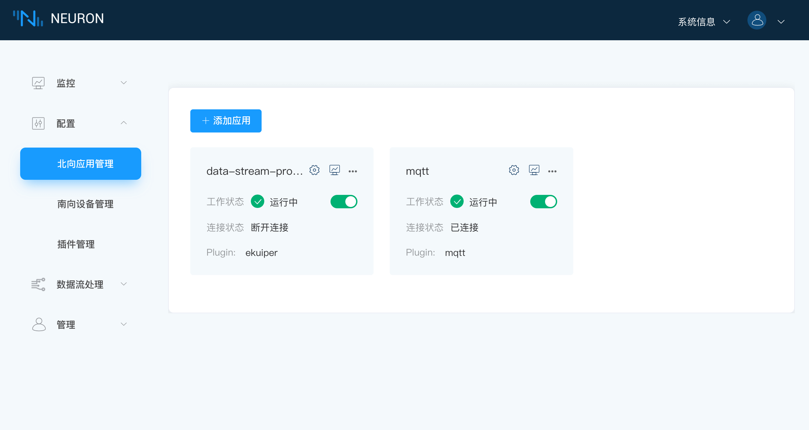
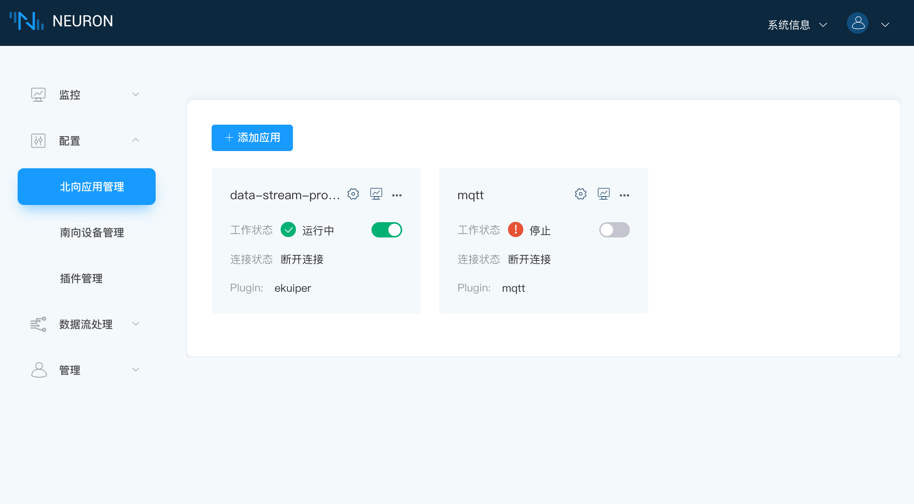
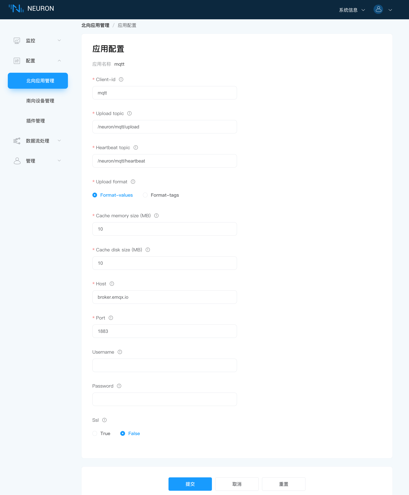

# MQTT 插件开发示例

北向应用开发主要包含以下几个部分，最底层的是指令处理层开发，最外层的是应用层开发。

| 模块        | 文件                      | 说明                       |
| ---------- | ------------------------ | ------------------------- |
| 指令处理层开发   | command.c command.h common.h heartbeat.c heartbeat.h read_write.c read_write.h | 插件对指令的解析  |
| 应用层开发   | mqtt_plugin.c mqtt_plugin.h mqtt_util.c mqtt_util.h  | 插件主题框架的实现  |
| 插件设置文件 | mqtt.json                                             | 插件设置文件的定义 |

## 常量说明

| 常量                   | 说明              |
| --------------------- | ---------------- |
| TOPIC_TYPE_READ       | 主题类型为读       |
| TOPIC_TYPE_WRITE      | 主题类型为写       |
| TOPIC_TYPE_UPLOAD     | 主题类型为上传     |
| TOPIC_TYPE_HEARTBEAT  | 主题类型为心跳包    |

## 第一步，指令处理层开发

MQTT 目前实现了上传数据、心跳数据、读 Tags 和写 Tags 的接口。command.c 中定义了 mqtt 请求对应响应的具体处理， heartbeat.c 和 read_write.c 为 command.c 提供需要的函数实现。

| 函数                              | 说明                 |
| -------------------------------- | ------------------- |
| command_response_handle          | mqtt 响应处理        |
| command_read_once_response       | 读主题的响应处理      |
| command_read_periodic_response   | 上传主题的响应处理    |
| command_write_response           | 写主题的响应处理      |
| command_heartbeat_response       | 心跳数据的响应处理     |

## 第二步，应用层开发

mqtt_util.c 和 mqtt_util.h 文件定义 mqtt_plugin.c 文件中使用的具体函数实现。

南北向驱动层开发中都需要先构建 neu_plugin_intf_funs_t 的结构体，并实现结构体中的每个元素的功能。

```c
static const neu_plugin_intf_funs_t plugin_intf_funs = {
    .open    = mqtt_plugin_open,
    .close   = mqtt_plugin_close,
    .init    = mqtt_plugin_init,
    .uninit  = mqtt_plugin_uninit,
    .start   = mqtt_plugin_start,
    .stop    = mqtt_plugin_stop,
    .setting = mqtt_plugin_config,
    .request = mqtt_plugin_request,
};
```

### .open

调用 mqtt_plugin_open 函数，基于 plugin 创建 node 时 neuron 第一个调用的函数，创建插件自己定义的结构体 struct neu_plugin。该结构体在 mqtt_plugin.h 中定义，需要注意的是结构体中的第一个成员一定是 neu_plugin_common_t common，其他成员可根据驱动的具体实现增加。

```c
static neu_plugin_t *mqtt_plugin_open(void)
{
    neu_plugin_t *plugin = (neu_plugin_t *) calloc(1, sizeof(neu_plugin_t));

    neu_plugin_common_init(&plugin->common);
	
    return plugin;
}
```

### .close

调用 mqtt_plugin_close 函数，删除 node 时，neuron 调用的最后一个函数，用于释放由 open 创建的 neu_plugin_t。

```c
static int mqtt_plugin_close(neu_plugin_t *plugin)
{
    free(plugin);

    return NEU_ERR_SUCCESS;
}
```

### .init

调用 mqtt_plugin_init 函数，在创建 node 时，neuron 调用完 open 后，紧接着调用的函数。此函数主要做插件内需要初始化的一些资源，mqtt 插件中主要初始化 mqtt 的运行状态及配置。

```c
static int mqtt_plugin_init(neu_plugin_t *plugin)
{
    assert(NULL != plugin);

    plugin->routine = NULL;
    plugin->running = false;
    plugin->config  = NULL;
    plugin_cache_init(plugin);

    const char *name = neu_plugin_module.module_name;
    plog_info(plugin, "initialize plugin: %s", name);

    return NEU_ERR_SUCCESS;
}
```

### .uninit

调用 mqtt_plugin_uninit 函数，删除 node 时，neuron 首先调用的函数，此函数主要释放一些在 init 中申请以及初始化的资源。

```c
static int mqtt_plugin_uninit(neu_plugin_t *plugin)
{
    assert(NULL != plugin);

    plugin_stop_running(plugin);
    plugin_cache_uninit(plugin);
    plugin_config_free(plugin);

    const char *name = neu_plugin_module.module_name;
    plog_info(plugin, "uninitialize plugin: %s", name);
    return NEU_ERR_SUCCESS;
}
```

### .start

调用 mqtt_plugin_start 函数，用户在 neuron node 页面，点击开始时，neuron 会调用此函数，通知插件开始运行，以及开始连接设备等，如果配置不正确，将会返回节点设置无效的错误。



```c
static int mqtt_plugin_start(neu_plugin_t *plugin)
{
    assert(NULL != plugin);

    int rc = plguin_start_running(plugin);
    if (0 != rc) {
        return NEU_ERR_NODE_SETTING_INVALID;
    }

    return NEU_ERR_SUCCESS;
}
```

### .stop

调用 mqtt_plugin_stop 函数，用户在 neuron node 页面，点击停止时，neuron 会调用此函数，stop 通知插件停止运行，关闭插件与 neuron 之间的连接。



```c
static int mqtt_plugin_stop(neu_plugin_t *plugin)
{
    assert(NULL != plugin);

    plugin_stop_running(plugin);
    return NEU_ERR_SUCCESS;
}
```

### .setting

调用 mqtt_plugin_config 函数，用户在 neuron node 设置页面进行设置时使用，node 设置的参数将通过 json 方式呈现（json 文件的配置请参考 **插件设置文件** ），neuron 将通过此函数通知插件进行设置。mqtt_plugin_config 函数首先会解析并保存配置信息，然后建立连接。



```c
static int mqtt_plugin_config(neu_plugin_t *plugin, const char *config)
{
	plog_info(plugin, "config: %s", config);

    return NEU_ERR_SUCCESS;
}
```

### .request

调用 mqtt_plugin_request 函数，根据请求类型对应响应处理。

```c
static int mqtt_plugin_request(neu_plugin_t *plugin, neu_reqresp_head_t *head,
                               void *data)
{
    assert(NULL != plugin);
    assert(NULL != head);
    assert(NULL != data);

    neu_err_code_e error = NEU_ERR_SUCCESS;

    switch (head->type) {
    case NEU_RESP_ERROR:
        error = write_response(plugin, head, data);
        break;
    case NEU_RESP_READ_GROUP:
        error = read_response(plugin, head, data);
        break;
    case NEU_REQRESP_TRANS_DATA:
        error = trans_data(plugin, data);
        break;
    case NEU_REQRESP_NODES_STATE: {
        error = node_state_send(plugin, head, data);
        break;
    }
    case NEU_REQRESP_NODE_DELETED:
        break;
    default:
        error = NEU_ERR_MQTT_FAILURE;
        break;
    }

    return error;
}
```

## 第三步，插件设置文件

mqtt.json 文件设置应用配置参数，配置 mqtt 插件每个参数的字段说明如下所示。

| 参数         | 说明                                                          |
| ------------ | ------------------------------------------------------------ |
| name         | 页面显示该参数的名称                                            |
| description  | 该参数的具体说明                                                |
| type         | 该参数的类型，目前常用的是 int 和 string 两种类型                  |
| attribute    | 该参数的属性，只有两种可选和必选，即 required 和 optional          |
| default      | 设置该参数的默认值                                              |
| valid        | 该参数可填写的范围，string 类型用 length，int 类型使用 max 和 min  |
| map          | 用于设置选项框                                                 |

```json
{
	"upload-topic": {
		"name": "upload topic",
		"description": "User defined upload topic",
		"type": "string",
		"attribute": "required",
		"default": "/neuron/${node-name}/upload",
		"valid": {
			"length": 255
		}
	},
	"heartbeat-topic": {
		"name": "heartbeat topic",
		"description": "User defined heartbeat topic",
		"type": "string",
		"attribute": "required",
		"default": "/neuron/${node-name}/heartbeat",
		"valid": {
			"length": 255
		}
	},
	"format": {
		"name": "upload format",
		"description": "The json format of the data reported in the upload topic. In the values mode, all items are contained in the values object or the errors object, respectively. In tags mode, all items are contained in an array",
		"attribute": "optional",
		"type": "map",
		"default": 0,
		"valid": {
			"map": [
				{
					"key": "format-values",
					"value": 0
				},
				{
					"key": "format-tags",
					"value": 1
				}
			]
		}
	},
	"cache": {
		"name": "cache size(MB)",
		"description": "The maximum byte limit in MB for the data backlog when an MQTT connection exception occurs",
		"type": "int",
		"attribute": "optional",
		"default": 64,
		"valid": {
			"min": 1,
			"max": 256 
		}
	},
	"ssl": {
		"name": "ssl",
		"description": "Enable SSL connection",
		"attribute": "optional",
		"type": "bool",
		"default": false,
		"valid": {}
	},
	"host": {
		"name": "host",
		"description": "MQTT broker host",
		"attribute": "required",
		"type": "string",
		"default": "broker.emqx.io",
		"valid": {
			"length": 255
		}
	},
	"port": {
		"name": "port",
		"description": "MQTT broker port",
		"attribute": "required",
		"type": "int",
		"default": 1883,
		"valid": {
			"min": 1024,
			"max": 65535
		}
	},
	"username": {
		"name": "username",
		"description": "User name",
		"attribute": "optional",
		"type": "string",
		"default": "",
		"valid": {
			"length": 255
		}
	},
	"password": {
		"name": "password",
		"description": "Password",
		"attribute": "optional",
		"type": "string",
		"default": "",
		"valid": {
			"length":255 
		}
	},
	"ca": {
		"name": "CA",
		"description": "CA certificate file",
		"attribute": "required",
		"type": "file",
		"condition": {
			"field": "ssl",
			"value": true
		},
		"default": "",
		"valid": {
			"length": 81960
		}
	},
	"cert": {
		"name": "client cert",
		"description": "client x509 certificate file",
		"attribute": "optional",
		"type": "file",
		"condition": {
			"field": "ssl",
			"value": true
		},
		"default": "",
		"valid": {
			"length": 81960
		}
	},
	"key": {
		"name": "client key",
		"description": "client key file",
		"attribute": "optional",
		"type": "file",
		"condition": {
			"field": "ssl",
			"value": true
		},
		"default": "",
		"valid": {
			"length": 81960
		}
	},
	"keypass": {
		"name": "keypass",
		"description": "key password",
		"attribute": "optional",
		"type": "string",
		"condition": {
			"field": "ssl",
			"value": true
		},
		"default": "",
		"valid": {
			"length": 256
		}
	}
}
```
