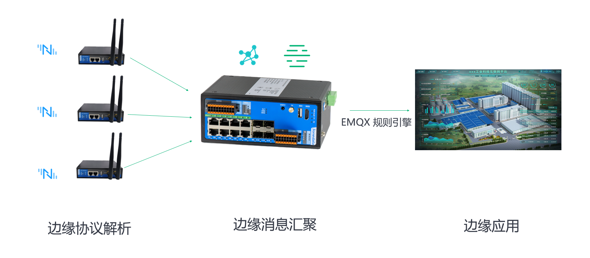
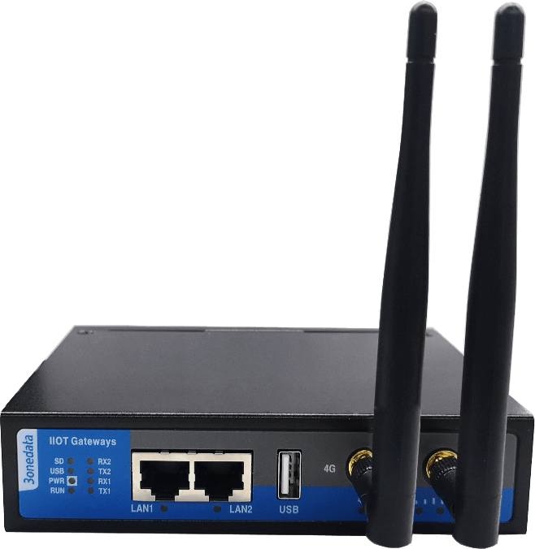
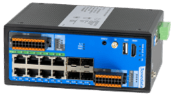

# 三旺通信

深圳市三旺通信股份有限公司（简称“三旺通信”），面向工业经济数字化、网络化、智能化的基础设施需求，秉持研发驱动的发展理念，致力于工业互联网通信产品研发、生产和销售，主打产品囊括工业以太网交换机、嵌入式工业以太网模块、设备联网产品、工业无线产品等领域，涉及上千种产品类别，应用涵盖智慧城市、综合管廊、智能制造、轨道交通、智能电力、煤炭石化等行业领域。业务遍布 30 多个海内外国家和地区，市场业绩连续 19 年超 30% 快速增长。

## 解决方案

在三旺高性价比的硬件产品中搭载 EMQ 的高性能工业协议网关软件 Neuron 后，并与云端的 EMQ 集群无缝桥接，形成了完整的工业互联网解决方案。让您的数据基础设施触达最后一公里的角落，彻底解决连接的烦恼。助力企业数字化转型和产业升级。

## 价值和优势

三旺在各类工业组网场景中都有丰富经验，其丰富的产品种类和网络接口覆盖了 Ethernet、Modbus、EtherCAT、WIFI、4G、5G、POE、LORA、NB-IOT 等各类组网需求。三旺网关优异的硬件资源和网络能力配置配合 Neuron 2.0 的内置的高性能总线和丰富的工业 PLC 协议支持，能够应对各类工业场景的数字化需求。

## 工业级多协议采集网关RCU-100

**产品规格**

- 支持 2 路百兆电口、2 路 3IN1 串口、1 路 USB 口、1 路 SIM 卡槽、1 路 TF 卡槽
- 支持各种主流的工业通信协议和 PLC 私有协议
- 支持 4G 联网，实现数据上云
- 支持 12~48V DC 宽压电源输入
- 支持 -40~75℃ 宽温工作

## 工业边缘计算智能网关 TCU-2000

TCU200是一款紧凑型ARM构架工业物联网边缘计算智能网关，可采集以太网、串口、I/O等各类终端设备信息，对接第三方物联网/云平台，实现本地化与云端远程协同管理与控制。该产品提供千兆光口、百兆电口、RS-485、RS-232、I/O、PWM等多种接口类型，采用壁挂式安装方式，能满足不同应用现场的需求。

**产品规格**

- 支持 2 路千兆光口（LC单 纤单模接头）、6 路百兆电口、2 路 RS-485 串口（3 线隔离）、1 路 RS-232 串口（3 线隔离）、4 路 DI 输入、4 路 DO 输出和 1 路 PWM 输出
- 支持边缘网络扩展、本地计算与存储等功能，提供智能管理与服务
- 采用标准 MQTT 协议，可对接第三方物联网/云平台，实现云端与本地协同管理和控制
- 采用 SW-Ring 环网专利技术，支持单环、耦合环、链环、Dual-homing 环网功能，网络故障自动恢复时间<20ms
- 支持 1 路 12~48V DC 电源输入
- 支持 -40~75℃ 宽温工作

