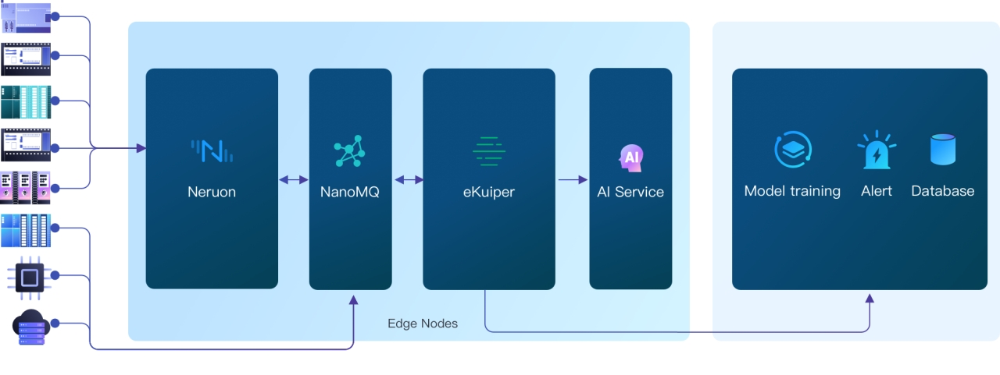
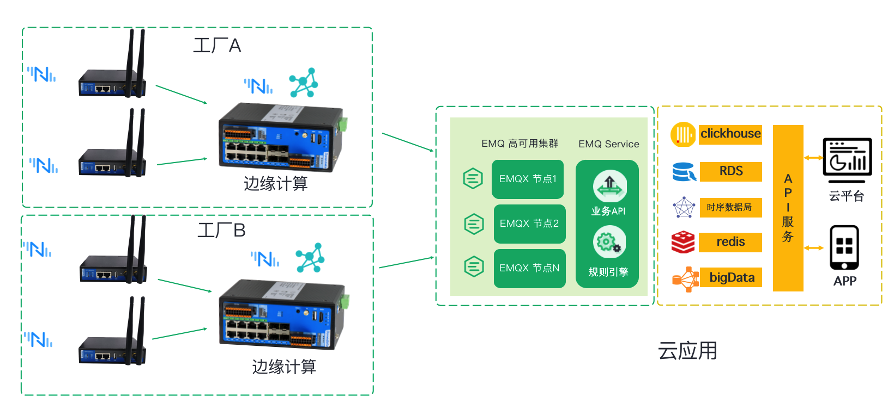

Eco Partners

# Hardware Gateway

工业 4.0 的浪潮正席卷全球。作为新一代信息技术与制造业深度融合的产物，工业互联网通过实现人、机、物的全面互联，构建起生产要素、产业链、价值链全面连接的新型工业生产制造和服务体系，成为支撑第四次工业革命的基础设施。加快发展工业互联网不仅是顺应产业发展大势、抢占产业未来制高点的战略选择，也是推动制造业质量变革、效率变革和动力变革，实现高质量发展的客观要求。

作为一款开源的、轻量级工业协议网关软件，Neuron 始终致力于推进与各工业互联网企业的生态合作关系。目前 Neuron 已与[视美泰](https://www.smartdevicetech.com/)与[三旺通信](https://www.3onedata.com.cn/)建立了生态合作关系。

## [视美泰](./smdt/smdt.md)

视美泰作为一家具备 “算法 + IoT 硬件 + 软件 + 云平台” 全栈能力的科技公司，致力于将人工智能技术应用在各个实际场景，成为物理世界与数字世界的连接器。Neuron 也与视美泰建立了深入的合作关系，目前已支持 GBOX-66X1、GBOX-68IE 和 3588D 等产品的集成。

## [三旺通信](./3onedata/3onedata.md)

三旺通信在工业网关、工业交换机领域有深厚积淀。在三旺高性价比的硬件产品中搭载 EMQ 的高性能工业协议网关软件 Neuron 后，并与云端的 EMQ 集群无缝桥接，形成了完整的工业互联网解决方案。让您的数据基础设施触达最后一公里的角落，彻底解决连接的烦恼。助力企业数字化转型和产业升级。

