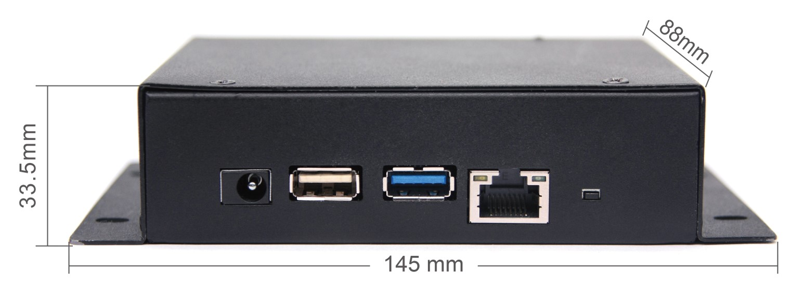
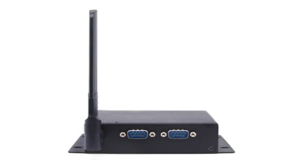
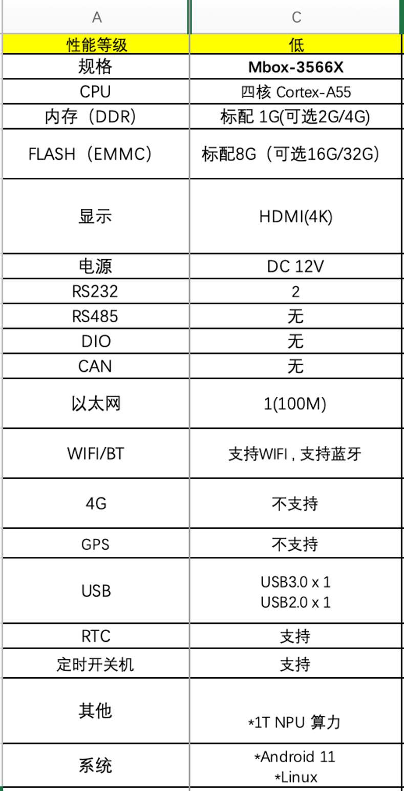
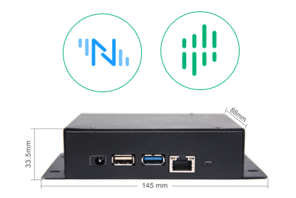
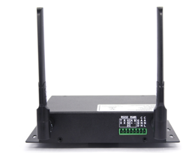
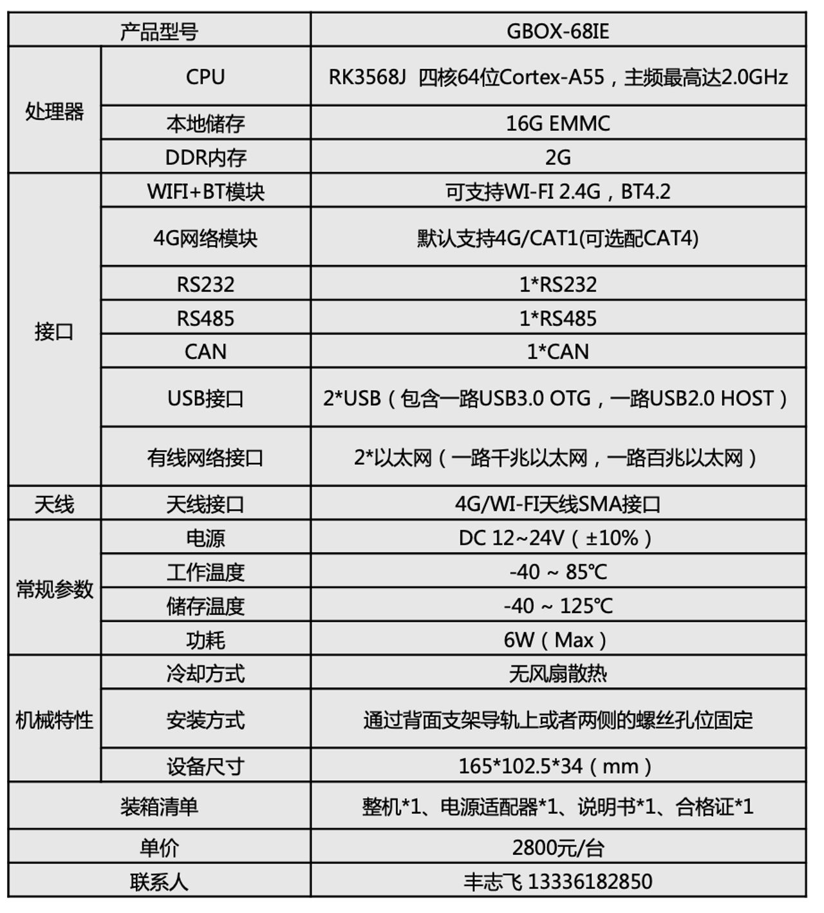
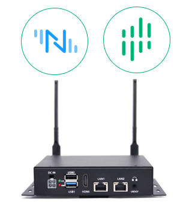
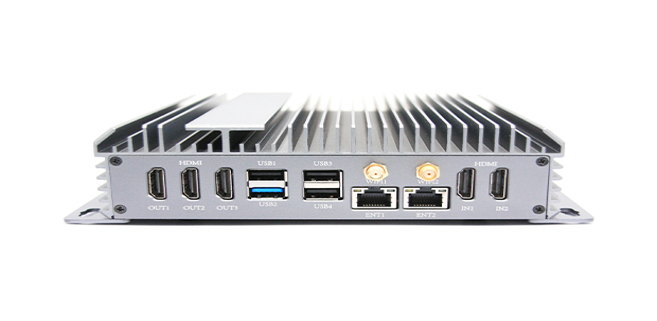

# 视美泰智能工业网关-GBOX-66X1

## Model Diagram

## Specification

## Preload EMQX edge products

* 实现80+工业协议适配数采能力
* 支持边缘数据清洗、聚合处理
* 支持AI算法扩展

# 视美泰智能工业网关-GBOX-68IE

## Model Diagram

## Specification

## Preload EMQX edge products

* 实现80+工业协议适配数采能力
* 支持边缘数据清洗、聚合处理
* 支持AI算法扩展

# 视美泰智能工业网关-3588D

## Model Diagram

## Specification

## Preload EMQX edge products

* 实现80+工业协议适配数采能力
* 支持边缘数据清洗、聚合处理
* 支持边缘AI算法扩展
* 支持海量MQTT设备连接接入能力
* 支持规则引擎，实现一站式的数据集成能力

