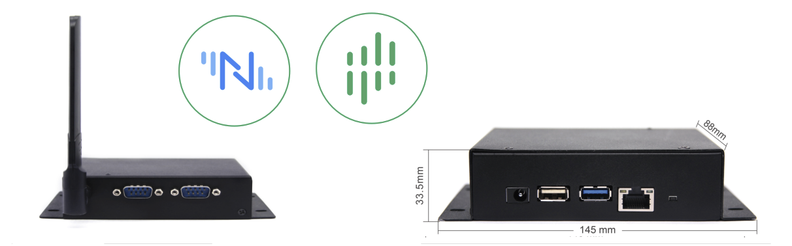
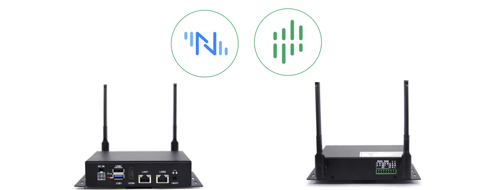
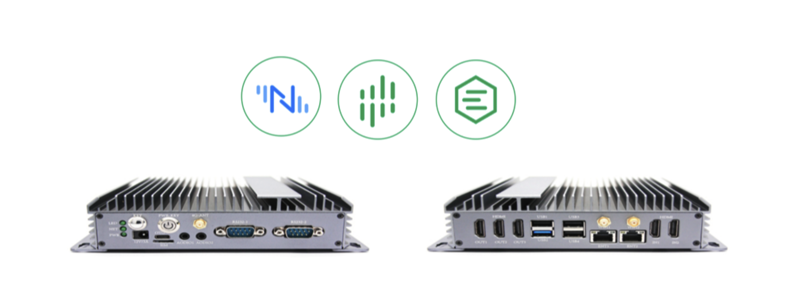

# 视美泰智能工业网关

视美泰作为一家具备 “算法 + IoT 硬件 + 软件 + 云平台” 全栈能力的科技公司，致力于将人工智能技术应用在各个实际场景，成为物理世界与数字世界的连接器。Neuron 也与视美泰建立了深入的合作关系，目前已支持 GBOX-66X1、GBOX-68IE 和 3588D 等产品的集成。

## GBOX-66X1

视美泰 GBOX-66X1可与 Neuron + eKuiper 集成，实现：

- 实现 80+ 工业协议适配数采能力
- 支持边缘数据清洗、聚合处理
- 支持AI算法扩展

**产品规格**

| A            | C                     |
| :----------- | :-------------------- |
| 性能等级     | 低                    |
| 规格         | Mbox-3566X            |
| CPU          | 四核 Cortex-A55       |
| 内存 (DDR)   | 标配 1G（可选 2G/4G） |
| FLASH (EMMC) | 标配 8G（可选16G/32G) |
| 显示         | HDMI(4K)              |
| 电源         | DC 12V                |
| RS232        | 2                     |
| RS485        | 无                    |
| DIO          | 无                    |
| CAN          | 无                    |
| 以太网       | 1(100M)               |
| WIFI/BT      | 支持WIFI 支持蓝牙 |
| GPS          | 不支持                |
| USB          | USB3.0x1  USB2.0x1 |
| RTC          | 支持                  |
| 定时开关机   | 支持                  |
| 其他         | *1T NPU 算力          |
| 系统         | *Android 11 *Linux |

## GBOX-68IE

视美泰 GBOX-68IE 可与 Neuron + eKuiper 集成，实现：

* 实现80+工业协议适配数采能力
* 支持边缘数据清洗、聚合处理
* 支持AI算法扩展

**产品规格**

| 处理器   | CPU          | RK3568J 四核 64 位 Cortex-A55，主频最高达 2.0GHz |
| -------- | :----------- | :----------------------------------------------- |
|          | 本地储存     | 16G EMMC                                         |
|          | DDR内存      | 2G                                               |
| 接口     | WIFI+BT 模块 | 可支持 WI-FI 2.4G，BT4.2                         |
|          | 4G 网络模块  | 默认支持 4G/CAT1（可选配 CAT4）                  |
|          | RS232        | 1 * RS232                                        |
|          | RS485        | 1 * RS485                                        |
|          | CAN          | 1 * CAN                                          |
|          | USB 接口     | 2 * USB (包含一路 USB3.0OTG，一路 USB2.0HOST)    |
|          | 有线网络接口 | 2 * 以太网(一路千兆以太网，一路百兆以太网)       |
| 天线     | 天线接口     | 4G/WI-FI 天线 SMA 接口                           |
|          | 电源         | DC12~24V (±10%)                                  |
|          | 工作温度     | -40~85 ℃                                         |
|          | 储存温度     | -40~125 ℃                                        |
|          | 功耗         | 6W (Max)                                         |
| 机械特性 | 冷却方式     | 无风扇散热                                       |
|          | 安装方式     | 通过背面支架导轨上或者两侧的螺丝孔位固定         |
|          | 设备尺寸     | 165 * 102.5 * 34(mm)                             |

## 3588D

视美泰 3588D 可与 Neuron + eKuiper + EMQX 的集成，实现：

* 实现 80+ 工业协议适配数采能力
* 支持边缘数据清洗、聚合处理
* 支持边缘 AI 算法扩展
* 支持海量 MQTT 设备连接接入能力
* 支持规则引擎，实现一站式的数据集成能力

**产品规格**

| 性能等级     | 高                                         |
| :----------- | :----------------------------------------- |
| 规格         | 3588D                                      |
| CPU          | 四核 Cortex-A76 + 四核 Cortex-A55          |
| 内存 (DDR)   | 标配 8G（可选 4G/6G）                      |
| FLASH (EMMC) | 标配 32G（可选 16G/64G/128G/256G）         |
| 显示         | HDMI输出 x3 Type-c DP x1 HDMI输入 x2 |
| 电源         | DC 12V                                     |
| RS232        | 2                                          |
| RS485        | 1                                          |
| DIO          | 2                                          |
| CAN          | 1                                          |
| 以太网       | 2 (1000M)                                  |
| WIFI/BT      | 支持 WIFI  支持蓝牙                     |
| GPS          | 预留                                       |
| USB          | Type-C x1  USB3.0 x1  USB2.0 x3    |
| RTC          | 支持                                       |
| 定时开关机   | 支持                                       |
| 其他         | * 6T NPU 算力  * 支持 SATA              |
| 系统         | * Android 12 * Linux(预计)              |

