# 快速教程

## 环境搭建

### 软件包安装

实例中使用的环境是 Ubuntu 20.04.3，armv71。

1. 下载安装包
Neuron 软件包可从 Neuron 官网 [https://neugates.io/zh/downloads](https://neugates.io/zh/downloads) 上下载。

2. 解压安装包
解压软件包到任何目录下（例如：/home/Neuron），输入命令：

```bash
sudo dpkg -i neuron-2.1.0-linux-armhf.deb
```

::: tip
安装 deb 包后，Neuron 自启动
:::

### Neuron 相关操作

#### 查看 Neuron 状态

```bash
sudo systemctl status neuron
```

#### 停止 Neuron

```bash
sudo systemctl stop neuron
```

#### 重启 Neuron

```bash
sudo systemctl restart neuron
```

### 在 Docker 中运行 EMQX

我们需要部署一个 MQTT Broker 客户端来做消息的连接处理，这里推荐使用 EMQX 。同样 EMQX 可以快速使用 Docker 容器安装使用。可从 [EMQX 官网](https://www.emqx.com/zh/try?product=broker) 获取最新版本。

1. 获取 Docker 镜像

```bash
docker pull emqx/emqx:4.4.3
```

2. 启动 Docker 容器

```bash
docker run -d --name emqx -p 1883:1883 -p 8081:8081 -p 8083:8083 -p 8084:8084 -p 8883:8883 -p 18083:18083 emqx/emqx:4.4.3
```

### 安装 Modbus 模拟器

安装 PeakHMISlaveSimulator 软件，安装包可在 [PeakHMI 官网](https://hmisys.com) 中下载。
安装后，打开 Modbus TCP slave.

::: tip
Windows 中尽量关闭防火墙，否则可能会导致 Neuron 连接不上模拟器。
:::

## 运行和使用

当环境和资源都准备好后，打开 Web 浏览器，输入运行 Neuron 的网关地址和端口号，即可进入到管理控制台页面，默认端口号为7000，例如：[http://127.0.0.1:7000](http://127.0.0.1:7000)。

### 1.登录

打开页面，进入到登录界面，用户可使用初始用户名与密码登录（初始用户名：admin，初始密码：0000），如下图所示。


### 2.License

在未上传 License 或者 License 过期时，Neuron 是无法读写和上报数据的，需要在界面申请有效的 License。

1. 在页面右上角`关于`下拉框中选择 License。

2. 首次登陆需要上传 license，您可以从我们的官方网站 [http://neugate.io](http://neugate.io) 申请免费试用的 License，或者您也可以联系我们销售代表获取正式的 License，收到 License 之后，点击`上传`按键，如下图所示。

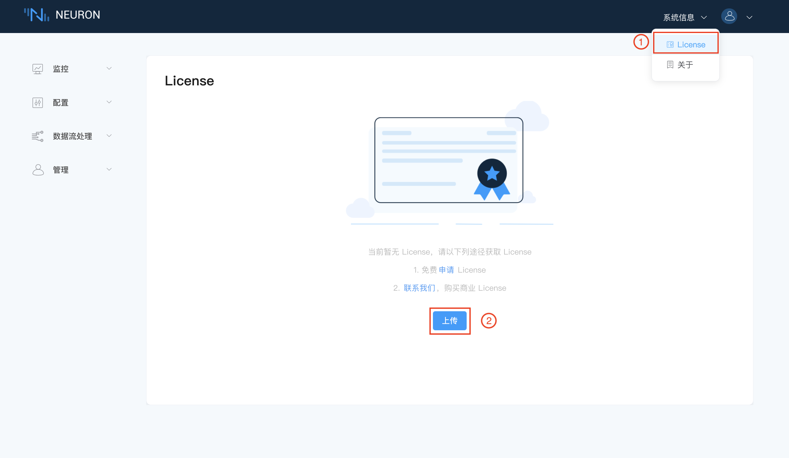
3. 成功上传后，页面将展示 License 信息。如果 License 过期，您必须重新获取 License，然后点击`重新上传`按键上传 License，如下图所示。

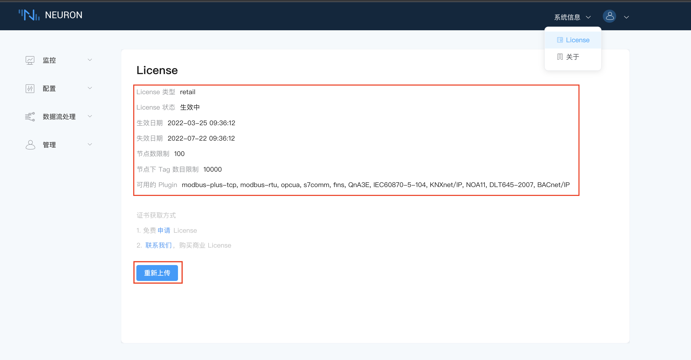

### 3.南向配置

在`配置`菜单中选择`南向设备管理`，进入到南向设备管理界面，此时未添加任何设备，在本例中，我们将创建 Modbus TCP 设备。

第一步，添加南向设备：

1. 点击`添加设备`按键，手动添加设备；
2. 填写设备名称，例如 modbus-plus-tcp-1;
3. 点击下拉框，将显示现在可用的所有南向驱动协议，此次我们选择 modbus-plus-tcp 的插件，如下图所示。

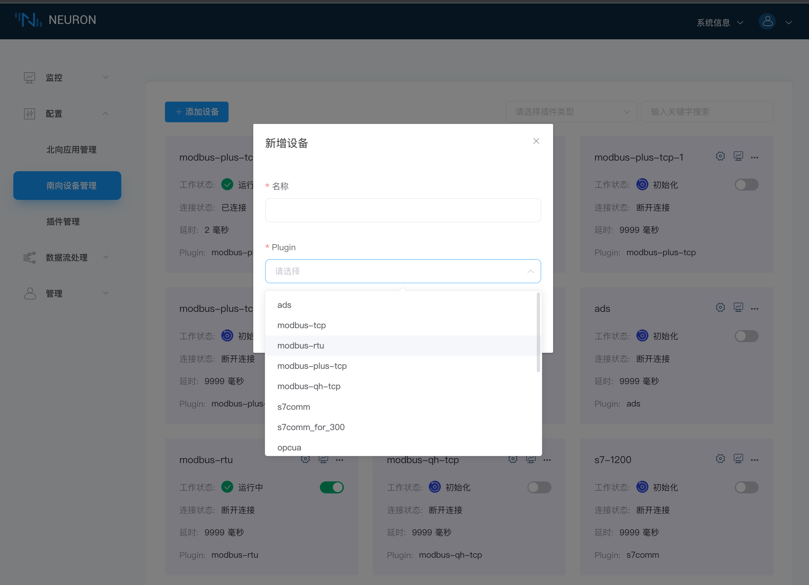

创建设备成功之后，会在南向设备管理界面出现一个刚刚创建的设备的卡片，此时设备的工作状态在初始化，连接状态在断开连接状态中，如下图所示。

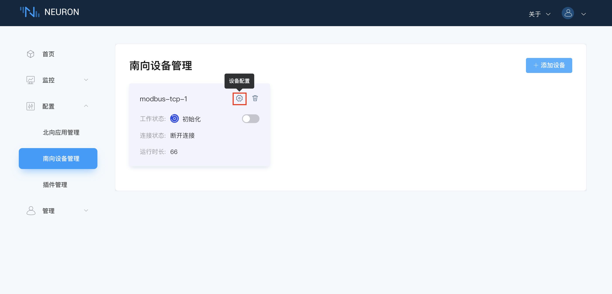
第二步，设备配置：
点击上图中的`设备配置`进行设备配置，如下图所示，带 ` * `是必填项，每项后面都有一个字段说明键，鼠标悬停在上面，将会显示详细的描述信息。

1. 填写运行 Modbus 模拟器的机器 IP；
2. 填写 Modbus 模拟器的端口号，默认是502；
3. 填写请求超时时间，默认是 3000；
4. 选择连接模式，默认 Neuron 作为 Client 模式；
5. 点击提交，完成设备配置，设备状态转为**准备好**。

::: warning
运行的 Neuron 和模拟器必须要在同一个网段下。
::: warning

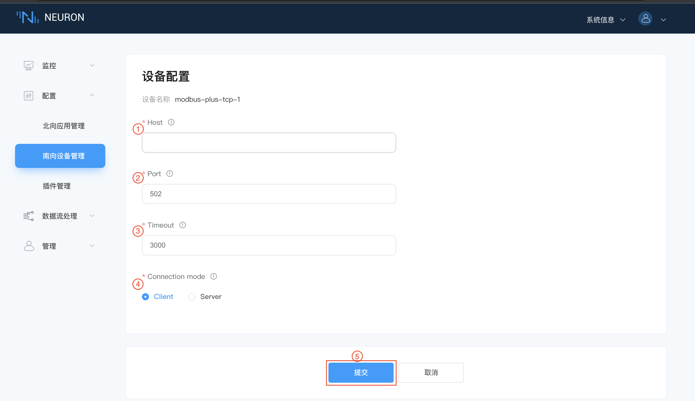
第三步，设置 Group：
点击设备节点框，进入 Group 列表管理界面，点击`创建`按键，如下图所示。

1. 填写 Group 名称，例如 group-1；
2. 填写 Interval，设置从设备读取数据及上报数据的时间间隔，设置的值要大于 100，我们这里设置成 100；
3. 点击`提交`，完成 Group 的创建。


Group 列表中会显示刚新建的 Group，如下图所示。

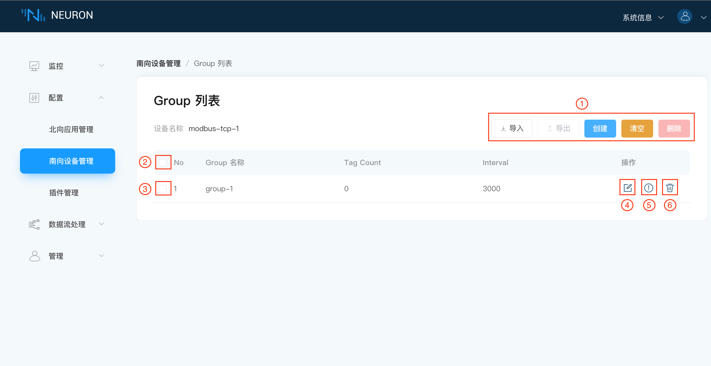
第四步，设置 tags：
点击最后一行的 `Tag 列表`图标，进入到 Tag 列表界面，如下图所示。此时我们可以选择`创建`按钮手动创建 Tags，也可以通过点击`导入`按键，用 Excel 的形式批量导入 Tags 信息，本例中将介绍手动添加的方式。


进入 Tag 列表页面后:

1. 填写 Tag 名称，例如，tag1；
2. 填写驱动地址，例如，1!40001。详细的驱动地址使用说明请参阅 [驱动使用说明](../module-plugins/module-driver.md)；
3. 选择 Tag 类型，例如，Read；
4. 选择数据类型，例如，int16；
5. 点击`创建`按键，完成 Tag 的创建；

::: tip
这里可以通过`添加`按键，再新建一个 Tag，Tag 创建成功后，信息框旁边会出现一个`删除`按键。
:::

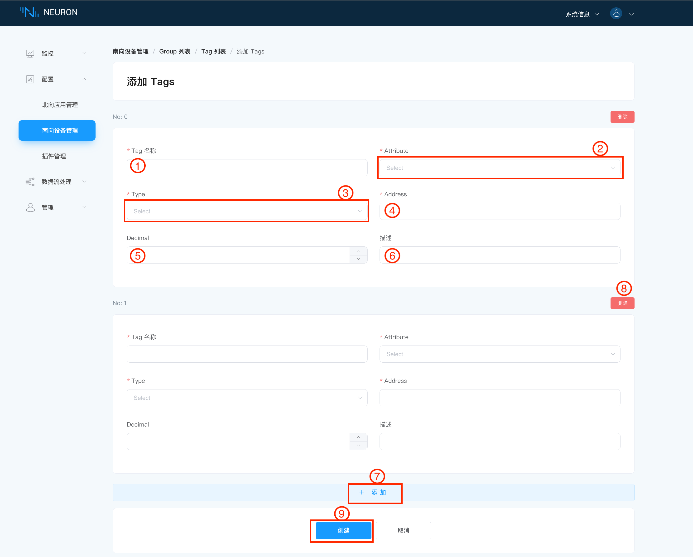

创建完成后，如下图所示。

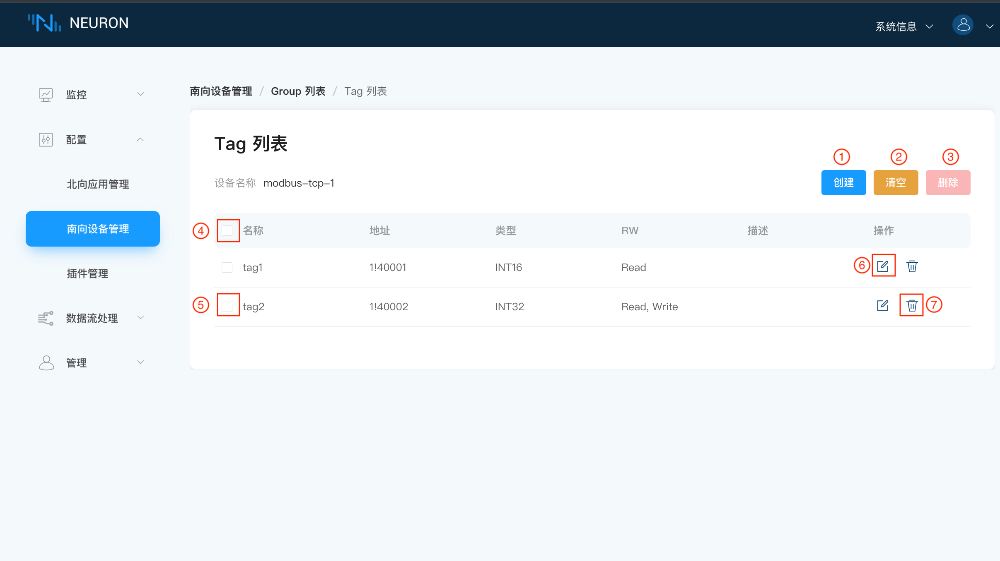

点击`南向设备管理`，点开设备卡片中的工作状态开关，使设备进入**运行中**的状态。

第五步，数据监控：
在`监控`菜单下选择`数据监控`，进入数据监控界面，如下图所示。

1. 下拉框选择想要查看的南向设备，这里选择上面已经创建好的 modbus-plus-tcp-1;
2. 下拉框选择想要查看所选南向设备下的 Group，这里选择上面已经创建好的 group-1；
3. 选择完成，页面将会展示读取到 Group 底下每一个 Tag 的值；

::: tip
Modbus TCP 模拟器的字节顺序默认是 BE 3,4,1,2
:::

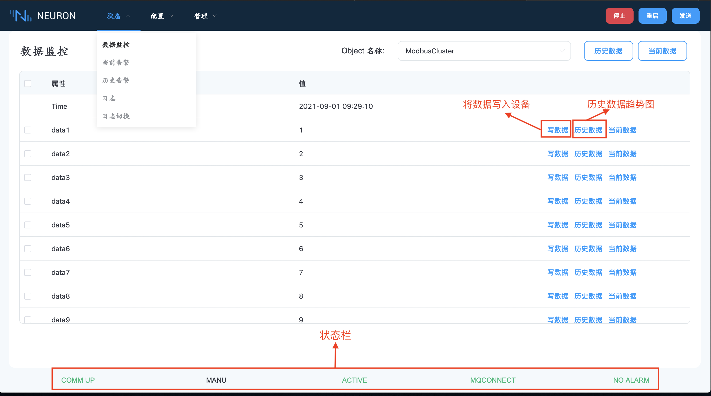

通过与模拟器的相关数据寄存器进行比较，检查数据监控中的每个 tag 的读值。

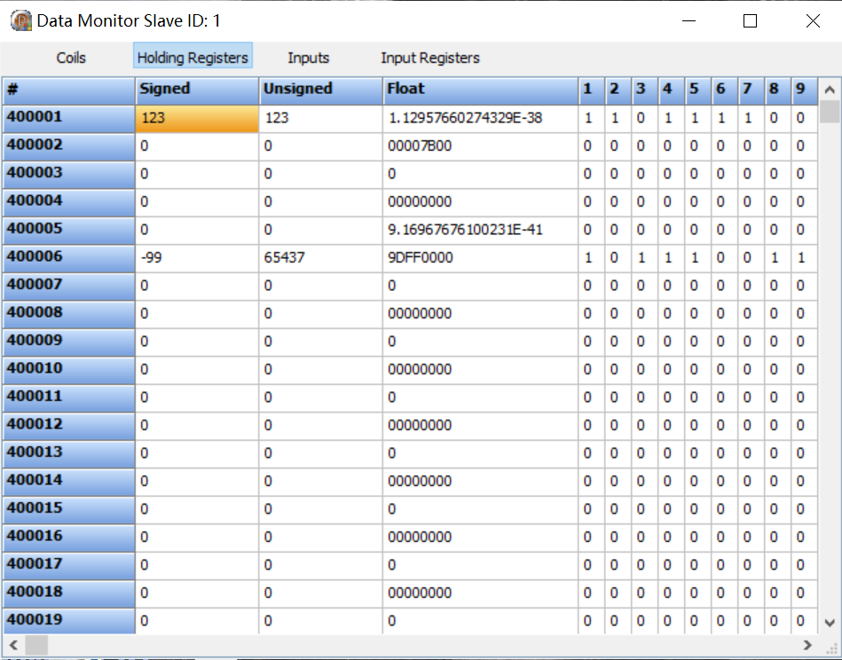

::: tip
在 Tag 设置了写属性的时候，数据监控界面的 Tag 会有一个写操作，点击`Write`可改写该 Tag 的数值，如下图所示。
:::

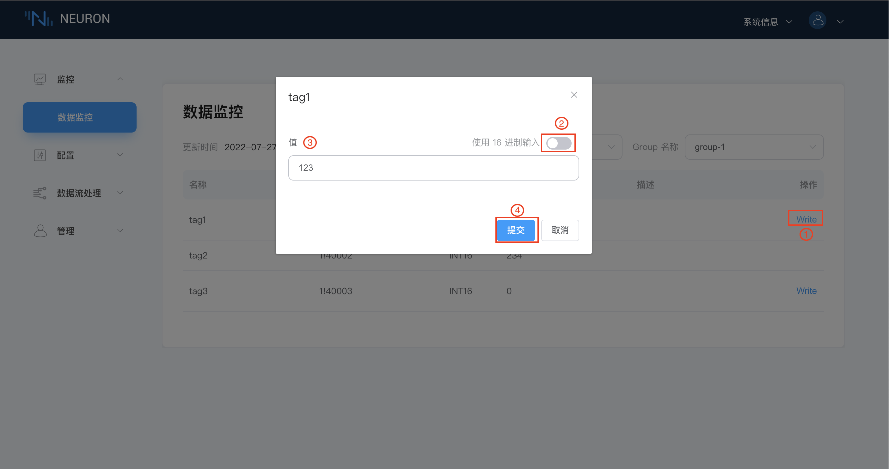

### 4.北向配置

在`配置`菜单中选择`北向应用管理`，进入到北向应用管理界面，会有一个默认的数据流应用节点，如需要，可手动添加更多的应用节点，在本例中，我们将创建一个 mqtt 应用节点。

第一步，添加北向应用：

1. 点击右上角的`添加配置`按键；
2. 填写应用名称，例如，mqtt-1；
3. 点击下拉框，将显示现在可用的所有北向应用，此次我们选择 mqtt 的插件，如下图所示。

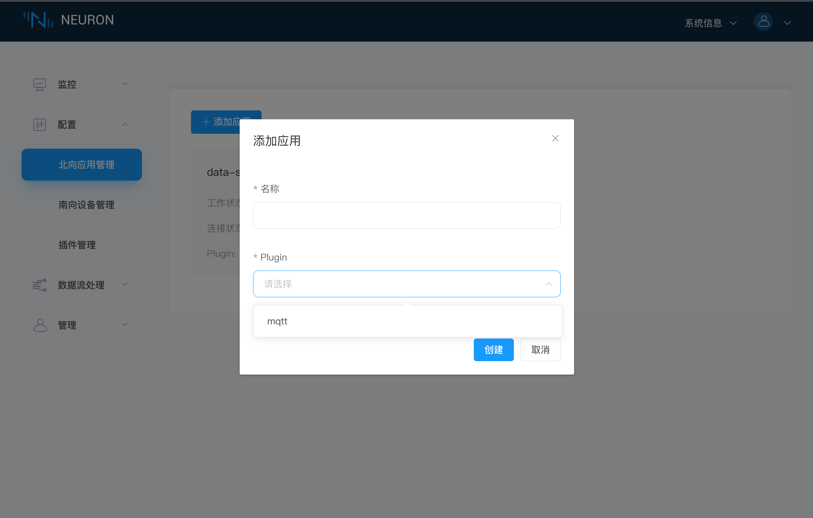

创建应用成功之后，会在北向应用管理界面出现一个刚刚创建的应用的卡片，此时应用的工作状态在初始化，连接状态在断开连接状态中，如下图所示。

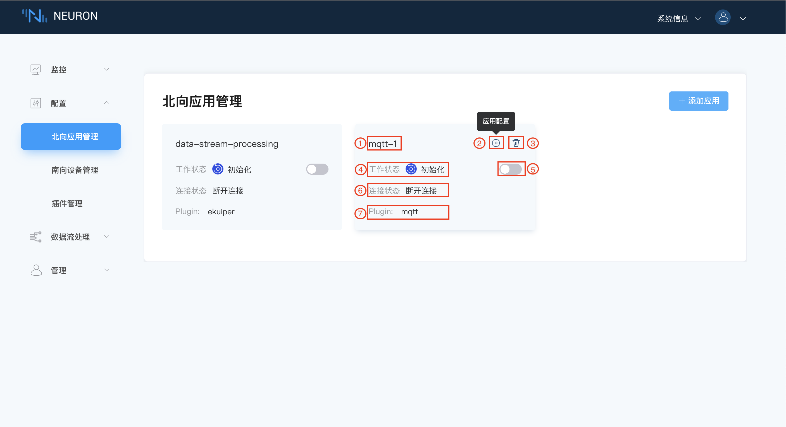

第二步，应用配置

在上图中，点击`应用配置`按键，进入到应用配置界面，如下图所示。带 ` * `是必填项，鼠标悬停在后面的字段说明图标上面，将会显示详细的说明信息。

1. 填写 MQTT 的 Client ID，也是北向应用节点的名称，例如，mqtt1，详细订阅主题请参阅[MQTT Topics](../mqtt.md)；
2. 选填自定义的 MQTT 发布主题；
3. 选择上传格式；
4. 设置 SSL 认证选项；
5. 填写 MQTT Broker 的 hostname，这里默认连接的是 emqx 公共的 broker；
6. 填写 MQTT Broker 的端口号；
7. 选填设置的用户名；
8. 选填设置的密码；
9. 点击`提交`，完成北向应用的配置，工作状态转为**准备好**，在应用配置正确的情况下，连接状态应转为**已连接**状态。

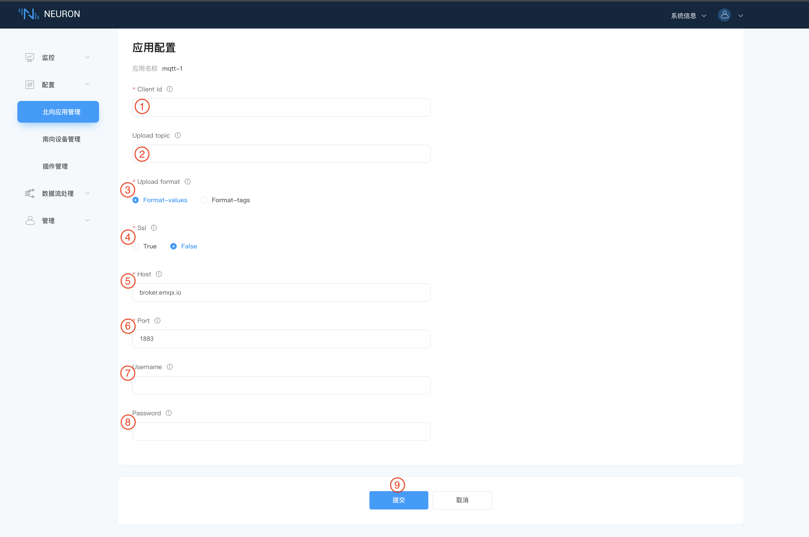

第三步，订阅 Group：

点击设备节点，进入到订阅Group界面，如下图所示。

1. 点击右上角的`添加订阅`按键添加订阅；
2. 点击下拉框选择南向设备，本例我们选择上面建好的 modbus-plus-tcp-1 的设备；
3. 点击下拉框选择所要订阅的 Group，本例我们选择上面建好的 group-1；
4. 点击`提交`，完成订阅，如下图所示。

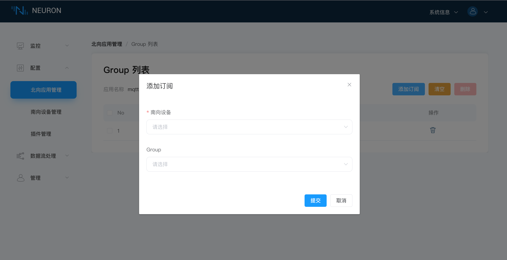

一个 Group 名将如下图所示。

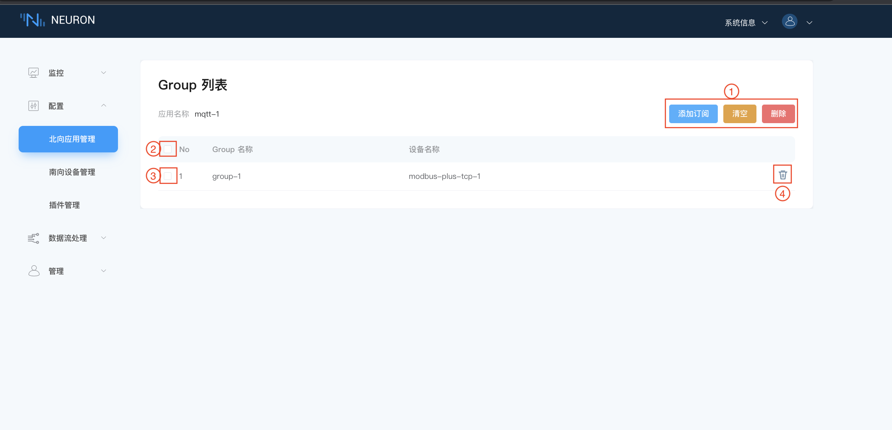

点击`北向应用管理`，点开应用卡片中的工作状态开关，使应用进入**运行中**的状态。

第四步，MQTT 客户端查看：

订阅完成后，我们可以使用 MQTT 客户端（这里推荐使用 MQTTX，可在官网中下载[https://www.emqx.com/zh/products/mqttx](https://www.emqx.com/zh/products/mqttx) 连接到刚才部署好的 EMQX 代理来查看上报的数据，如下图所示。

1. 打开 MQTTX 添加新的连接，正确填写名称与刚部署好的 EMQX Edge 的 Host 与 Port，完成连接;
2. 添加新的订阅，默认的上传 Topic 的主题格式为`neuron/{mqtt_clientid}/upload`，其中 {mqtt_clientid} 是在 Neuron 界面中北向应用中配置的`Client-id`，本例我们填写上面设置好的 `mqtt1`；

订阅成功之后可以看到 MQTTX 可以一直接收到 Neuron 采集并上报过来的数据，如下图所示。

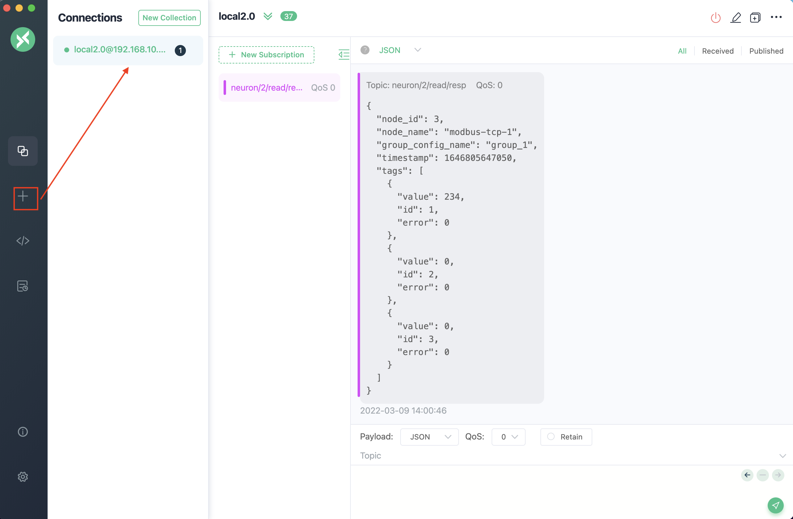


### 5.数据流处理

数据流引擎中预先定义了一个名为 `neuronStream` 的数据流，其属性为`neuron`。这个数据流收集 neuron 从各个设备采集过来的数据，所有规格都将共享此数据流。本节将介绍**清洗数据到云端**和**反控设备**两条规则。

第一步，订阅 Group：

点击 `data-stream-processing` 应用节点以转到订阅 Group 的界面，如下图所示。


1. 点击右上角`添加订阅`；
2. 点击下拉框，选择南向设备，本例中选择已构建的**modbus-plus-tcp-1**；
3. 点击下拉框，选择要订阅的 Group，本例中选择已构建的 **group-1**；
4. 点击`提交`按键完成订阅，如下图所示。

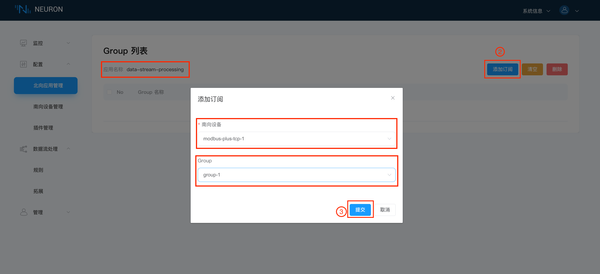

第二步，添加清洗数据到云端的规则

本模块实现将 neuron 从设备采集到的数据进行 +1 处理，并重命名为有意义的名字后，将结果发送到云端的 MQTT 动态 topic `${node_name}/${group_name}`中。


1. 点击`新建规则`，进入新建规则界面；
2. 填写 `Rule ID` 和`SQL` 的描述；
3. 点击`添加` ，为规则添加 sink 动作，每条规则可添加多条 sink 动作；
4. 点击`提交` 完成规则的定义。

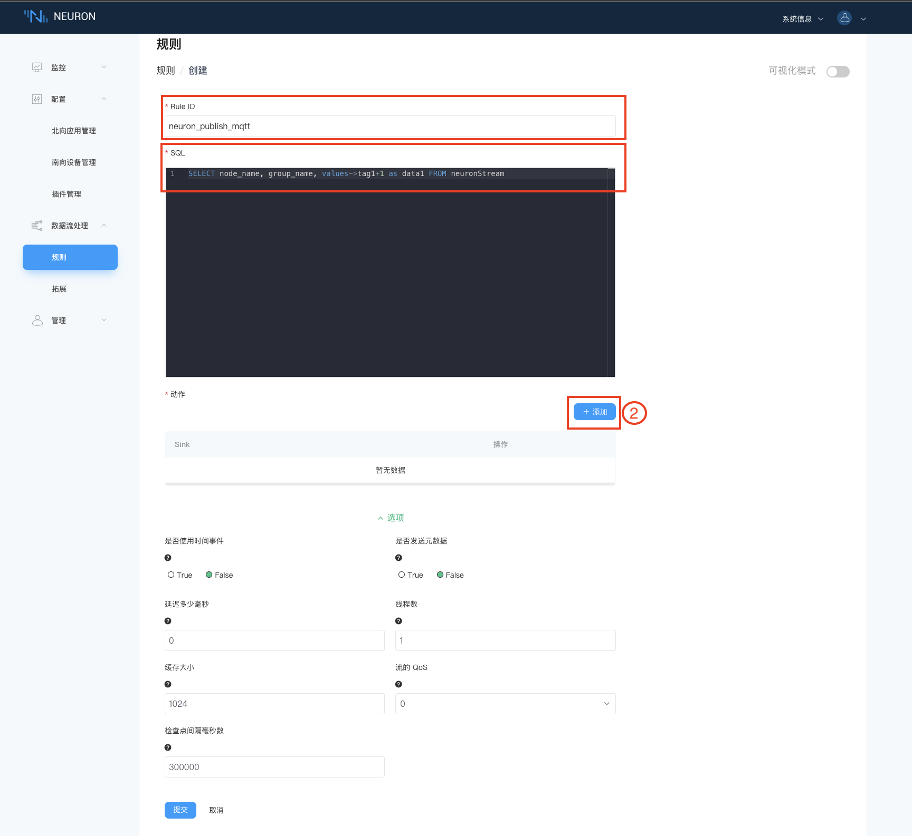

1. 下拉选择 Sink；
2. 填写 MQTT 服务器地址；
3. 填写 MQTT 主题，本例中使用 `{{.node_name}}/{{.group_name}}`；
4. 选择 `True` 以将结果数据按条发送；
5. 选择 `提交` 完成 sink 动作的添加。

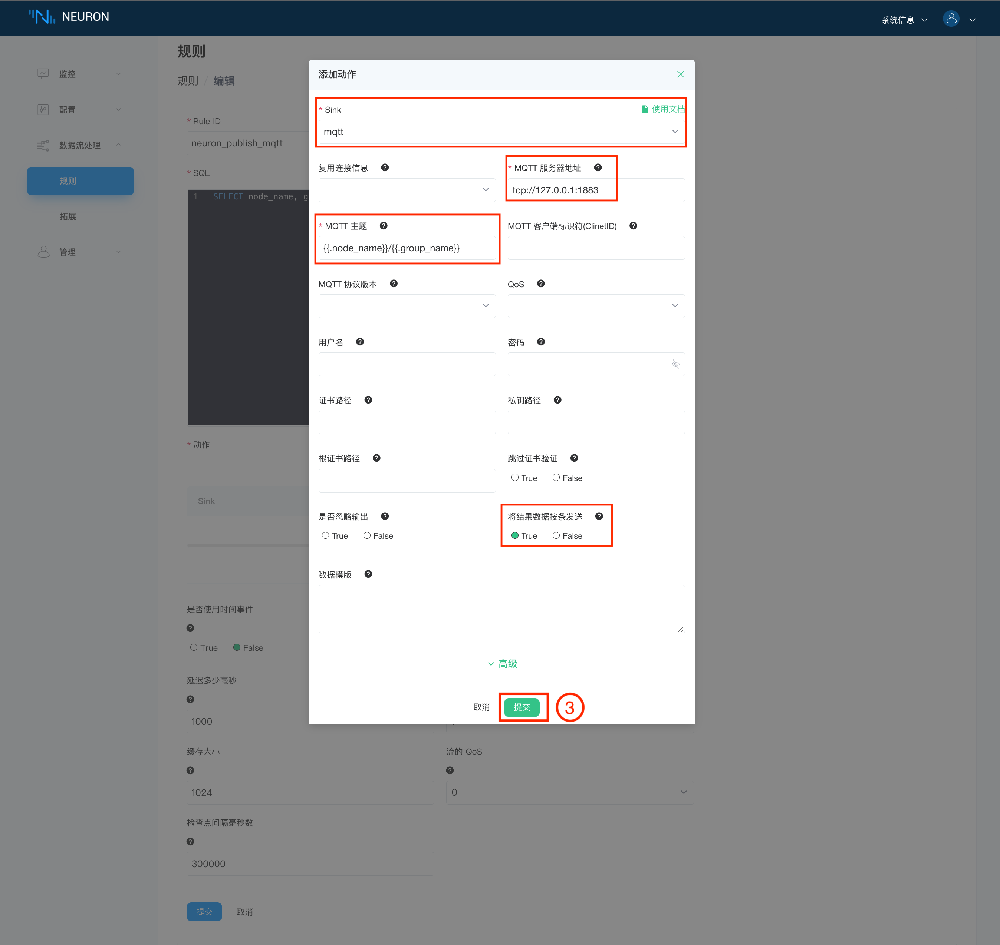

规则如下图所示。


1. 启动规则，如下图所示。

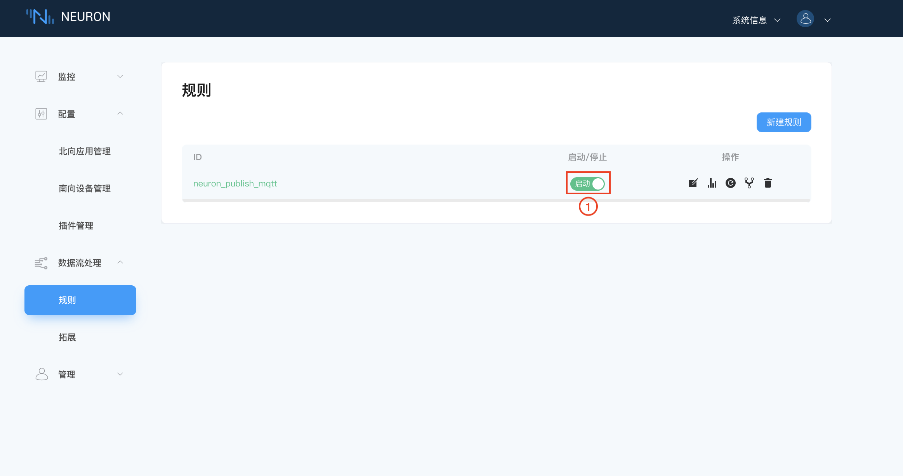

1. 启动 MQTTX ，订阅主题 `{{.node_name}}/{{.group_name}}`，结果如下图所示。

::: tip
此例中使用的 node_name 为 **modbus-plus-tcp-1**，group_name 为**group-1**，即，订阅主题为 modbus-plus-tcp-1/group-1。
:::


第三步，添加反控设备的规则

本模块实现将 neuron 从设备采集到的数据进行 +1 处理，neuron 将结果写到设备中，此时 tag 属性需要有写属性，否则无法写成功。

1. 点击`新建规则`，进入新建规则界面；
2. 填写 `Rule ID` 和`SQL` 的描述；
3. 点击`添加` ，为规则添加 sink 动作，每条规则可添加多条 sink 动作；
4. 点击`提交` 完成规则的定义。


1. 下拉选择 Sink；
2. 填写节点名称；
3. 填写分组名称；
4. 填写标签字段；
5. 选择 `提交` 完成 sink 动作的添加。

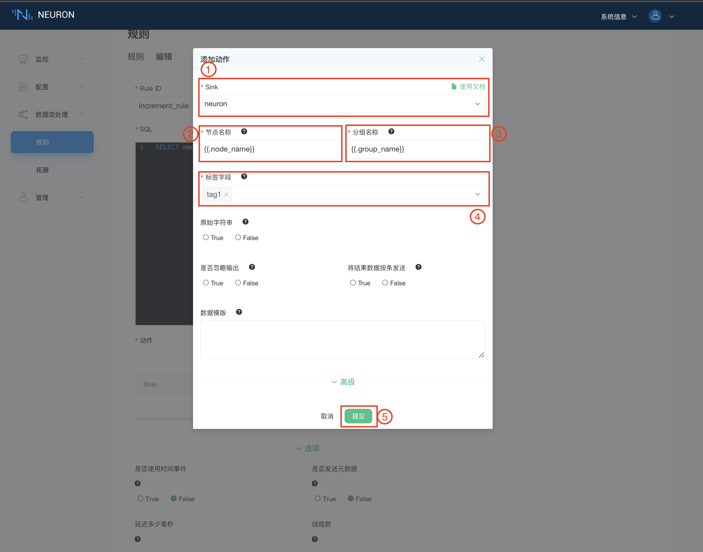

规则如下图所示。

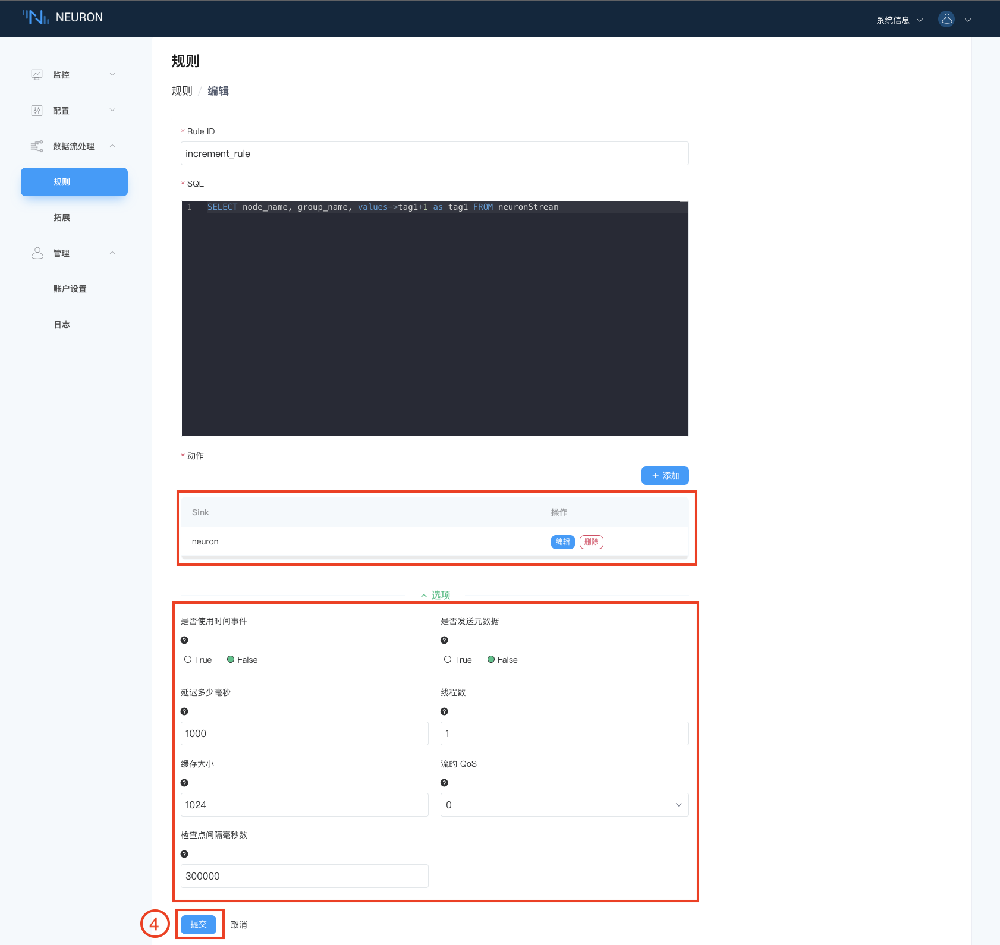

1. 启动规则，如下图所示。


1. 打开 neuron 数据监控，查看数据。
