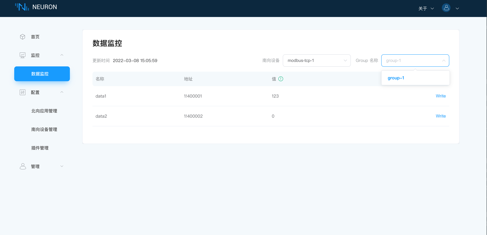

# 快速教程

下文介绍了如何在 Docker 容器中快速使用 Neuron 实例

## 环境搭建

### 在 Docker 中运行 Neuron

获取 Docker 镜像(请在官网中获取最新版本)

```bash
~\$ docker pull neugates/neuron:1.3.3
```

启动 Docker 容器(请在官网中获取最新版本)

```bash
~\$ docker run -d --name neuron -p 7000:7000 neugates/neuron:1.3.3
```

### 在 Docker 中运行 EMQ X Edge

除运行 Neuron 实例外，我们还需要部署一个 MQTT Broker 来做消息的连接处理，这里推荐使用 [EMQ X Edge](https://www.emqx.cn/downloads#edge)，轻量级的边缘计算消息中间件。同样 EMQ X Edge 可以快速使用 Docker 容器进行安装使用。

获取 Docker 镜像(请在官网中获取最新版本)

```bash
~\$ docker pull emqx/emqx-edge:4.2.2
```

启动 Docker 容器(请在官网中获取最新版本)

```bash
~\$ docker run -d --name emqx -p 1883:1883 -p 18083:18083 emqx/emqx-edge:4.2.2
```

## 资源准备

1. 安装 Modbus 模拟器： PeakHMISlaveSimulator。 安装后，打开 Modbus TCP slave。

2. 准备一份配置好的对象数据表，可以点击 [neuron_batch_modbus_5.xlsx](https://github.com/emqx/edge-stack/blob/master/developer-scripts/neuron_batch_modbus_5.xlsx) 选择下载到本地。

## 运行和使用

当环境和资源都准备好后，我们可以打开 Web 浏览器，输入您运行的网关地址和端口号，即可进入到管理控制台页面，Neuron 管理控制台的端口号为 7000，例如：[http://127.0.0.1:7000](http://127.0.0.1:7000)

### 提示

Windows中尽量关闭防火墙，否则可能会导致Neuron连接不上模拟器。

### 登录

打开页面后，会进入到一个登录页面，此时可以使用初始化用户名密码进行登录，用户名：admin，密码：0000，进入后为安全起见，可以修改初始化的密码。


### 1.配置驱动

说明：登录成功后，此时系统中没有预设好的数据，可能会返回 `Function not allowed in current mode` 错误提示，该错误提示为正常提示，因为目前系统处于 `INACTIVE` 状态。

第一步，点击 `新建驱动` 按钮，进行南北向配置。
第二步，北向协议配置。北向协议下拉框中选择`MQTT Client`，`Host name`填写刚才使用 Docker 安装好的 EMQ X Edge 的 Host 地址和端口号。端口号默认为 1883，下方表格为连接 MQTT 的可选参数，可配置用户名密码，证书等。
第三步，驱动协议配置。驱动协议下拉框中选择所需驱动协议，这里以modbus tcp协议为例，选择`Modbus TCP`，`Host name`填写Modbus 模拟器所在机器的 IP 地址，端口号一般为 502，下方表格为驱动参数，如有需要可自行修改参数默认值。
第四步，点击 `提交` 按钮，完成一个 Modbus 的驱动的配置。


### 2.配置对象

为快速进行使用数据，我们可以使用刚才下载到本地的对象数据表，进行数据导入操作，来快速配置 Object。此时点击上方的 `导入` 按钮，选择刚才本地下载好的 Excel 文件，就可以成功导入事先配置好的数据了。

我们也可以一个个进行 Object 的数据的配置。
第一步，在Object设置界面，点击`创建`按钮，开始配置Object，如下图所示，设置对象的名称，大小，数据更新时间间隔，数据保存时间间隔，是否带时间戳。


第二步，创建object完成之后，如下图所示，再进行属性配置。


第三步，属性设置完成之后，会提示设置地址，点击`地址`按钮，输入该点位的驱动地址。


至此，对象及属性设置完成。
### 3.配置事件

根据需要，选择是否配置事件，如果需要配置，在配置完成 Object 后，就可以进行事件配置。我们选择顶部菜单栏中的配置一栏，点击事件设置，进入到事件配置页面，选择 `创建` 按钮，会有一个事件设置弹出框，我们需要选择 Object 的的属性数据进行对比，触发一条告警信息，类型选择为 alarm。还可以填写子程序编号，当事件触发时，可执行子程序，这里没有配置子程序，我们就填写一个默认数值0即可。完成后点击提交按钮即可创建该事件。

如果不需要报警事件，此步骤可跳过，进行下一步操作。


### 4.发送数据

当配置完驱动，Object 和 事件后，我们就可以向 Neuron 发送刚才的配置好的所有数据，只需点击最右上角的 `发送` 按钮并确认。发送成功后，会提示系统正在重启，返回到登录页面，等待几秒后，重新登录后进入，此时页面中有了刚才已经配置好的所有数据。当底部系统状态分别为 `COMM UP`、`MANU`、`ACTIVE`、`MQCONNECT`、`NO ALARM` 时，表示 Neuron 数据配置成功并且运行正常。



### 5.查看数据点监控

此时我们使用预先准备安装好的 Modbus TCP 模拟器，找到 Object 对应属性对应的地址项，并重新修改该值，设置该值为 12 后，在状态菜单栏下的数据监控页面，可以看到表格中对应属性的值实时发生了变化，变为刚才修改后的值。还可点击当前数据，实时查看当前属性的数据变化图表。


### 6.查看事件告警

我们设置了事件之后，可以看到底部出现一个红色的 `UNACK ALARM` 的状态提醒，说明出现未确认的告警信息，我们可以选择状态菜单栏，点击当前告警项，进入到告警页面查看告警信息，说明刚才配置的事件已经生效。如果已经发现存在该告警后，可以点击 `acknowledge` 按钮进行告警确认，底部的 `UNACK ALARM` 变为了 `ALARM`，表示存在告警信息，但是已经确认。


### 7.查看上报数据

此时如果我们可以查看到底部的 `MQCONNECT` 状态，说明 Neuron 已经成功连接到 MQTT Broker。我们可以使用 MQTT 客户端连接到刚才部署好的 EMQ X Edge，这里推荐使用 MQTT X。打开 MQTT X 并设置连接成功后，订阅上面 Neuron 发布的主题，主题格式为 `Neuron/Telemetry/{neuron-uuid}`，`neuron-uuid` 可以通过管理控制台中的 `管理` -> `关于` 中进行获取，订阅成功后，可以看到 MQTT X 可以一直接收到 Neuron 采集并上报过来的数据(详细订阅主题可查看API文档)。

如需自主订阅主题，请在第一项的配置驱动里的北向协议配置找到TOPIC项，填写自己所需的订阅主题名称。


