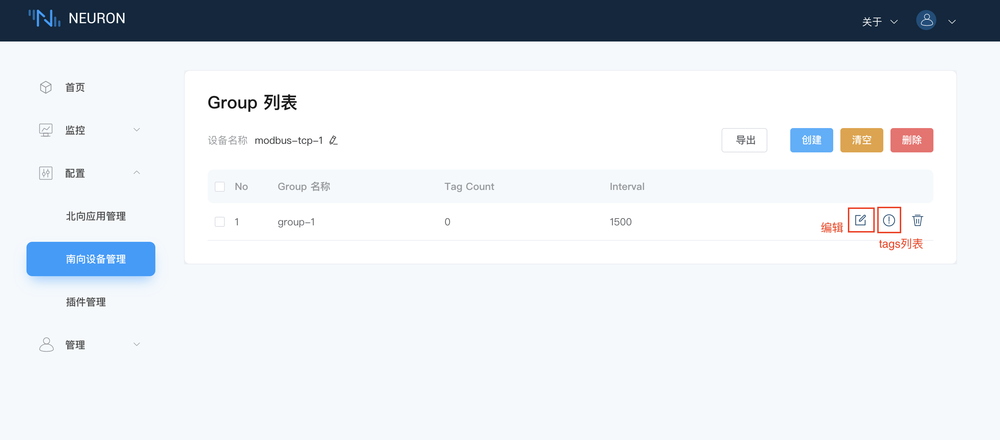
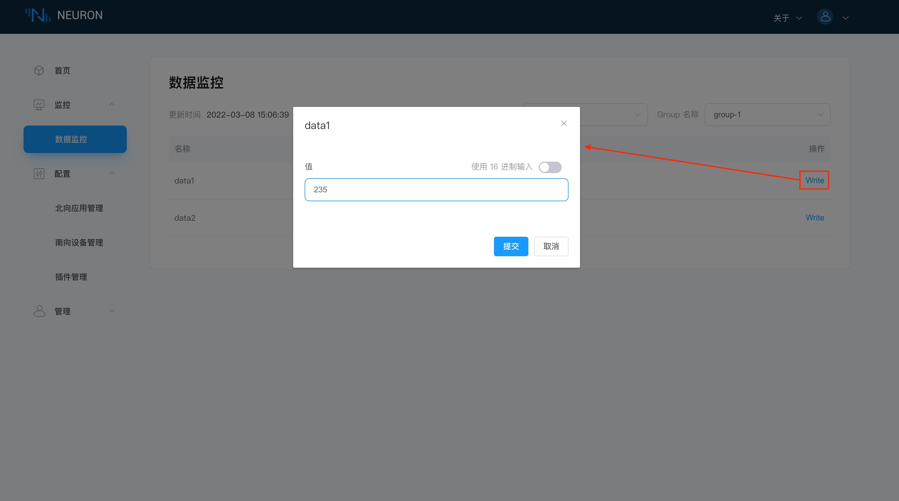

# 快速教程

## 环境搭建

### 软件包安装

实例中使用的环境是 Ubuntu 20.04.3，armv71。

1. 下载安装包
Neuron 软件包可从 Neuron 官网 [https://neugates.io/zh/downloads](https://neugates.io/zh/downloads) 上下载。

2. 解压安装包
解压软件包到任何目录下（例如：/home/Neuron），输入命令：

```bash
sudo dpkg -i neuron-2.1.0-linux-armhf.deb
```

::: tip
安装 deb 包后，Neuron 自启动
:::

### Neuron 相关操作

#### 查看 Neuron 状态

```bash
sudo systemctl status neuron
```

#### 停止 Neuron

```bash
sudo systemctl stop neuron
```

#### 重启 Neuron

```bash
sudo systemctl restart neuron
```

### 在 Docker 中运行 EMQX

我们需要部署一个 MQTT Broker 客户端来做消息的连接处理，这里推荐使用 EMQX 。同样 EMQX 可以快速使用 Docker 容器安装使用。可从 [EMQX 官网](https://www.emqx.com/zh/try?product=broker) 获取最新版本。

1. 获取 Docker 镜像

```bash
docker pull emqx/emqx:4.4.3
```

2. 启动 Docker 容器

```bash
docker run -d --name emqx -p 1883:1883 -p 8081:8081 -p 8083:8083 -p 8084:8084 -p 8883:8883 -p 18083:18083 emqx/emqx:4.4.3
```

### 安装 Modbus 模拟器

安装 PeakHMISlaveSimulator 软件，安装包可在 [PeakHMI 官网](https://hmisys.com) 中下载。
安装后，打开 Modbus TCP slave.

::: tip
Windows 中尽量关闭防火墙，否则可能会导致 Neuron 连接不上模拟器。
:::

## 运行和使用

当环境和资源都准备好后，打开 Web 浏览器，输入运行 Neuron 的网关地址和端口号，即可进入到管理控制台页面，默认端口号为7000，例如：[http://127.0.0.1:7000](http://127.0.0.1:7000)。

### 第一步，登录

打开页面，进入到登录界面，用户可使用初始用户名与密码登录（初始用户名：admin，初始密码：0000），如下图所示。


### 第二步，为设备驱动添加南向插件模块

在`配置`菜单中选择`南向设备管理`，进入到南向设备管理界面，此时未添加任何设备，在本例中，我们将创建 Modbus TCP 设备，如下图所示。


* 点击`添加设备`按键；
* 填写设备名称，例如 modbus-plus-tcp-1;
* 点击下拉框，将显示现在可用的所有南向驱动协议，此次我们选择 modbus-plus-tcp 的插件。

### 第三步，管理南向设备节点列表

创建设备成功之后，会在南向设备管理界面出现一个新创建的设备的卡片，如下图所示。


设备卡片中包含设备名称，设备配置按键，删除按键，工作状态，连接状态和该设备卡片使用的插件名称，点击卡片任意空白处，还可进入 Group 列表管理界面。目前工作状态分为五种：

* 初始化：首次添加南向设备卡片后，进入初始化状态；
* 配置中：进入设备配置中，进行设备配置时，进入到配置中的状态；
* 准备好：成功配置设备后，进入到准备好的状态；
* 运行中：手动打开工作状态，进入到运行状态，在添加 Group 和 Tag 后，Neuron 连接到设备采集数据；
* 停止：手动关闭工作状态，进入到停止状态，neuron 断开与设备的连接，停止采集数据；

### 第四步，设置南向设备参数

点击`设备配置`，进入设备配置界面，如下图所示。


带 ` * ` 是必填项，每项后面都有一个字段说明键，鼠标悬停在上面，将会显示详细的描述信息。

* 填写运行 Modbus 模拟器的机器 IP；
* 填写 Modbus 模拟器的端口号，默认是502；
* 填写连接请求超时时间，默认是 3000；
* 选择连接模式，默认 Neuron 作为 Client 模式；
* 点击提交，完成设备配置，点开设备卡片中的工作状态开关，使设备进入**运行中**的状态。

::: warning
运行的 Neuron 和模拟器必须要在同一个网段下。
:::

### 第五步，在节点中创建组

点击设备节点卡片任意空白处，进入 Group 列表管理界面，如下图所示。


* 点击`创建`按键；
* 填写 Group 名称，例如 group-1；
* 填写 Interval，设置 neuron 从设备采集数据的时间间隔及将数据上报到 MQTT 的时间间隔。最小可设置 100ms，但在采集的数据较多时，如果数据监控界面报点位值失效的错误，可以适当调大 interval 的值；
* 点击`提交`，完成 Group 的创建。

### 第六步，管理群组列表

Group 列表中会显示刚新建的 Group，如下图所示。



* `清空`按键，一键删除所有创建的 Group。
* `删除`按键，在选择全选时，再点击`删除`按钮，效果等同于`清空`，可删除所有 Group。当单选某些 Group 时，再点击`删除`按键，可快捷批量删除选择的 Group。
* 每个组都包含了 Group 名称，该 Group 下标签的总数，Interval 的值，`查看` Group 配置按键， `Tag 列表`按键和`删除`按键。

### 第七步，添加数据标签到组中

点击 `Tag 列表`图标，进入到 Tag 列表管理界面，如下图所示。


此时我们可以选择`创建`按键手动创建 Tags，也可以通过点击`导入`按键，用 Excel 的形式批量导入 Tags 信息。

### 第八步，设置数据标签详细信息

本例中将介绍手动添加的方式，如下图所示。


* 填写 Tag 名称，例如，tag1；
* 填写驱动地址，例如，1!40001。详细的驱动地址使用说明请参阅 [驱动使用说明](../module-plugins/module-driver.md)；
* 下拉选择 Tag 类型，例如，Read， Subscribe 暂时不支持 ；
* 下拉选择数据类型，例如，int16，每个驱动支持的数据类型不一样，下拉可选择的数据类型也不一样；
* 点击`创建`按键，完成 Tag 的创建；

::: tip
这里可以通过`添加`按键，再新建一个 Tag，Tag 创建成功后，信息框旁边会出现一个`删除`按键。
:::

### 第九步，管理组的数据标签

创建完成后，如下图所示。


* `导入`按键，以 Excel 形式批量配置 tag 信息；
* `导出`按键，以 Excel 形式输出已经创建的 tag 信息；
* `清空`按键，一键删除所有的 tag；
* `删除`按键，在选择全选时，再点击`删除`按钮，效果等同于`清空`，可删除所有 tag。当单选某些 tag 时，再点击`删除`按键，可快捷批量删除选择的 tag；
* 每个标签包含了名称，地址，类型，读写属性，描述，重新`编辑` tag 信息的按键和`删除`按键。

### 第十步，查看数据监控中的数据

在`监控`菜单下选择`数据监控`，进入数据监控界面，如下图所示。


* 下拉框选择想要查看的南向设备，这里选择上面已经创建好的 modbus-plus-tcp-1;
* 下拉框选择想要查看所选南向设备下的 Group，这里选择上面已经创建好的 group-1；
* 选择完成，页面将会展示读取到 Group 底下每一个 Tag 的值；

::: tip
Modbus TCP 模拟器的字节顺序默认是 BE 3,4,1,2
:::

### 第十一步，更改模拟器数据标签值

通过设置模拟器里寄存器的值，查看数据监控显示的值是否与模拟器中的值一致，如下图所示。


### 第十二步，在界面中输入反控设备的值

当 Tag 设置了写属性时，数据监控界面的 Tag 会有一个写操作，点击`Write`可以实现反控设备，如下图所示。



:::warning
设备中该点位也必须具有可写属性。
:::

### 第十三步，为应用程序添加北向插件模块

在`配置`菜单中选择`北向应用管理`，进入到北向应用管理界面，会有一个默认的数据流应用节点，如需要，可手动添加更多的应用节点，在本例中，我们将创建一个 mqtt 应用节点，如下图所示。


* 点击右上角的`添加应用`按键；
* 填写应用名称，例如，mqtt-1；
* 点击下拉框，将显示现在可用的所有北向应用，此次我们选择 mqtt 的插件。

### 第十四步，管理北向应用节点列表

创建应用成功之后，会在北向应用管理界面出现一个刚刚创建的应用的卡片，如下图所示。


应用卡片中包含应用名称，设备配置按键，删除按键，工作状态，连接状态和该设备卡片使用的插件名称，点击卡片任意空白处，还可进入 Group 列表管理界面。目前工作状态分为五种：

* 初始化：首次添加北向应用卡片后，进入初始化状态；
* 配置中：进行应用配置时，进入到配置中的状态；
* 准备好：成功配置应用后，进入到准备好的状态；
* 运行中：手动打开工作状态，进入到运行状态，neuron 连接到北向应用，进行传输数据；
* 停止：手动关闭工作状态，进入到停止状态，neuron 断开与北向应用的连接，停止传输数据；

### 第十五步，设置北向应用参数

点击`应用配置`按键，进入到应用配置界面，如下图所示。


带 ` * `是必填项，鼠标悬停在后面的字段说明图标上，将会显示详细的说明信息。

* 填写 MQTT 的 Client ID，例如，mqtt1，详细订阅主题请参阅 [MQTT Topics](../mqtt.md)；
* 选填自定义的 MQTT 发布主题；
* 选择上传格式；
* 设置 SSL 认证选项；
* 填写 MQTT Broker 的 hostname，这里默认连接的是 emqx 公共的 broker；
* 填写 MQTT Broker 的端口号；
* 选填设置的用户名；
* 选填设置的密码；
* 点击`提交`，完成北向应用的配置，点开应用卡片中的工作状态开关，使应用进入**运行中**的状态。

### 第十六步，订阅南向标签组

点击应用节点卡片任意空白处，进入到订阅 Group 界面，如下图所示。


* 点击右上角的`添加订阅`按键添加订阅；
* 点击下拉框选择南向设备，本例我们选择上面建好的 modbus-plus-tcp-1 的设备；
* 点击下拉框选择所要订阅的 Group，本例我们选择上面建好的 group-1；
* 点击`提交`，完成订阅。

### 第十七步，管理订阅的群组列表

成功添加订阅后， Group 列表中将显示刚订阅的 Group，如下图所示。


* `清空`按键，一键取消所有订阅的 Group。
* `删除`按键，在选择全选时，再点击`删除`按钮，效果等同于`清空`，可取消所有 Group 的订阅。当单选某些 Group 时，再点击`删除`按键，可快捷批量取消已选择的 Group 的订阅。
* 每个组都包含了 Group 名称，设备名称和`删除`按键。

### 第十八步，查看 MQTT 代理中的负载

订阅完成后，我们可以使用 MQTT 客户端（这里推荐使用 MQTTX，可在官网中下载[https://www.emqx.com/zh/products/mqttx](https://www.emqx.com/zh/products/mqttx) 连接到刚才部署好的 EMQX 代理来查看上报的数据，如下图所示。


订阅成功之后可以看到 MQTTX 可以一直接收到 Neuron 采集并上报过来的数据。

* 打开 MQTTX 添加新的连接，正确填写名称与刚部署好的 EMQX Edge 的 Host 与 Port，完成连接;
* 添加新的订阅，默认的上传 Topic 的主题格式为`neuron/{mqtt_clientid}/upload`，其中 {mqtt_clientid} 是在 Neuron 界面中北向应用中配置的`Client-id`，本例我们填写上面设置好的 `mqtt1`；
