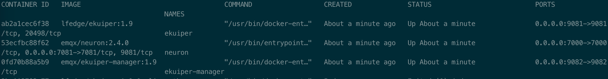
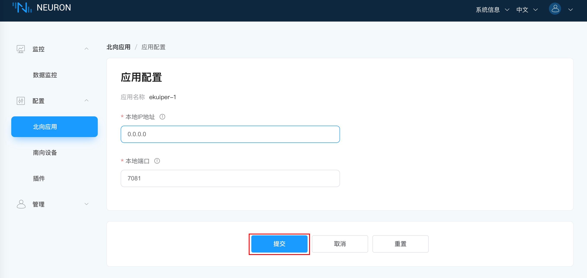
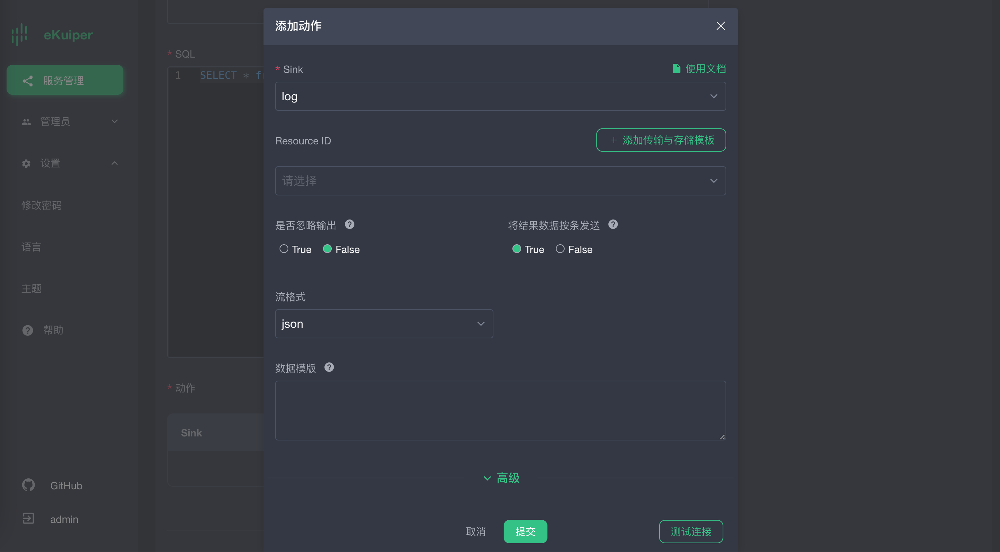

# Neuron与eKuiper集成

将Neuron与eKuiper集成在一起，为物联网数据分析和边缘计算带来了许多好处。通过集成eKuiper，Neuron具有以下能力：

<b>扩展的数据分析能力</b>
Neuron可以提供先进的实时数据分析功能，例如异常检测、预测性维护和优化算法，为工业物联网部署提供更全面、更智能的解决方案。

<b>边缘计算能力</b>
Neuron可以在边缘处理数据，靠近工业设备，减少延迟，实现更快的响应时间。

<b>无缝的数据处理和转换</b>
Neuron支持数据提取、转换和加载（ETL），可以在数据用于分析之前高效地预处理和清洗数据，确保云端AI/ML分析功能的数据质量和一致性。

<b>基于数据驱动的边缘决策</b>
Neuron可以在本地分析和处理基于AI的洞察，而不仅仅依赖于基于云的决策系统。

# Neuron2.4 对接eKuiper1.9配置文档

Neuron是一款工业协议网关软件，可以实现工业设备的数据采集，Neuron结合eKuiper的流式数据处理分析能力，可以在数据采集基础之上实现边端的数据过滤清洗、预处理、分析等操作，提升边端智能。

在Neuron2.4 和eKuiper1.9版本之前，Neuron与eKuiper通过NNG-IPC方式进行通讯与对接，有诸多限制，比如Neuron与eKuiper必须部署在同一物理节点上，并且只能一对一通讯。

从 Neuron 2.4.0 版本开始， Neuron北向的eKuiper 插件从 IPC 传输层切换到了 TCP 传输层，而 eKuiper 1.9.0 版本开始也采用了 TCP 传输层。 使用 TCP 传输层去除了在同一主机上部署 Neuron 和 eKuiper 的限制，并允许 Neuron 和 eKuiper 之间建立多个连接。

本篇文章详细介绍通过docker compose的部署方式，实现Neuron2.4.x 和eKuiper1.9.x的TCP连接，以下为具体的配置过程。

## 快速部署

Neuron 和 eKuiper 都支持二进制安装包以及 Docker 容器化部署方案。本文以 Docker 方案为例，采用 [docker compose](https://docs.docker.com/compose/) 方式，一键完成边缘端两个组件的快速部署。

1. 复制 `docker-compose.yml`文件到部署的机器上。其内容如下，包含了 Neuron，eKuiper 以及 eKuiper 的管理界面 eKuiper manager。

   ```yaml
   version: '3.4'
   
   services:
      manager:
         image: emqx/ekuiper-manager:1.9
         container_name: ekuiper-manager
         ports:
            - "9082:9082"
      ekuiper:
         image: lfedge/ekuiper:1.9
         ports:
            - "9081:9081"
         container_name: ekuiper
         hostname: ekuiper
         environment:
            KUIPER__BASIC__CONSOLELOG: "true"
            KUIPER__BASIC__IGNORECASE: "false"
         volumes:
            - /tmp/data:/kuiper/data
            - /tmp/log:/kuiper/log
   
      neuron:
         image: emqx/neuron:2.4.0
         ports:
            - "7000:7000"
            # The default port to communicate with eKuiper. Change it if you want to use another port.
            - "7081:7081"
         container_name: neuron
         hostname: neuron
         environment:
            DISABLE_AUTH: 1
         volumes:
            - /tmp/neuron/data:/opt/neuron/persistence
   
   ```
   以下为配置说明：
   
   - 在本配置文件中Neuron与eKuiper的通讯端口使用的 7081，Neuron监听7081端口，等待eKuiper的链接。

   - 由于Neuron容器和eKuiper容器配置了hostname，所以软件之间可以通过hostname相互访问，如果没有配置hostname，可以通过宿主机的IP进行相互访问。
   
   - Neuron、eKuiper和eKuiper-manager的镜像版本，可根据实际使用情况自行调整，只要Neuron>=2.4.0，eKuiper>=1.9.0即可，eKuiper-manager版本与eKuiper版本最好保持一致。
   
   - eKuiper环境变量配置，可参考https://ekuiper.org/docs/zh/latest/configuration/configuration.html
   
2. 在该文件所在目录，运行:
   
   ```shell
   # docker compose up -d
   ```

3. 所有的容器启动完毕之后，请使用 `docker ps` 命令确定所有的容器已经正常启动。

   

## 配置 Neuron 

Neuron 启动之后，我们需要配置 Neuron 的南向设备和北向 eKuiper 应用通道，然后启动模拟器进行模拟数据采集。

南向设备和模拟器配置，请参考[Neuron 快速教程](https://neugates.io/docs/zh/latest/quick-start/southdevices-connect.html#%E7%AC%AC%E4%B8%80%E6%AD%A5-%E6%B7%BB%E5%8A%A0%E5%8D%97%E5%90%91%E8%AE%BE%E5%A4%87) ，完成南向配置部分。

### Neuron 北向 eKuiper 应用配置

在配置菜单中选择`北向应用管理`，进入到北向应用管理界面，此时未添加任何应用，需要手动添加应用，在本例中，我们将创建一个 eKuiper 应用。

第一步，添加北向应用：

1. 点击`添加配置`按键；
2. 填写应用名称，例如，ekuiper-1；
3. 下拉框中显示在该软件版本中，我们可用的北向应用，此次我们选择 ekuiper 的插件，如下图所示。

4. 创建应用成功之后，会在北向应用管理界面出现一个刚刚创建的应用的卡片，此时应用的工作状态在初始化，连接状态在断开连接状态中。

第二步，eKuiper应用配置：

点击查看第一步应用卡片 ekuiper-1 上的应用配置，点击确认，使用默认配置即可。



第三步，订阅 Group：

点击第一步应用卡片 ekuiper-1 中任意空白处，进入到订阅Group界面，如下图所示。


1. 点击右上角的`添加订阅`按键添加订阅；
2. 下拉框选择南向设备，这里我们选择之前建好的南向设备 Modbus1 ；
3. 下拉框选择所要订阅的 Group，这里我们选择之前建好的南向设备 Modbus1 的group；
4. 点击提交，完成订阅。
5. 点击`北向应用管理`，点开应用卡片中的工作状态开关，使应用进入运行中的状态。

至此，Neuron 已配置好数据采集，并将采集到的数据发送到北向的 eKuiper 通道中。

注意：由于目前没有eKuiper连接到当前Neuron，所以Neuron北向应用eKuiper节点的连接状态仍为`断开状态`


## eKuiper配置

eKuiper manager 是一个 Web 管理界面，可管理多个 eKuiper 实例。因此，我们需要设置 manager 管理的 eKuiper 实例。详细设置请参考eKuiper 管理控制台的使用。https://ekuiper.org/docs/zh/latest/operation/manager-ui/overview.html#%E6%A6%82%E8%A7%88

以下教程中，我们使用eKuiper manager对eKuiper进行配置管理，包括流和规则的创建。

### eKuiper manager 中添加eKuiper节点

通过http://[yourhost]:9082登录ekuiper manager，用户名密码为：admin/public

添加eKuiper服务：


1.服务类型选择`直接连接服务`

2.服务名称可自定义

3.端点URL，输入eKuiper容器的hostname加端口号9081

### 创建Neuron流

登录my-eKuiper节点，在`流管理`页面创建流。具体配置如下：


1.可自定义任意流名称，上图取名为neuronStream

2.流类型设置为`neuron`，表示该流会连接到 Neuron 中。

3.配置组，选择添加配置组，名称为neuron-source，路径为tcp://neuron:7081。其中neuron与neuron容器的hostname一致。

4.点击提交。

### 配置eKuiper规则

Neuron 流建立之后，我们可以在 eKuiper 里创建任意多条规则，对采集的数据进行各种计算和处理。本文仅介绍Neuron与eKuiper的TCP通讯建立和数据打通，所以仅配置一个最简单的规则，将Neuron的数据打印到eKuiper的log中。更多 eKuiper 的数据处理能力，请参考扩展阅读部分。

新建eKuiper规则如下：

添加规则动作，并提交规则。



## 查看Neuron与eKuiper连通状态

Neuron连接状态正常


eKuiper规则运行状态正常


eKuiper LOG信息正常


