# Sparkplug B

## 概览

Sparkplug B 是一种建立在 MQTT 3.1.1 基础上的工业物联网数据传输规范。Sparkplug B 在保证灵活性和效率的前提下，使 MQTT 网络具备状态感知和互操作性，为设备制造商和软件提供商提供了统一的数据共享方式。

Neuron 从设备采集到的数据可以通过 Sparkplug B 协议从边缘端传输到 Sparkplug B 应用中，用户也可以从应用程序向 Neuron 发送数据修改指令。Sparkplug B 是运行在 MQTT 之上的应用型协议，所以在 Neuron 中的设置与 MQTT 驱动相似。

## 示例

这里以通过Neuron南向采集设备实际点位数据，通过北向Sparkplug B插件将数据上报到EMQX在通过编解码功能解码后得到正确完整的数据结果，流程如图：

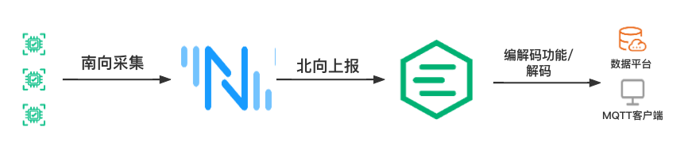

## Neuron

### 南向

通过南向驱动采集Modbus TCP模拟器点位值去模拟实际设备点位值，配置如下：

**添加设备**


**设备配置**

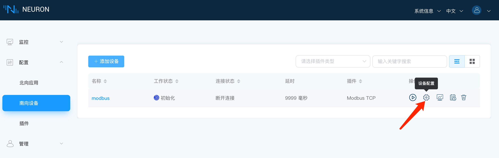

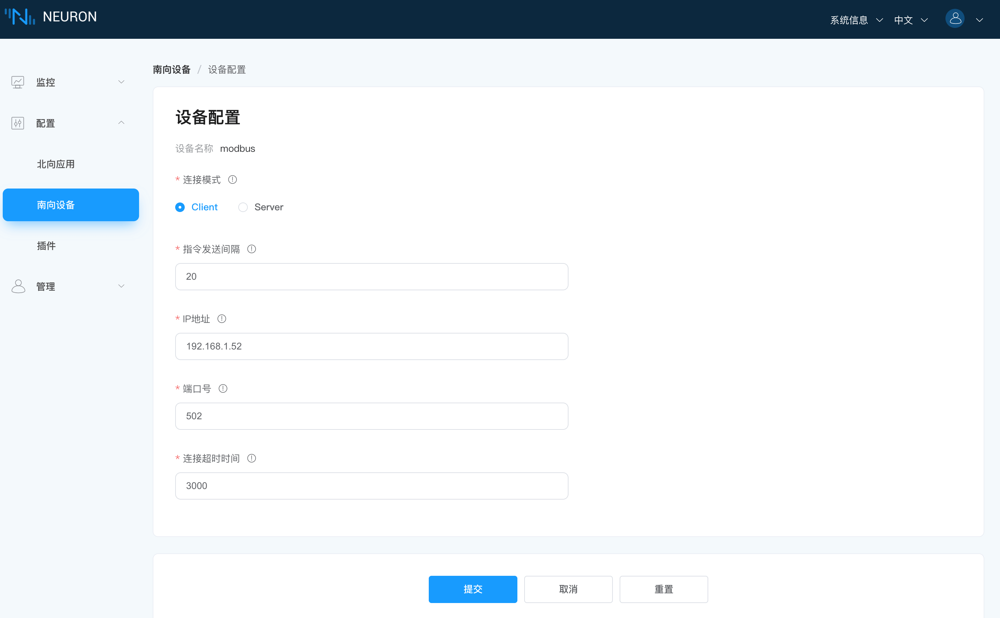

**Group创建**

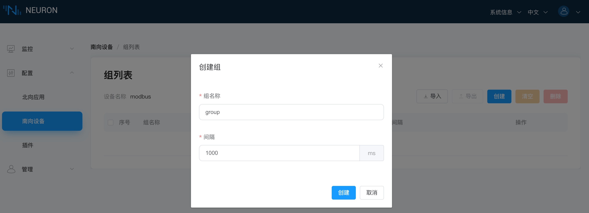

**点位创建**


### 北向

**添加应用**


**应用配置**

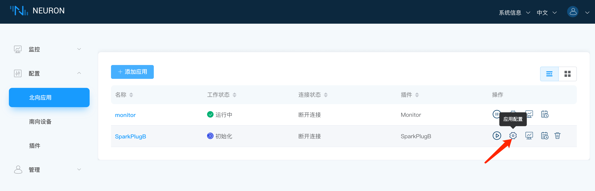

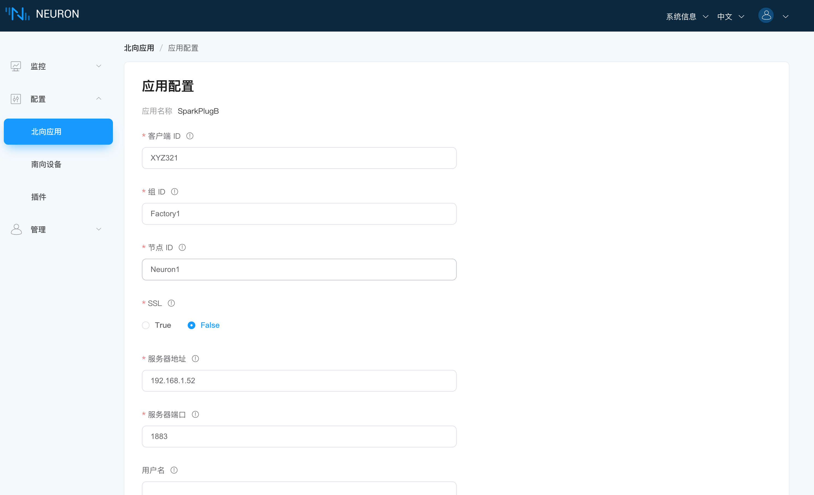

**添加订阅**

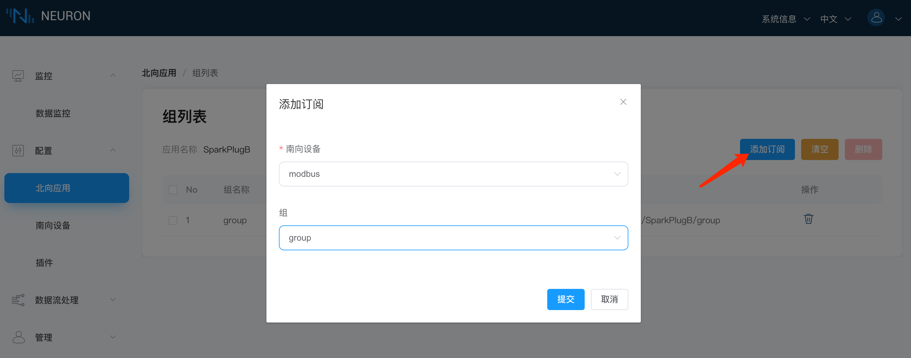

## EMQX

如果直接订阅Neuron北向SparkPlugB上报到的EMQX数据，则会出现字符串乱码的情况，如图：

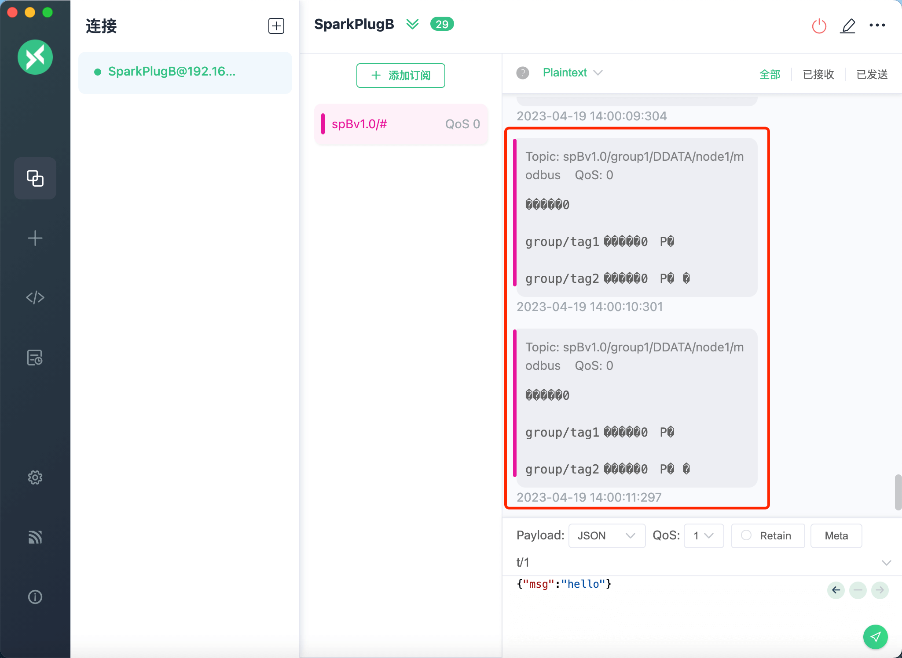

所以可以通过EMQX规则引擎编解码的能力，编写一个相应的proto文件结合规则引擎将上报的数据进行解码后得到正确完整的数据结果。

### 创建编解码

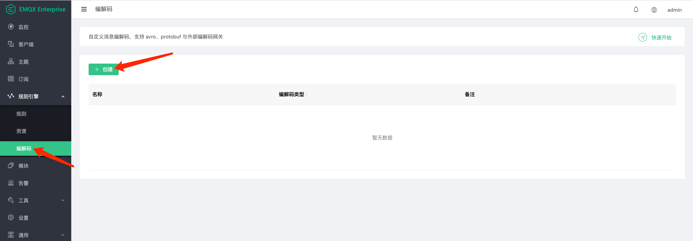

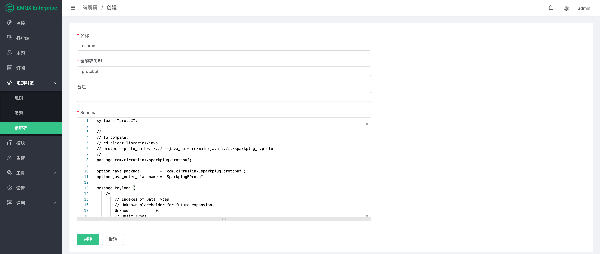

```
## 完整proto文件
syntax = "proto2";

//
// To compile:
// cd client_libraries/java
// protoc --proto_path=../../ --java_out=src/main/java ../../sparkplug_b.proto 
//

message Payload {
    /*
        // Indexes of Data Types
        // Unknown placeholder for future expansion.
        Unknown         = 0;
        // Basic Types
        Int8            = 1;
        Int16           = 2;
        Int32           = 3;
        Int64           = 4;
        UInt8           = 5;
        UInt16          = 6;
        UInt32          = 7;
        UInt64          = 8;
        Float           = 9;
        Double          = 10;
        Boolean         = 11;
        String          = 12;
        DateTime        = 13;
        Text            = 14;
        // Additional Metric Types
        UUID            = 15;
        DataSet         = 16;
        Bytes           = 17;
        File            = 18;
        Template        = 19;
        
        // Additional PropertyValue Types
        PropertySet     = 20;
        PropertySetList = 21;
    */

    message Template {
        
        message Parameter {
            optional string name        = 1;
            optional uint32 type        = 2;

            oneof value {
                uint32 int_value        = 3;
                uint64 long_value       = 4;
                float  float_value      = 5;
                double double_value     = 6;
                bool   boolean_value    = 7;
                string string_value     = 8;
                ParameterValueExtension extension_value = 9;
            }

            message ParameterValueExtension {
                extensions              1 to max;
            }
        }

        optional string version         = 1;          // The version of the Template to prevent mismatches
        repeated Metric metrics         = 2;          // Each metric is the name of the metric and the datatype of the member but does not contain a value
        repeated Parameter parameters   = 3;
        optional string template_ref    = 4;          // Reference to a template if this is extending a Template or an instance - must exist if an instance
        optional bool is_definition     = 5;
        extensions                      6 to max;
    }

    message DataSet {

        message DataSetValue {

            oneof value {
                uint32 int_value                        = 1;
                uint64 long_value                       = 2;
                float  float_value                      = 3;
                double double_value                     = 4;
                bool   boolean_value                    = 5;
                string string_value                     = 6;
                DataSetValueExtension extension_value   = 7;
            }

            message DataSetValueExtension {
                extensions  1 to max;
            }
        }

        message Row {
            repeated DataSetValue elements  = 1;
            extensions                      2 to max;   // For third party extensions
        }

        optional uint64   num_of_columns    = 1;
        repeated string   columns           = 2;
        repeated uint32   types             = 3;
        repeated Row      rows              = 4;
        extensions                          5 to max;   // For third party extensions
    }

    message PropertyValue {

        optional uint32     type                    = 1;
        optional bool       is_null                 = 2; 

        oneof value {
            uint32          int_value               = 3;
            uint64          long_value              = 4;
            float           float_value             = 5;
            double          double_value            = 6;
            bool            boolean_value           = 7;
            string          string_value            = 8;
            PropertySet     propertyset_value       = 9;
            PropertySetList propertysets_value      = 10;      // List of Property Values
            PropertyValueExtension extension_value  = 11;
        }

        message PropertyValueExtension {
            extensions                             1 to max;
        }
    }

    message PropertySet {
        repeated string        keys     = 1;         // Names of the properties
        repeated PropertyValue values   = 2;
        extensions                      3 to max;
    }

    message PropertySetList {
        repeated PropertySet propertyset = 1;
        extensions                       2 to max;
    }

    message MetaData {
        // Bytes specific metadata
        optional bool   is_multi_part   = 1;

        // General metadata
        optional string content_type    = 2;        // Content/Media type
        optional uint64 size            = 3;        // File size, String size, Multi-part size, etc
        optional uint64 seq             = 4;        // Sequence number for multi-part messages

        // File metadata
        optional string file_name       = 5;        // File name
        optional string file_type       = 6;        // File type (i.e. xml, json, txt, cpp, etc)
        optional string md5             = 7;        // md5 of data

        // Catchalls and future expansion
        optional string description     = 8;        // Could be anything such as json or xml of custom properties
        extensions                      9 to max;
    }

    message Metric {

        optional string   name          = 1;        // Metric name - should only be included on birth
        optional uint64   alias         = 2;        // Metric alias - tied to name on birth and included in all later DATA messages
        optional uint64   timestamp     = 3;        // Timestamp associated with data acquisition time
        optional uint32   datatype      = 4;        // DataType of the metric/tag value
        optional bool     is_historical = 5;        // If this is historical data and should not update real time tag
        optional bool     is_transient  = 6;        // Tells consuming clients such as MQTT Engine to not store this as a tag
        optional bool     is_null       = 7;        // If this is null - explicitly say so rather than using -1, false, etc for some datatypes.
        optional MetaData metadata      = 8;        // Metadata for the payload
        optional PropertySet properties = 9;

        oneof value {
            uint32   int_value                      = 10;
            uint64   long_value                     = 11;
            float    float_value                    = 12;
            double   double_value                   = 13;
            bool     boolean_value                  = 14;
            string   string_value                   = 15;
            bytes    bytes_value                    = 16;       // Bytes, File
            DataSet  dataset_value                  = 17;
            Template template_value                 = 18;
            MetricValueExtension extension_value    = 19;
        }

        message MetricValueExtension {
            extensions  1 to max;
        }
    }

    optional uint64   timestamp     = 1;        // Timestamp at message sending time
    repeated Metric   metrics       = 2;        // Repeated forever - no limit in Google Protobufs
    optional uint64   seq           = 3;        // Sequence number
    optional string   uuid          = 4;        // UUID to track message type in terms of schema definitions
    optional bytes    body          = 5;        // To optionally bypass the whole definition above
    extensions                      6 to max;   // For third party extensions
}
```

### 创建规则

**SQL语句**

```
SELECT
  schema_decode('neuron', payload, 'Payload') as SparkPlugB
FROM
  "spBv1.0/group1/DDATA/node1/modbus"
```

这里的关键点在于 `schema_decode('neuron', payload, 'Payload')`:

- `schema_decode` 函数将 payload 字段的内容按照 'protobuf_person' 这个 Schema 来做解码;
- `as SparkPlugB` 将解码后的值保存到变量 "SparkPlugB" 里;
- 最后一个参数 `Payload` 指明了 payload 中的消息的类型是 protobuf schema 里定义的 'Payload' 类型。

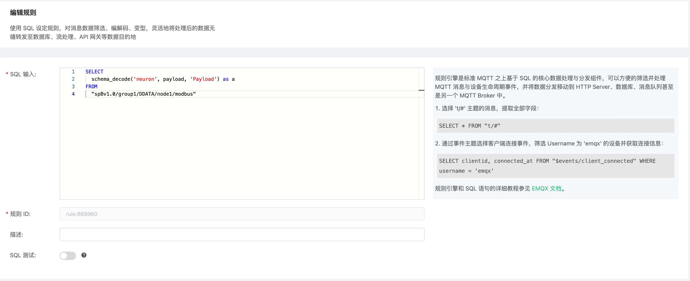

**然后使用以下参数添加动作：**

- 动作类型：消息重新发布
- 目的主题：SparkPlugB/test

这个动作将解码之后的 "Payload" 以 JSON 的格式发送到 `SparkPlugB/test` 这个主题。

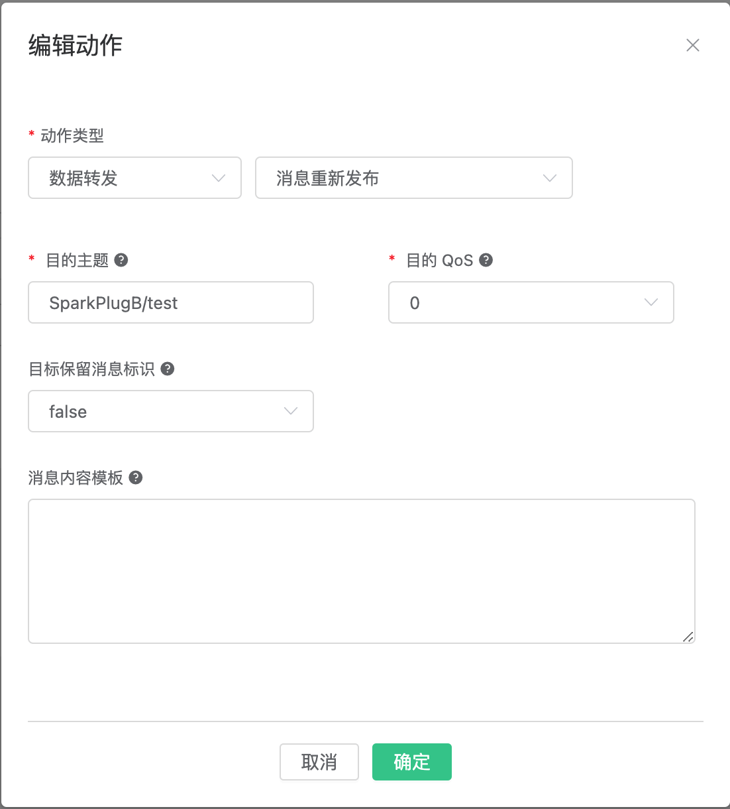

## 验证

这里通过MQTTX工具去订阅通过EMQX规则引擎编解码功能解码后的数据，如图：

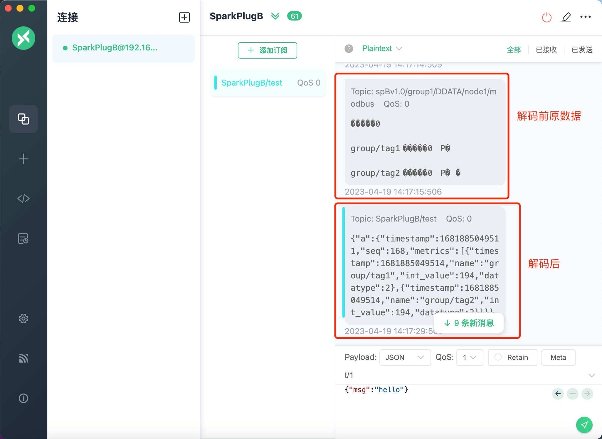

如上图，可以看到解码前的原数据是乱码的，解码后得到完整正确的数据结果；至此，通过Neuron南向采集设备点位值，北向SparkPlugB上报到EMQX，通过编解码功能解码得到完整的数据结果已完成。

## 附件

Neuron上报数据到EMQX的Topic是根据Sparkplug B协议规范定义的`namespace/group_id/DDATA/edge_node_id/device_id`,如图：

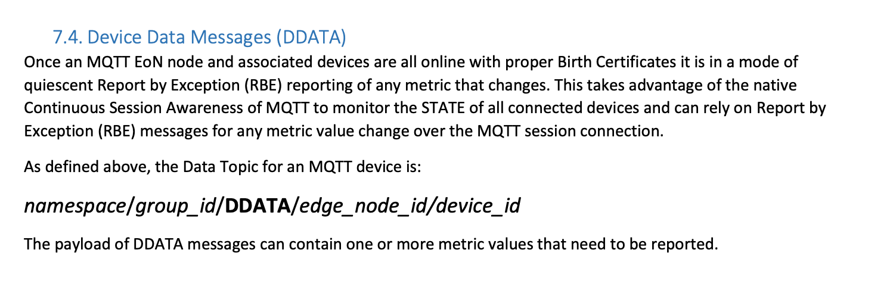

至于更多Neuron北向Sparkplug B插件相关标准如何定义的，可以参考Sparkplug B协议规范[🔗](https://www.eclipse.org/tahu/spec/Sparkplug%20Topic%20Namespace%20and%20State%20ManagementV2.2-with%20appendix%20B%20format%20-%20Eclipse.pdf)。


