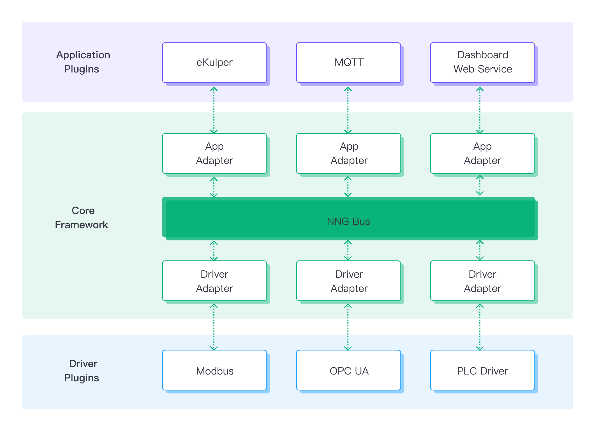

# 架构

Neuron 是一款专门打造为工业物联网（IIoT）打造的软件解决方案。它支持在边缘侧运行，凭借其超低延迟处理能力，可有效管理边缘侧的数据收集、转发、派发和聚合任务。

## 利用 NNG 消息库打造高效消息总线

Neuron 采用了轻量级的 NNG（Nanomsg-Next-Generation）消息库来搭建消息总线，为节点间通信提供了可靠且高效的基础设施。每一个 Neuron节点都是一个适配器和插件的组合。

Neuron 利用 NNG 进行线程间的通信。NNG 以其高效的消息队列、负载平衡和端点动态发现等功能，支持大规模系统和极高的消息传输速率，从而实现了卓越的扩展性和容错能力，也为打造分布式、可扩展应用提供了一个方便、高效的消息传递框架。

## 星型框架：信息框架拓扑结构

Neuron 利用 nanomsg 库的 pair-1 功能，构建了一个星型的可扩展框架。在这个框架中，中央消息路由位于系统核心位置，连接到南向驱动适配器和北向应用适配器。

在这个星形的可扩展框架中：

- 南向驱动节点作为数据生产者，负责与设备通信，收集数据，这些数据将作为系统内数据的初始来源。
- 北向应用节点作为数据消费者，从核心消息路由处接收数据消息，并根据系统要求或逻辑处理或转发数据。
- 在 Neuron 系统框架中，核心消息路由（Manager）起到一个关键的枢纽角色，负责接收南向驱动节点的数据，并将它们有效地路由到北向应用节点。

## 核心消息路由

核心消息路由（Manager）负责监控消息总线和南向/北向适配器的运行。

**数据标签管理**：Manager 模块负责维护系统内所有节点的数据标签配置。这些数据标签中存储了设备或 PLC 中的地址及属性信息，Manager 模块负责保证这些配置的实时性和可访问性，便于后续的数据收集与处理。

**插件管理**：Manager 模块支持用户动态灵活地加载/卸载动态 .so 文件（共享对象文件），并允许用户在插件表中把这些文件注册为替代插件，以便随时扩展系统功能。

**适配器管理**：用户可按实际需求从插件表中选择和安装所需插件。通过管理适配器，Manager 模版确保了所安装的插件能按预期提供与目标设备间的通信。

**组管理**：用户可选择订阅数据标签组，Neuron 会基于订阅创建一个用于路由的订阅表。借助该订阅表，Manager 模块能够将数据信息精确路由到各订阅节点，被准确送达到组内的各接收者。

**消息路由**：Manager 模块的核心功能之一是依据数据标签的设置，以便将数据信息路由到指定的终端节点。通过数据标签内的信息，Manager 模块能判定每条消息的目标节点，确保数据能有效地被送达到预设的接收者。

## 高效的多线程管理

Neuron 采用边缘原生设计，特别针对现代多核 CPU 架构（ARM 和 RISC-V 嵌入式系统）进行了优化。它利用NNG高效的异步I/O特性，实现了节点间的高效通信，充分发挥了多核CPU的优势。因此，Neuron可以为用户提供卓越的实时处理能力和并发支持。

Neuron 与 NNG 的结合主要带来了如下优势：

- 异步 I/O - Neuron 通过使用 NNG 库的异步 I/O 框架，实现了数据的快速处理。
- SMP 和多线程 - 利用现代 SMP 系统的特性，Neuron 支持用户轻松扩展添加多个核心。
- Brokerless - 依赖于轻量级部署和集成优势，Neuron 可以无缝地整合进各种系统。

## 松耦合设计

Neuron 采用了松耦合设计，在这种架构中，每个 Neuron 节点作为单独的线程运行，使得用户可以动态创建或移除节点，而不会对其他运行节点产生影响。这种“热插拔”的设计使得插件的添加或升级变得更为便捷，也更容易根据用户需求进行功能扩展。

以下是使用松耦合设计的一些优势：

- 插件通过适配器形成节点。
- 用户可以根据需求动态加载插件。
- 适配器和不同插件的组合，可以在节点上实现不同的功能。
- 每个节点独立运作，允许在升级个别插件升级的同时不影响其他节点。
- 可以通过加载模块的方式动态添加节点。

## 数据类型转换

Neuron 节点可以提供各种应用或驱动服务，并处理不同的数据类型。为了实现高效的数据传输，Neuron 设计了统一的数据类型，例如，Modbus 数据类型需要在服务节点内转换为 Neuron 统一数据类型，然后转换为 JSON 格式，用于向其他应用传输消息。这种数据类型的转换确保了整个系统内数据格式的一致性和兼容性。

## 并行流处理

Neuron 支持并行流处理，适合处理异步 I/O 操作。为了提高效率，建议将相关的南向驱动节点（数据生产者）加入到数据流组中，然后北向应用节点（数据消费者）可以根据需求，从不同的节点订阅特定的数据流组。这种方式可以提高系统内数据流的高效和灵活性，同时也能提高系统的整体性能和可扩展性。

