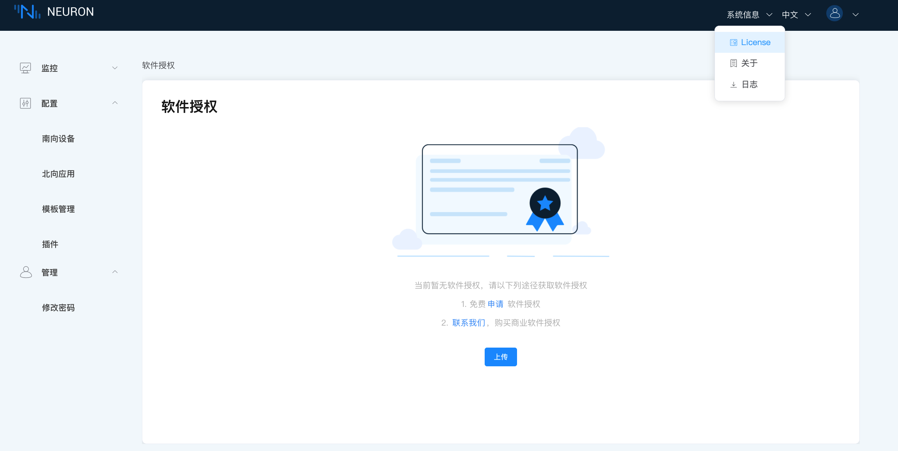

# 许可证政策

Neuron 是一个开源项目。我们鼓励我们的社区开发自己的插件模块。

核心架构，仪表板和一些驱动模块（例如 modbus-tcp，mqtt 和 eKuiper 等）是在 LGPLv3 许可下开源的。您无需安装 EMQ 许可证即可运行这些开源模块。

对于商业模块，Neuron 提供了 30 个点（30 个连接和 30 个数据标签）的免费额度。您可在不安装 EMQ 许可证的情况下，运行这些商业模块。超出免费额度后，则必须安装有效的试用版或官方 EMQ 许可证。

:::tip 注意

Fanuc Focas Ethernet 和 Mitsubishi CNC 插件不在 30 点永久免费的范围内。如希望体验，可直接 [联系我们](https://www.emqx.com/zh/contact?product=neuron)。

:::

## 申请许可证

试用的 EMQ 许可证可从[ EMQ 官方网站](https://www.emqx.com/zh/apply-licenses/neuron)上下载 。所有可用的模块都可以在 100 个连接和 1000 个数据标签的限制下试用 15 天。 如果试用 EMQ 许可证过期，您可以通过我们的官网重新申请试用 EMQ 许可证。 但是，一个邮箱最多只能申请两次试用许可证。

:::tip 注意
官网申请试用许可证时，必须使用硬件标识进行设备的绑定。您可直接[联系我们](https://www.emqx.com/zh/contact?product=neuron)申请不需要硬件标识绑定设备的许可证，或申请正式许可证。
:::

## 管理许可证

申请许可证后，您可在登录 Neuron 后，点击页面顶部工具栏的 系统信息 -> License 上传许可证，或管理许可证文件。

