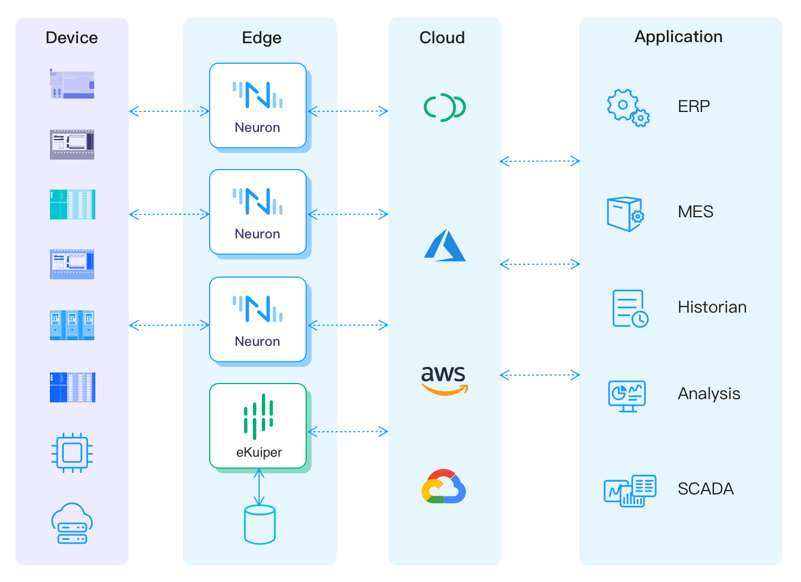

# 集成

Neuron可以通过MQTT和REST与各种云平台集成，包括EMQX Cloud、AWS、Google Cloud Platform和Microsoft Azure，将实时工业数据直接无缝地流向工业应用，如MES、ERP、大数据、分析软件等等。

Neuron还为数据分析AI/ML提供了一个集成的SQL流处理规则引擎eKuiper，以利用边缘侧低延迟处理的优势。输出的流数据可以存储在边缘侧的influxdb等时间序列数据库中。

