# NeuOPC设置

## 本机OPCDA服务器访问

本例使用 windows 7 SP1 32位系统演示

### neuopc 运行环境安装

1. 进入 neuopc [项目页面](https://github.com/neugates/neuopc)下载最新的 Release 组件包"neuopc-package.zip"，解压后可见如下文件：

   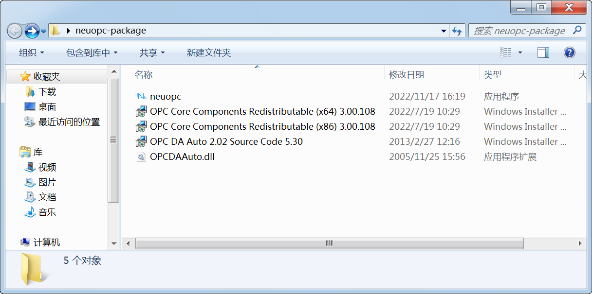

   * neuopc ——运行 OPCDA 转换 OPCUA 的主程序；
   * OPC Core Components Redistributable (x64) 3.00.108.msi ——OPC 基金会官方组件，需要在 x64系统下安装；
   * OPC Core Components Redistributable (x86) 3.00.108.msi ——OPC 基金会官方组件，需要在 x86系统下安装；
   * OPC DA Auto 2.02 Source Code 5.30.msi ——OPC 基金会官方组件，在大部分系统中已经无法正常安装，但是可以使用 msi 提取工具从中提取出 OPCDAAuto.dll 组件；
   * OPCDAAuto.dll ——OPC 基金会官方组件，是一个 COM 组件，专门为 .NET 平台进行提供 OPCDA 的服务访问；

2. 检查组件是否已安装

   * 如果是32位操作系统，则进入到 C:\Windows\System32 目录下，如果是64位操作系统，则进入到 C:\Windows\SysWOW64 目录下，检查是否有如下文件存在：

   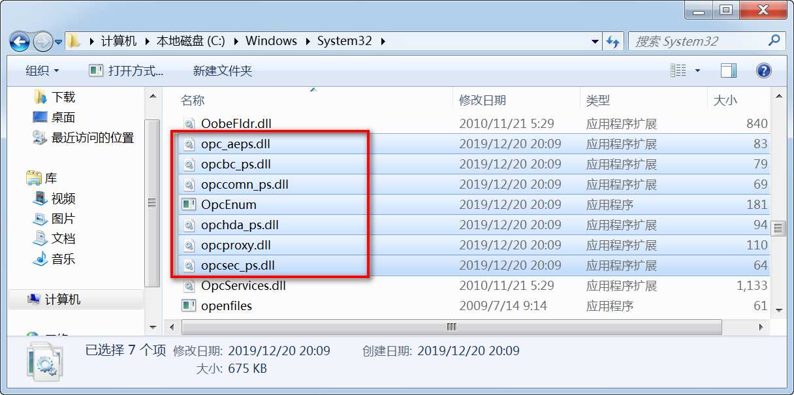

   ::: tip

   如果文件不存在则安装对应平台的 OPC Core Components Redistributable 组件，如果存在则不用安装。

   :::

   * 打开 "Windows 任务管理器"检查 OpcEnum 系统服务是否在运行，如图：

   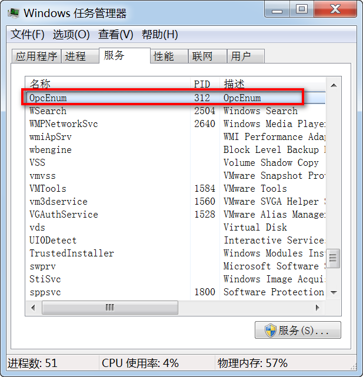

   ::: tip

   如果正常运行，说明 OPC Core Components Redistributable 已经正常安装。

   :::

   * 拷贝 OPCDAAuto.dll 文件到系统目录中，如果是32位操作系统则拷贝到 C:\Windows\System32 目录下，如果是64位操作系统则拷贝到 C:\Windows\SysWOW64 目录下，拷贝完成后使用管理员权限打开 powershell 输入如下命令：

   ```powershell
   cd C:/Windows/System32 # x86系统
   cd C:/Windows/SysWOW64 # x64系统
   ./regsvr32 OPCDAAuto.dll
   ```

   ::: tip

   成功后如下图所示：

   :::

   

3. 本机安装 MatrikonOPCSimulation 模拟器程序；

4. 运行 neuopc.exe 程序，选择 DA Host 和 DA Server 后点击 Connect，设置 UA 的各项参数后点击 Run，运行成功，如图：

   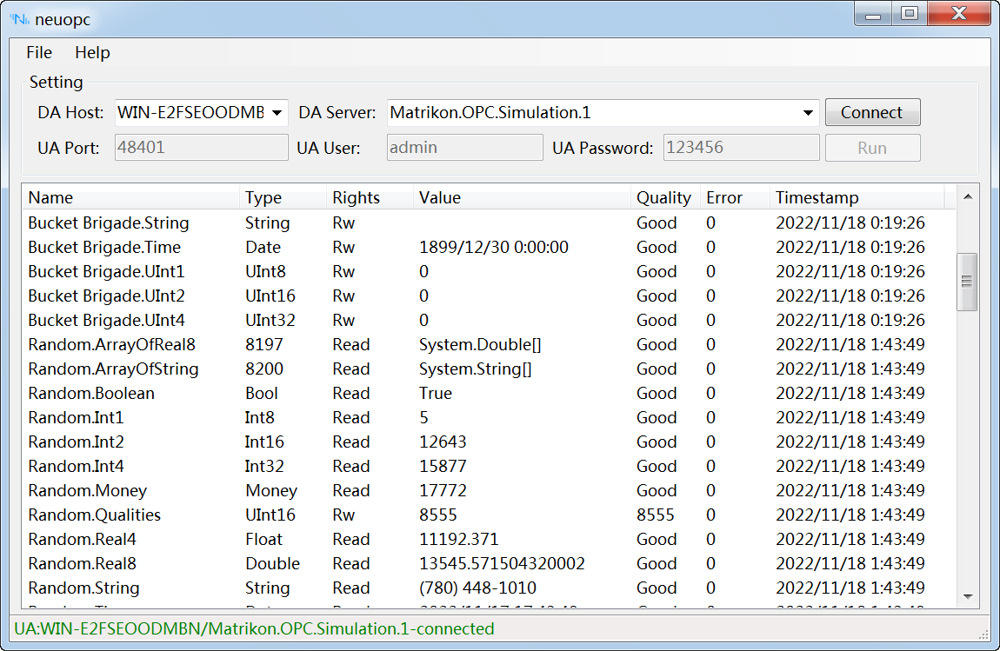

## 远程主机 OPCDA 服务器访问

本例使用上文设置好的主机作为客户机连接局域网内的另一台主机，实现跨主机的 OPCDA 数据读取与转换，远程主机使用 Windows 10 x64 操作系统演示。

### 远程主机 DCOM 设置

在远程主机上安装 MatrikonOPC Server for Simulation，并将电脑的防火墙关闭。演示使用的是 Administrator 账户。

1. 按下 WIN + R 键后在弹出的对话框中输入 dcomcnfg 确定后进入组件服务，如图：

   

2. 先对本机属性进行总体的设置， 展开"组件服务\计算机\我的电脑"，右键我的电脑打开菜单中的属性设置：

   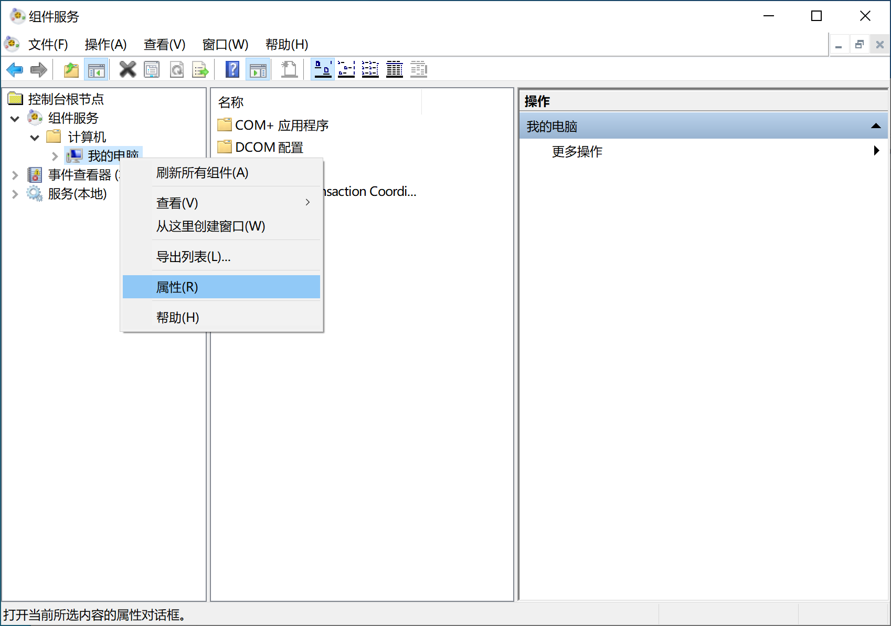

   在"默认属性"中勾选"在此计算机上启用分布式COM"，"默认身份验证级别"设置位"无"：

   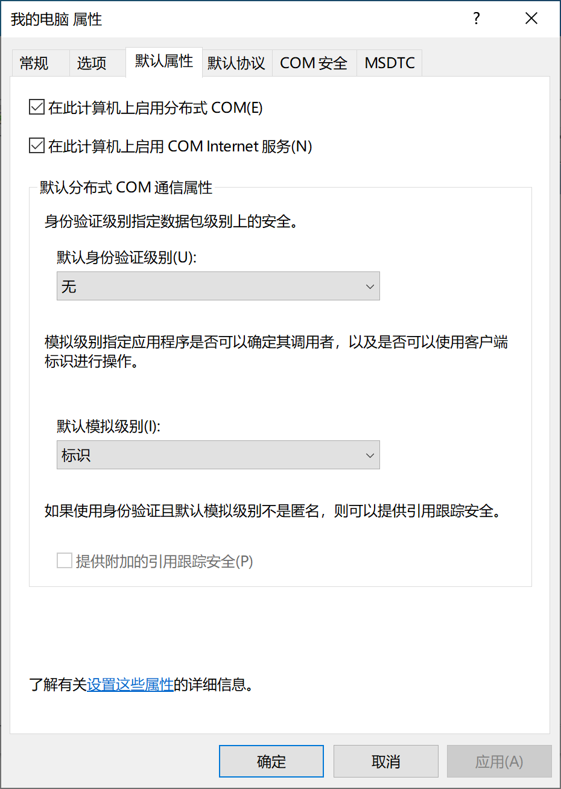

   在"默认协议"中只保留"面向连接的TCP/IP"：

   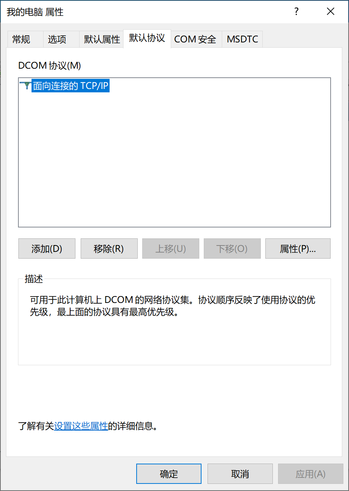

   在"COM安全"中将"访问权限"和"启动和激活权限"中的"编辑限制"和"编辑默认值"都分别添加"Everyone"、"Administrators"、"ANONYMOUS LOGON"用户，并将其下所有权限都勾选上：

   

3. 展开"组件服务\计算机\我的电脑\DCOM配置"，分别设置"OpcEnum"和 "MatrikonOPC Server for Simulation and Testing" 的属性，在"常规"-"身份验证级别"中选择"无"：

   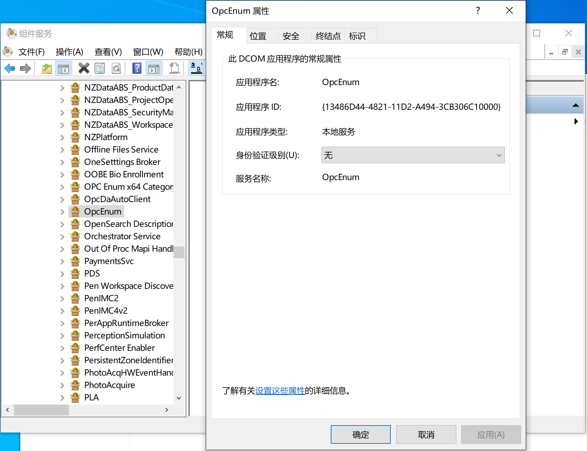

   在"位置"中勾选"在数据所在的计算机上运行应用程序"和"在此计算机上运行应用程序"：

   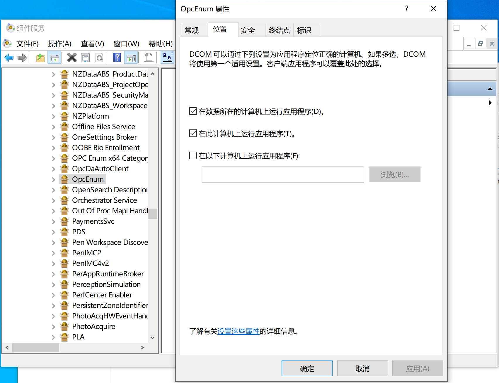

   在"安全"中所有权限选择自定义后分别添加"Everyone"、"Administrators"、"ANONYMOUS LOGON"用户，并将其下的所有权限勾选上：

   

4. 确认关闭系统防火墙或者添加安全策略允许 OpcEnum 和 Matrikon 等程序通过。

至此 OPCDA 的远程主机测试环境已经设置完成。

### 本地主机 DCOM 设置

为了远程访问设置好的远程主机，还需要对本地主机进行 DCOM 设置，这里继续使用上文【本机OPCDA服务器访问】配置的windows 7 SP1 32位系统演示，配置内容除"MatrikonOPC Server for Simulation and Testing"以外，与远程主机一致，开始前先关闭本地主机的防火墙。

1. 先对本机属性进行总体的设置， 展开"组件服务\计算机\我的电脑"，右键我的电脑打开菜单中的属性设置，设置的内容和方式与远程主机一致：

   

   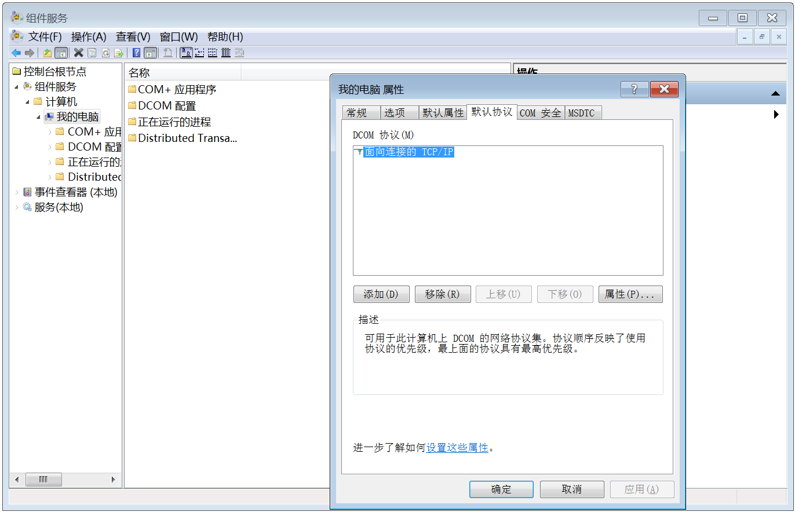

   

2. 展开"组件服务\计算机\我的电脑\DCOM配置"，设置"OpcEnum"，设置的内容和方式与远程主机一致:

   

   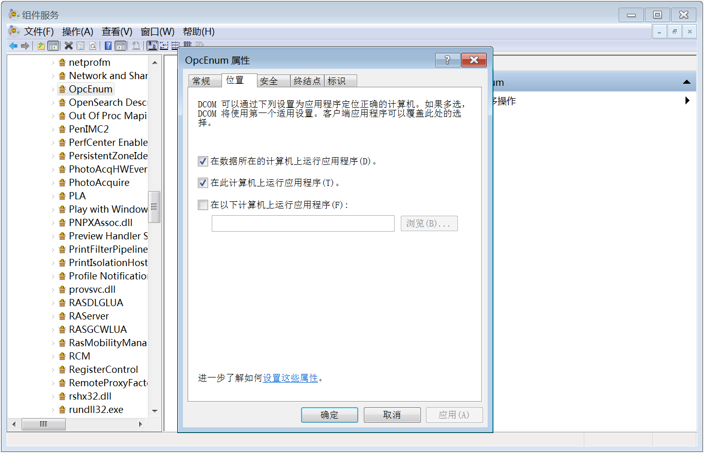

   

3. 确认关闭系统防火墙或者添加安全策略允许 OpcEnum 程序通过。

至此 OPCDA 的本地主机测试环境已经设置完成。

