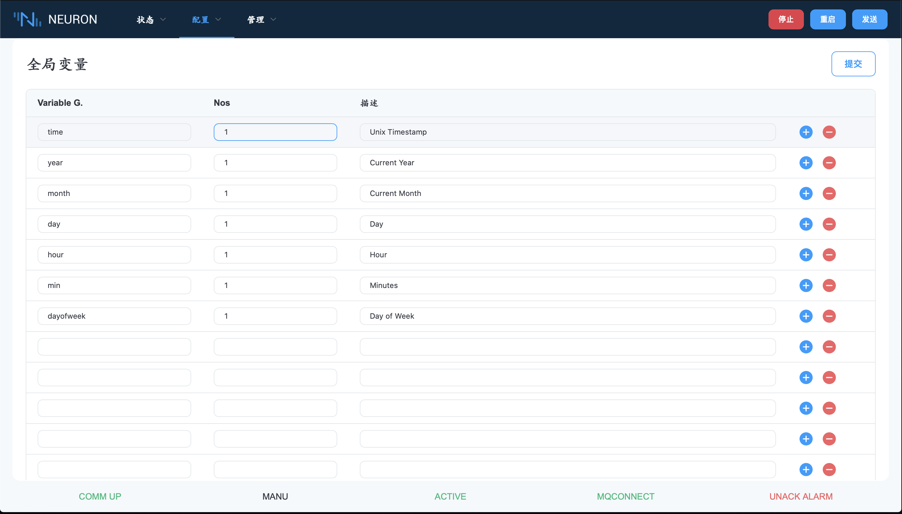
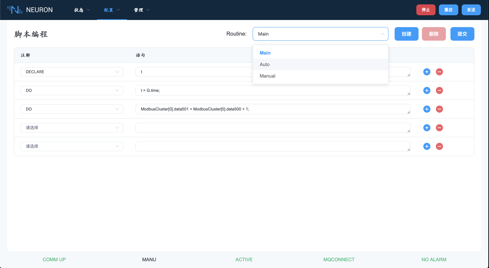

# Neuron 脚本

Neuron 脚本包含两个设置环境，分别是全局变量和脚本编程。全局变量有一些预定义的内部变量，可以在脚本编程中使用。

以下是标准的全局变量，可以在脚本中使用：

以下是脚本编程环境：

脚本编程环境分为如上图所示的两部分。左边部分是语句栏，右边部分是表达式栏。

## 脚本程序

Neuron 代理包含了一个元编程组件的运行环境，允许用户创建一些脚本，以持续循环的方式运行，对数据和变量进行操作。它从 "主例程" 开始，根据机器模式以 "自动例程" 或 "菜单例程" 的方式运行相应的例程。下面的流程图显示了这些例程在运行时环境中的关系。

编程环境中的各个部分是按顺序运行的。首先在主程序开始前有一秒钟的空闲循环（时间中断）。完成主程序后，系统会检查运行模式。如果处于暂停模式，或者与控制系统的通讯中断，系统就会从空转循环中重新开始。如果处于半自动模式，系统继续进行手动模式程序。如果是在自动模式下，系统首先继续执行自动模式程序。

所有部件（主模式、手动模式、服务模式和自动模式）都可以对子程序进行调用。子程序可以调用其他子程序，也可以调用自己（递归调用）。但在调用子程序时要注意，不要变成无休止的循环。

程序中的所有变化都可以在运行该行时进行。当然，如果进行错误的修改，可能会有一些副作用。
