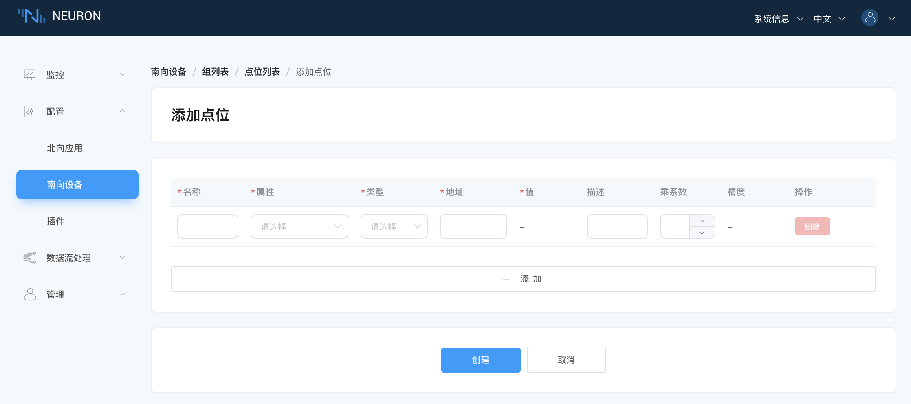

# 配置采集数据组和点位

## 第一步，在设备卡片中创建组

创建点位组，同一个组的数据以相同的频率进行采集以及上报。

点击新增的设备节点，进入组列表管理界面，点击 `创建` 来创建组。

* 名称：添加组名称，例如 group-1；
* 间隔：此组点位采集与上报的频率，单位毫秒，100则意味着每100毫秒采集一次整组点位，并进行一次整组的点位数值上报。

## 第二步，在组中添加采集数据点
添加需要采集的设备点位，包括点位地址，点位属性，数据类型等。

点击组中的 `Tag 列表` 图标，进入 Tag 列表管理界面。

点击 `创建` 按键，进入添加标签页面，如下图所示。



* 名称：填写 Tag 名称，例如，tag1；
* 属性：下拉选择 Tag 属性，例如，read，write，subscribe；
* 类型：下拉选择数据类型，例如，int16，uint16，int32，uint32，float，bit；
* 地址：填写驱动地址，例如，1!40001。1 代表 Modbus 模拟器中设置的点位站点号，40001 代表点位寄存器地址，详细的驱动地址使用说明请参阅 [模块配置](../module-plugins/module-driver.md)；
* 乘系数：默认不填。
* 描述：默认不填，可以填写标签的相关描述。

:::tip
点位创建完成后，设备卡片的工作状态处于 **运行中**，连接状态应处于 **已连接**。若此时连接状态仍然处于 **未连接** 的状态，请先在 Neuron 运行环境终端执行以下指令，以确认 Neuron 运行环境能否访问到到对应的 IP 及端口：

```bash
$ telnet <运行 Modbus 模拟器 PC 端的 IP> 502
```

请您确认在设备配置时 IP 与 Port 正确设置，防火墙关闭。
:::