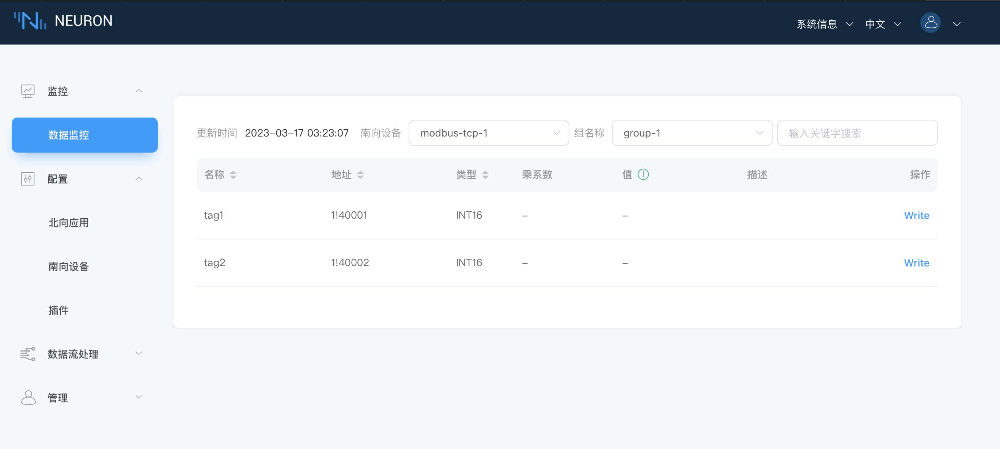

# 数据监控

在`监控`菜单下选择`数据监控`，进入数据监控界面，查看已创建点位读取到的数值，如下图所示。

数据监控以组为单位显示数值：

* 南向设备：下拉框选择想要查看的南向设备，例如，选择上面步骤已经创建好的 modbus-tcp-1;
* Group 名称：下拉框选择想要查看所选南向设备下的组，例如，选择上面步骤已经创建好的 group-1；
* 选择完成，页面将会展示读取到组底下每一个标签的值；