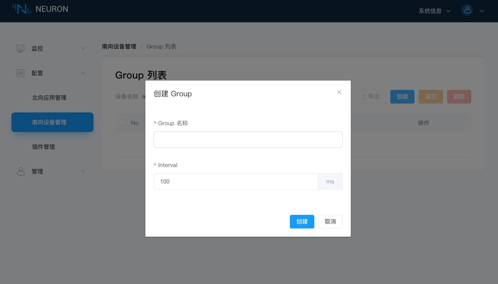
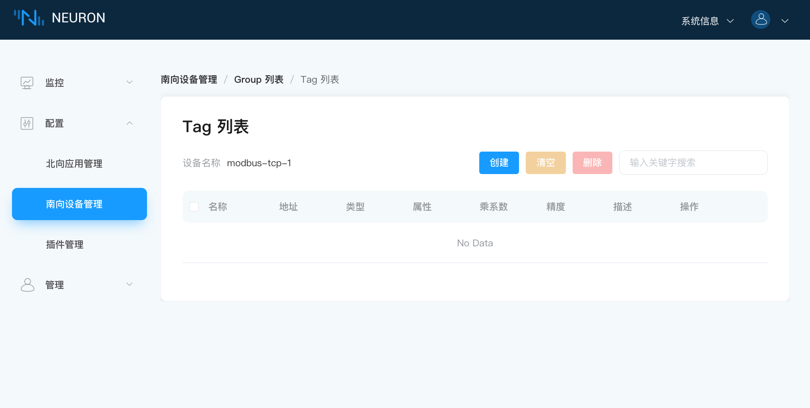
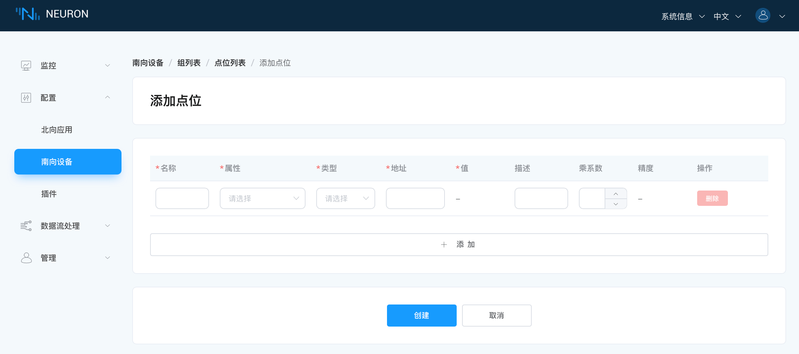

# 配置采集数据组和点位

## 第一步，在设备卡片中创建组

创建组可用于设备采集点位的归类。

单击设备节点卡片任意空白处，进入 Group 列表管理界面，点击 `创建` 按键，弹出 `创建 Group` 的对话框，如下图所示。



为设备节点创建一个组：

* Group 名称：填写 Group 名称，例如 group-1；
* 点击 `创建`，完成组的创建。

## 第二步，在组中添加数据标签

添加需要采集的设备点位，包括点位地址，点位属性，数据类型等。

点击组中的 `Tag 列表` 图标，进入 Tag 列表管理界面，如下图所示。



选择 `创建` 按键，进入添加标签页面。



手动为组创建标签：

* 名称：填写 Tag 名称，例如，tag1；
* 属性：下拉选择 Tag 属性，例如，read，write；
* 类型：下拉选择数据类型，例如，int16；
* 地址：填写驱动地址，例如，1!40001。1 代表 Modbus 模拟器中设置的点位站点号，40001 代表点位寄存器地址，详细的驱动地址使用说明请参阅 [模块配置](../module-plugins/module-driver.md)；
* 点击`创建`按键，完成 Tag 的创建；

:::tip
更多标签操作可参考文档最后的 **进阶操作**。

点位创建完成后，设备卡片的工作状态处于 **运行中**，连接状态应处于 **已连接**。若此时连接状态仍然处于 **未连接** 的状态，请先在 Neuron 运行环境终端执行以下指令，以确认 Neuron 运行环境能否访问到到对应的 IP 及端口：

```bash
$ telnet <运行 Modbus 模拟器 PC 端的 IP> 502
```

用户请确认在设备配置时 IP 与 Port 是否正确设置，防火墙是否关闭。
:::