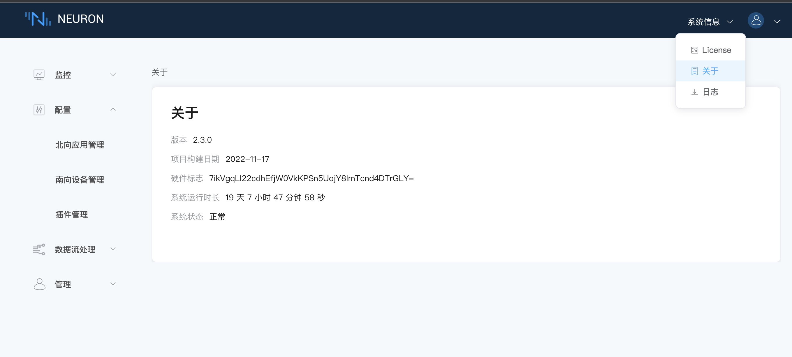
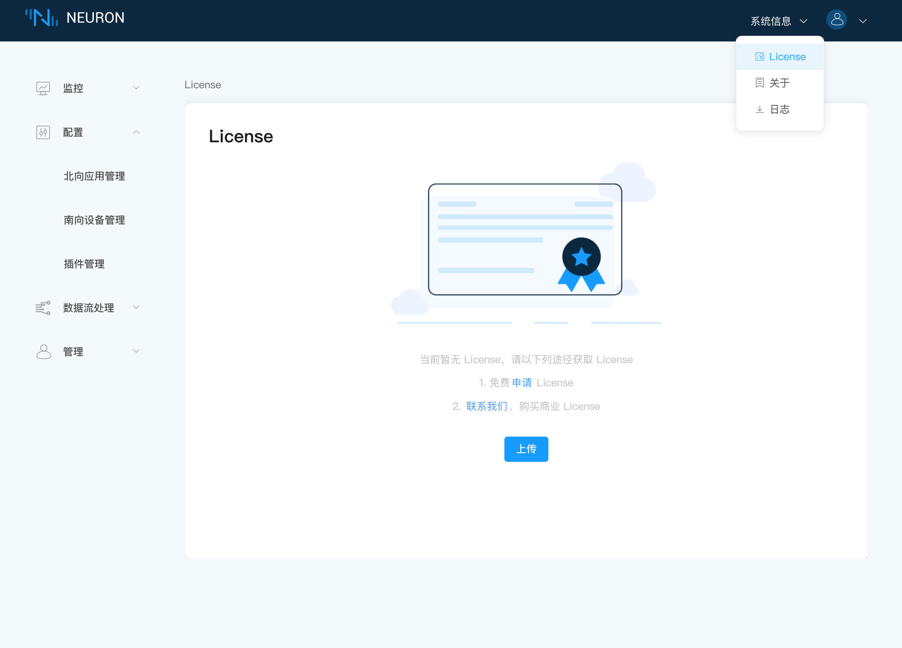

# 申请和安装许可证

Neuron 是一个开源项目。我们鼓励我们的社区开发自己的插件模块。

核心架构，仪表板和一些驱动模块（例如 modbus-tcp，mqtt 和 eKuiper 等）是在 LGPLv3 许可下开源的。Neuron 可以在没有 EMQ 许可证的情况下运行这些开源模块。但是，所有商业模块都需要 EMQ 官方许可证才能不受限制地运行。

试用的 EMQ 许可证可从[官方网站](https://www.emqx.com/zh/apply-licenses/neuron)上下载 。所有可用的模块都可以在 100 个连接和 1000 个数据标签的限制下试用 15 天。 如果试用 EMQ 许可证过期，您可以通过我们的官网重新申请试用 EMQ 许可证。 但是，一个邮箱最多只能申请两次试用许可证。

当然，您也可以直接 [联系我们](https://www.emqx.com/zh/contact?product=neuron)获取正式的 License。

## 第一步，查看硬件标志

查看硬件标志，如下图所示。

## 第二步，安装许可证

安装 License，如下图所示。

* 点击右上角系统信息下拉框中的 `License`。
* 点击 `上传` 按钮选择许可文件（.lic 文件），点击提交。

:::tip
申请有效的 License 时需要填写硬件标志。

在未上传 License 或者 License 过期时，商业版的可插拔模块是无法使用的。

用户可以在页面点击`申请`申请试用许可证，或点击`联系我们`联系我们的销售代表购买商业许可证。
:::

## 第三步，查看许可证详细信息

在 License 成功上传后，页面将展示 License 信息，如下图所示。

许可证页面详细信息包括以下方面：

* 生效日期，Neuron 申请 License 生效的时间；
* 失效日期，Neuron 可使用的截止日期，如果 License 过期，系统将无法正常工作，您必须重新获取新的有效的 License，`重新上传`上传 License；
* 节点数限制，Neuron 可创建节点总数的最大值，一个节点指的是一个南向设备或者是一个北向应用；
* Tag 数目限制，Neuron 可创建的所有标签总和的最大值；
* 可用的 Plugin，Neuron 已授权的插件。每个商业插件模块都可以在 EMQ 许可证中独立授权。
