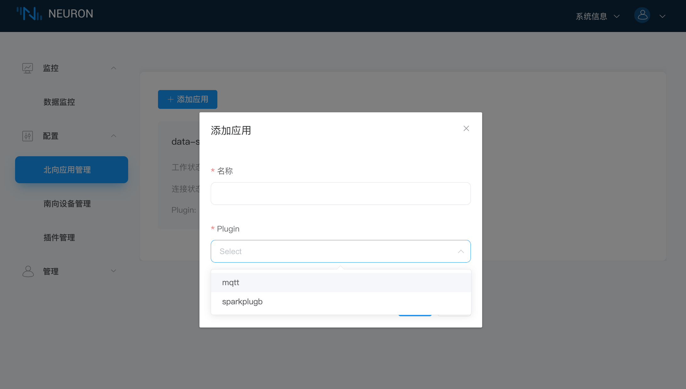

# 连接到 MQTT

## 第一步，为应用程序添加北向插件模块

创建北向应用卡片用于 Neuron 与北向应用建立连接并将采集到的设备数据上传到 MQTT Broker。

在`配置`菜单中选择`北向应用管理`，单击 `添加应用` 按键添加应用，如下图所示。

添加一个 MQTT 云连接模块：

* 名称：填写应用名称，例如，mqtt；
* Plugin：下拉框选择 mqtt 的插件；
* 点击 `创建` 按键新增应用。

## 第二步，设置北向应用参数

配置 Neuron 与北向应用建立连接所需的参数。

点击应用卡片上的 `应用配置` 按键进入应用配置界面，如下图所示。

设置 MQTT 连接：

* 使用默认的上报主题（/neuron/mqtt/upload）；
* 使用默认的公共的 EMQX Broker（broker.emqx.io）；
* 点击`提交`，完成北向应用的配置，应用卡片自动进入 **运行中** 的工作状态。

## 第三步，订阅南向标签组

采集到的数据都是以组为单位上传云端的，用户需要选择上传哪些组的数据。

点击应用节点卡片任意空白处，进入订阅 Group 界面，点击右上角的 `添加订阅` 按键添加订阅，如下图所示。

订阅南向设备的数据组：

* 南向设备：下拉框选择已创建的南向设备，例如，modbus-tcp-1；
* Group：点击下拉框选择所要订阅的 Group，例如，group-1；
* 点击`提交`，完成订阅。

## 第四步，在 MQTT 客户端查看数据

订阅完成后，用户可以使用 MQTT 客户端（推荐使用 MQTTX，可在[官网](https://www.emqx.com/zh/products/mqttx)中下载）连接到公共的 EMQX 代理来查看上报的数据，如下图所示。

订阅成功之后可以看到 MQTTX 可以一直接收到 Neuron 采集并上报过来的数据。

* 打开 MQTTX 添加新的连接，正确填写名称与公共 EMQX Broker 的 Host 与 Port，完成连接;
* 添加新的订阅，Topic 要与设置北向应用参数中的 Upload topic 保持一致，例如，填写 `/neuron/mqtt/upload`。

:::tip
默认的上传 Topic 的主题格式为 `/neuron/{node_name}/upload`，其中 {node_name} 为创建的北向应用的名称。用户也可自定义上报主题。
:::
