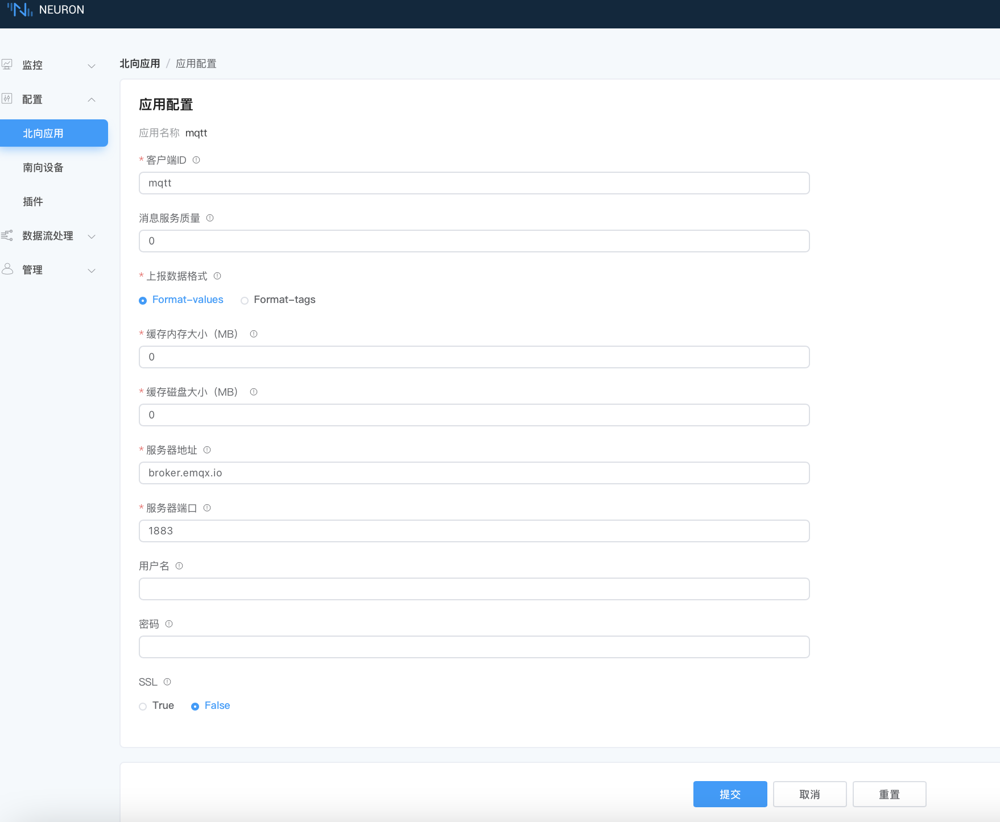

# 连接到 MQTT

## 第一步，添加北向MQTT插件节点

创建北向MQTT节点，连接并将点位数值上传到 MQTT Broker。

在 **配置 -> 北向应用** ，点击 `添加应用` 添加 MQTT 客户端节点：

* 名称：此应用节点名称，例如，mqtt；
* 插件：选择 MQTT 插件；

## 第二步，设置 MQTT 客户端参数

配置 MQTT 客户端相关参数。

点击应用卡片上的 `应用配置` 按键进入应用配置界面设置 MQTT 连接，如下图所示。

设置 MQTT 连接：

* 使用默认的上报主题（/neuron/mqtt/upload）；
* 使用默认的公共的 EMQX Broker（broker.emqx.io）；
* 点击`提交`，完成北向应用的配置，应用卡片自动进入 **运行中** 的工作状态。

## 第三步，订阅设备点位组

采集点位是以组为单位进行数据上传的，订阅选择要上传的点位组。

点击 MQTT 节点卡片，进入组列表，点击 `添加订阅` 选择要订阅的点位组，订阅南向设备的点位组：

## 第四步，使用 MQTTX 查看数据

订阅完成后，用户可以使用 MQTT 客户端（推荐使用 MQTTX，可在[官网](https://www.emqx.com/zh/products/mqttx)中下载）连接到公共的 EMQX 代理来查看上报的数据，如下图所示。

订阅成功之后可以看到 MQTTX 可以一直接收到 Neuron 采集并上报过来的数据。

* 打开 MQTTX 添加新的连接，正确填写名称与公共 EMQX Broker 的 Host 与 Port，完成连接;
* 添加新的订阅，Topic 要与设置北向应用参数中的 Upload topic 保持一致，例如，填写 `/neuron/mqtt/upload`。

:::tip
默认的上传 Topic 的主题格式为 /neuron/{node_name}/upload，其中 `{node_name}` 为创建的北向应用的名称。用户也可自定义上报主题。
:::
