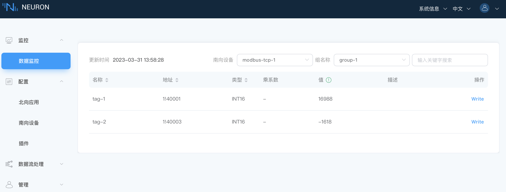

# 快速教程

本章节将指导用户从下载安装开始，以 Modbus TCP 驱动协议为例，快速开始使用 Neuron 采集模拟 Modbus 设备的数据，并将数据上传到 MQTT Broker。

## 安装 Neuron

Neuron 提供多种安装方式，用户可在 [安装](./installation.md) 中查看详细的安装方式。本实例采用容器化部署的方式，以便于最快开始体验 Neuron。

获取 Docker 镜像

```bash
$ docker pull emqx/neuron:latest
```

启动 Docker 容器

```bash
$ docker run -d --name neuron -p 7000:7000 --privileged=true --restart=always emqx/neuron:latest
```

## 安装 Modbus 模拟器

安装 PeakHMI Slave Simulators 软件，安装包可在 [PeakHMI 官网](https://hmisys.com) 中下载。

安装后，运行 Modbus TCP slave EX。设置模拟器点位数值及站点号，如下图所示。


::: tip
须保证 Neuron 与模拟器运行在同一局域网内。

Windows 中尽量关闭防火墙，否则可能会导致 Neuron 连接不上模拟器。
:::

## Neuron 快速使用

打开 Web 浏览器，输入运行 Neuron 的网关地址和端口号，即可进入到管理控制台页面，默认端口号为 7000。

访问格式，http://x.x.x.x:7000。x.x.x.x 代表安装 Neuron 的网关地址。

### 第一步，登录

页面打开后，进入到登录界面，用户可使用初始用户名与密码登录（初始用户名：admin，初始密码：0000），如下图所示。


### 第二步，添加南向设备

创建南向设备卡片可用于 Neuron 与设备建立连接、设备驱动协议的选择及设备数据采集点位的配置。

在 `配置` 菜单中选择 `南向设备管理`，进入到南向设备管理界面，单击 `添加设备` 按键新增设备，如下图所示。


添加一个新的南向设备：

* 名称：填写设备名称，例如 modbus-tcp-1；
* Plugin：下拉框选择 modbus-tcp 的插件；
* 点击 `创建` 按键新增设备。

### 第三步，设置南向设备参数

配置 Neuron 与设备建立连接所需的参数。

单击南向设备卡片上的 `设备配置` 按键进入设备配置界面，如下图所示。


* Host：填写安装 PeakHMI Slave Simulators 软件的 PC 端 IP 地址。
* 点击 `提交`，完成设备配置，设备卡片自动进入 **运行中** 的工作状态；

:::tip
每个设备所需的配置参数有所不同，详细南向设备参数说明可参考 [模块配置](../module-plugins/module-driver.md)。
:::
### 第四步，在设备卡片中创建组

创建组可用于设备采集点位的归类。

单击设备节点卡片任意空白处，进入 Group 列表管理界面，点击 `创建` 按键，弹出 `创建 Group` 的对话框，如下图所示。


为设备节点创建一个组：

* Group 名称：填写 Group 名称，例如 group-1；
* 点击 `创建`，完成组的创建。

### 第五步，在组中添加数据标签

添加需要采集的设备点位，包括点位地址，点位属性，数据类型等。

点击组中的 `Tag 列表` 图标，进入 Tag 列表管理界面，如下图所示。


选择 `创建` 按键，进入添加标签页面。


手动为组创建标签：

* 名称：填写 Tag 名称，例如，tag1；
* 属性：下拉选择 Tag 属性，例如，read，write；
* 类型：下拉选择数据类型，例如，int16；
* 地址：填写驱动地址，例如，1!40001。1 代表 Modbus 模拟器中设置的点位站点号，40001 代表点位寄存器地址，详细的驱动地址使用说明请参阅 [模块配置](../module-plugins/module-driver.md)；
* 点击`创建`按键，完成 Tag 的创建；

:::tip
更多标签操作可参考文档最后的 **进阶操作**。

点位创建完成后，设备卡片的工作状态处于 **运行中**，连接状态应处于 **已连接**。若此时连接状态仍然处于 **未连接** 的状态，请先在 Neuron 运行环境终端执行以下指令，以确认 Neuron 运行环境能否访问到到对应的 IP 及端口：

```bash
$ telnet <运行 Modbus 模拟器 PC 端的 IP> 502
```

用户请确认在设备配置时 IP 与 Port 是否正确设置，防火墙是否关闭。
:::

### 第六步，数据监控中查看采集数据

在`监控`菜单下选择`数据监控`，进入数据监控界面，查看已创建点位读取到的数值，如下图所示。



数据监控以组为单位显示数值：

* 南向设备：下拉框选择想要查看的南向设备，例如，选择上面步骤已经创建好的 modbus-tcp-1;
* Group 名称：下拉框选择想要查看所选南向设备下的组，例如，选择上面步骤已经创建好的 group-1；
* 选择完成，页面将会展示读取到组底下每一个标签的值；

### 第七步，为应用程序添加北向插件模块

创建北向应用卡片用于 Neuron 与北向应用建立连接并将采集到的设备数据上传到 MQTT Broker。

在`配置`菜单中选择`北向应用管理`，单击 `添加应用` 按键添加应用，如下图所示。


添加一个 MQTT 云连接模块：

* 名称：填写应用名称，例如，mqtt；
* Plugin：下拉框选择 mqtt 的插件；
* 点击 `创建` 按键新增应用。

### 第八步，设置北向应用参数

配置 Neuron 与北向应用建立连接所需的参数。

点击应用卡片上的 `应用配置` 按键进入应用配置界面，如下图所示。


设置 MQTT 连接：

* 使用默认的上报主题（/neuron/mqtt/upload）；
* 使用默认的公共的 EMQX Broker（broker.emqx.io）；
* 点击`提交`，完成北向应用的配置，应用卡片自动进入 **运行中** 的工作状态。

### 第九步，订阅南向标签组

采集到的数据都是以组为单位上传云端的，用户需要选择上传哪些组的数据。

点击应用节点卡片任意空白处，进入订阅 Group 界面，点击右上角的 `添加订阅` 按键添加订阅，如下图所示。


订阅南向设备的数据组：

* 南向设备：下拉框选择已创建的南向设备，例如，modbus-tcp-1；
* Group：点击下拉框选择所要订阅的 Group，例如，group-1；
* 点击`提交`，完成订阅。

### 第十步，在 MQTT 客户端查看数据

订阅完成后，用户可以使用 MQTT 客户端（推荐使用 MQTTX，可在[官网](https://www.emqx.com/zh/products/mqttx)中下载）连接到公共的 EMQX 代理来查看上报的数据，如下图所示。


订阅成功之后可以看到 MQTTX 可以一直接收到 Neuron 采集并上报过来的数据。

* 打开 MQTTX 添加新的连接，正确填写名称与公共 EMQX Broker 的 Host 与 Port，完成连接;
* 添加新的订阅，Topic 要与设置北向应用参数中的 Upload topic 保持一致，例如，填写 `/neuron/mqtt/upload`。

:::tip
默认的上传 Topic 的主题格式为 `/neuron/{node_name}/upload`，其中 {node_name} 为创建的北向应用的名称。用户也可自定义上报主题。
:::

## 进阶操作

### 软件授权

目前，Neuron 开源了 MQTT、RESTful API、Modbus TCP，用户可以直接使用开源的驱动协议。但是，通过上传有效的许可证，用户可使用 OPC UA、Modbus RTU、三菱 PLC、欧姆龙 PLC 等更多的驱动协议。

许可证的获取及上传方式的详细说明请参考 [许可证政策](../quick-start/license-install/license-install.md)。

Neuron 已支持的驱动协议可参考 [模块列表](../introduction/module-list/module-list.md)。

### 点位进阶操作

* [配置点位导入/导出](../user-guide/configuration-import-export.md)：用 Excel 表格批量导入点位；
* 乘系数：用于简单处理采集数据，用法为，设备值 * 乘系数 = 显示值；
* 设置精度：数据类型选择 float/double 时，会显示一个可选参数 **精度**，用于设置精度，可选范围 1-17；
* [反控设备](../user-guide/device-control.md)：可通过 Neuron / 北向应用操作具有写属性的设备点位；

### 数据流处理

Neuron 支持与 eKuiper 集成实现清洗数据、控制设备等数据流处理功能，详细说明可参考 [数据处理引擎](../data-processing-engine/prerequisite-setup.md)。

### 数据变化上传 MQTT Broker

当点位属性设置为 Subscribe 时，只有在采集到的数值发生变化时，才会将变化后的数值上传到云端。

### 管理操作

* [管理日志](../user-guide/log-management.md)。
* [修改密码](../user-guide/change-password.md)。
* [数据统计](../user-guide/data-statistics.md)。
* [管理插件模块](../user-guide/plugin-modules-management.md)。

## 参数说明

带 `*` 的参数是必填项，每个参数后面都有一个字段说明键，鼠标悬停在上面，将会详细地说明字段。

### 组相关参数说明

* Interval，用于设置 Neuron 从设备采集数据的时间间隔及将数据上报到 MQTT 的时间间隔。最小可设置 100ms，但在采集的数据较多时，如果数据监控界面报点位值失效的错误，可以适当调大 interval 的值；

### 南向设备/北向应用卡片参数

创建南向设备/北向应用成功之后，会在南向/北向管理界面出现一个新创建的卡片，如下图所示。


这个设备卡片包含以下信息：

* 名称：用户为南向设备/北向应用提供的唯一名称，设置完成后，该名称暂不支持修改。
* 设备/应用配置：单击此按键进入配置界面，用于设置 Neuron 与南向设备/北向应用建立连接所需要的参数设置。
* 数据统计：统计节点卡片信息。
* 更多
    * DEBUG 日志：打印节点 debug 日志，十分钟后恢复默认日志等级。
    * 删除：将此节点从南向设备列表中删除。
* 工作状态：显示设备节点的当前状态，五种工作状态。
    * **初始化**：首次添加南向设备/北向应用卡片后，进入初始化状态；
    * **配置中**：进入设备/应用配置中，进入配置中的状态；
    * **准备好**：成功配置后，进入准备好的状态；
    * **运行中**：运行设备卡片；

* 工作状态切换按键：打开以连接到设备。
    * 打开，Neuron 与设备/应用建立连接，开始采集数据。
    * 关闭，断开连接，停止采集数据。
* 连接状态：显示设备的连接状态。
    :::tip
    在添加 Group 和 Tag 后，Neuron 才会连接设备采集数据，连接状态才会显示 **已连接**。
    :::
* 延时：收发一次指令的时间间隔。
* 插件模块名称：用于显示此设备使用的插件模块的名称。
