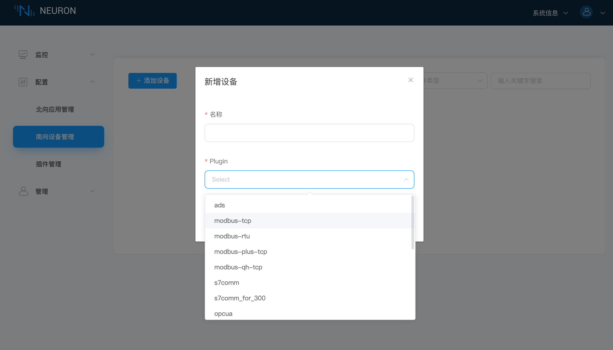

# 连接到南向设备

## 第一步，添加南向设备

创建南向设备卡片可用于 Neuron 与设备建立连接、设备驱动协议的选择及设备数据采集点位的配置。

在 `配置` 菜单中选择 `南向设备管理`，进入到南向设备管理界面，单击 `添加设备` 按键新增设备，如下图所示。

添加一个新的南向设备：

* 名称：填写设备名称，例如 modbus-tcp-1；
* Plugin：下拉框选择 modbus-tcp 的插件；
* 点击 `创建` 按键新增设备。

## 第二步，设置南向设备参数

配置 Neuron 与设备建立连接所需的参数。

单击南向设备卡片上的 `设备配置` 按键进入设备配置界面，如下图所示。

* Host：填写安装 PeakHMI Slave Simulators 软件的 PC 端 IP 地址。
* 点击 `提交`，完成设备配置，设备卡片自动进入 **运行中** 的工作状态；

:::tip
每个设备所需的配置参数有所不同，详细南向设备参数说明可参考 [模块配置](../module-plugins/module-driver.md)。
:::