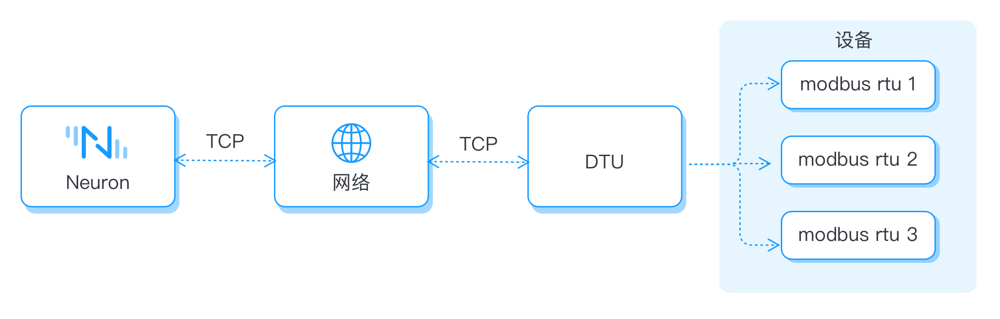
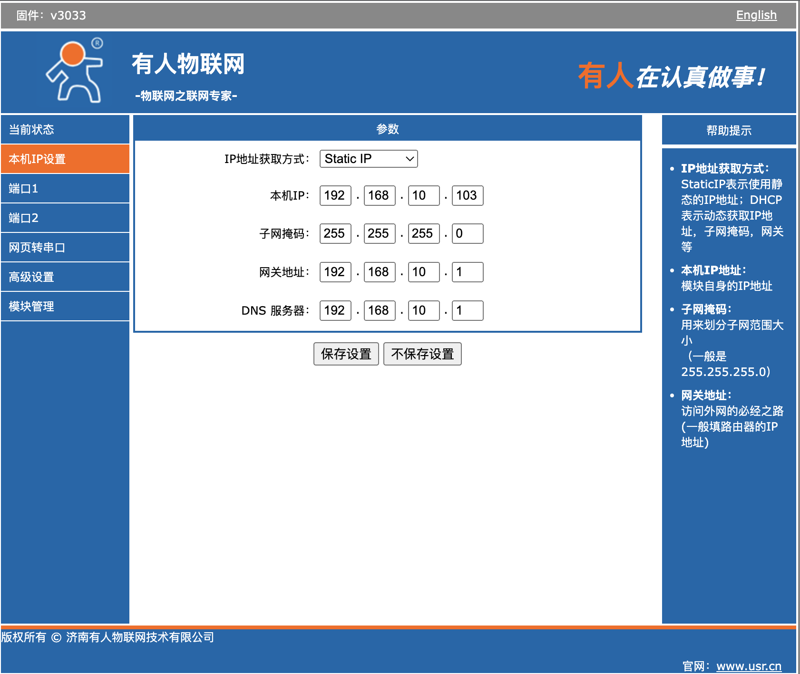
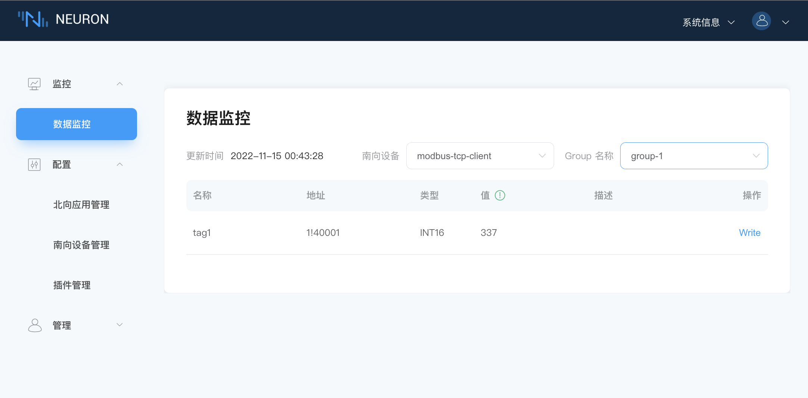
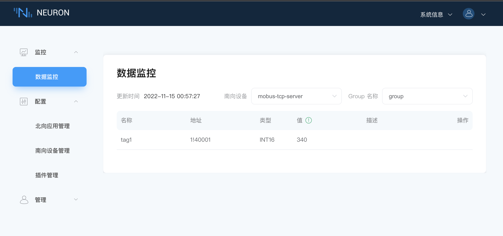

# 有人云 DTU 连接 Neuron 示例

本文将以有人云 DTU 透传模块通过 RS485 方式连接设备为例，介绍如何将串口设备转换为网络连接到 Neuron。连接示意图如下图所示。



DTU 支持数据的双向转换，支持将 RS232、RS485、RS422 等常见的串口数据与 TCP/IP数据进行相互转换，并通过无线通信网络进行传送。DTU 一般采用的通信方式有2/3/4G、NB-IoT、LoRaWAN、WIFI 等.

## 什么是 client/server 模式？

Client/Server 又称客户/伺服器模式，简称 C/S 模式，是一种网络通讯架构，用以将通讯建立连接的双方以客户端（Clent）与服务器（Server）的身份区分开来。

C/S 结构虽然在技术上已经很成熟，并且具有交互性强、具有安全的存取模式、响应速度快、利于处理大量数据等特点。但是 C/S 结构缺少通用性，系统维护、升级需要重新设计和开发，从而增加了维护和管理的难度，并且进一步的数据拓展困难较多，所以 C/S 结构只限于小型的局域网。若 Client 与 Server 不在同一局域网内，用户需要通过处理以保证 Client 端能够通过一个网络地址访问到 Server 端并且 Server 端能够给 Client 一个访问的权限，才能实现两端的通信。

一个完整的网间通信需要协议、本机地址、本地端口号、远程端口号、远程地址五个元素标识。在 C/S 模式中，客户端接收用户请求，主动给服务器发送连接请求，服务器被动等待来自客户端的请求，处理请求并传回结果到客户端。端口号则用于区分不同服务的逻辑编号。

* 客户端侧在配置 TCP 连接时，必须设置服务器 IP 地址及监听端口；
* 服务端侧在配置 TCP 连接时，必须设置服务器使用的端口，客户端 IP 地址及端口为可选项；

## 如何连接作为 Client 的 Neuron？

本节主要介绍在 Neuron 与 DTU 在同一局域网内，并且 Neuron 作为 Client 端的条件下，如何配置以实现两者的通信连接。

### 配置 DTU Server

首先，需要配置 DTU 与串口连接的参数，其次，需要配置 DTU 与 Neuron 建立连接的 Socket 参数，如下图所示。


* 工作方式，TCP Server，Modbus TCP；
* 填写未被使用的本地端口，无需填写远程端口；
* 下面参数作为可选项。

:::tip
当 DTU 的工作方式为 Modbus TCP 时，因为 DTU 将 modbus rtu 串口协议转换为 modbus tcp 协议，所以，应使用 Neuron 中的 modbus-plus-tcp 驱动。

当 DTU 的工作方式为透传模式时，此时应当使用 Neuron 中的 modbus-rtu 驱动。
:::

### 查看 DTU IP

在配置 Neuron 南向驱动时需要作为 Server 端的 DTU 的 IP，如下图所示。


### 配置 Neuron 南向驱动 Client

在南向驱动管理中建立插件为 modbus-plus-tcp 的节点，并进行驱动配置，如下图所示。


* 连接模式选择 client；
* Host 填写 DTU 的 IP 地址；
* Port 填写 DTU 配置的端口；

### 查看数据监控

在南向驱动添加了点位后，进入数据监控界面，查看从设备端采集到的数据，如下图所示。


## 如何连接作为 Server 的 Neuron？

本节主要介绍在 Neuron 与 DTU 在同一局域网内，并且 Neuron 作为 Server 端的条件下，如何配置以实现两者的通信连接。

### 配置 DTU Client

首先，需要配置 DTU 与串口连接的参数，其次，需要配置 DTU 与 Neuron 建立连接的 Socket 参数，如下图所示。


* 远程服务器地址，填写作为 server 端的 Neuron 运行的 IP 地址；
* 本地端口，默认不填写；
* 远程端口，由于 每个 TCP Server 端口都会在客户端指定的端口上监听传入的 TCP 流量，因此，需要用户自定一个未被占用的端口，用以客户端与服务端之间进行握手建立连接。

:::tip
可在 Server 端的终端执行以下指令，确定监听端口是否被占用。

```bash
# 查看端口范围
$ cat /proc/sys/net/ipv4/ip_local_port_range
# 确认端口是否占用
$ telnet <ip> <port>
```

:::

### 配置 Neuron 南向驱动 Server

在南向驱动管理中建立插件为 modbus-plus-tcp 的节点，并进行驱动配置，如下图所示。


* 连接模式选择 server；
* Host，填写 0.0.0.0；
* Port，填写监听端口；

### 查看数据监控

在南向驱动添加了点位后，进入数据监控界面，查看从设备端采集到的数据，如下图所示。



## 补充说明

当 Neuron 与 DTU 不在同一局域网内时，可以将 Neuron 运行环境的局域网 IP 及端口映射到公网，并将 Neuron 作为 Server 端，DTU 作为 Client 端，配置方式同上文所述。
