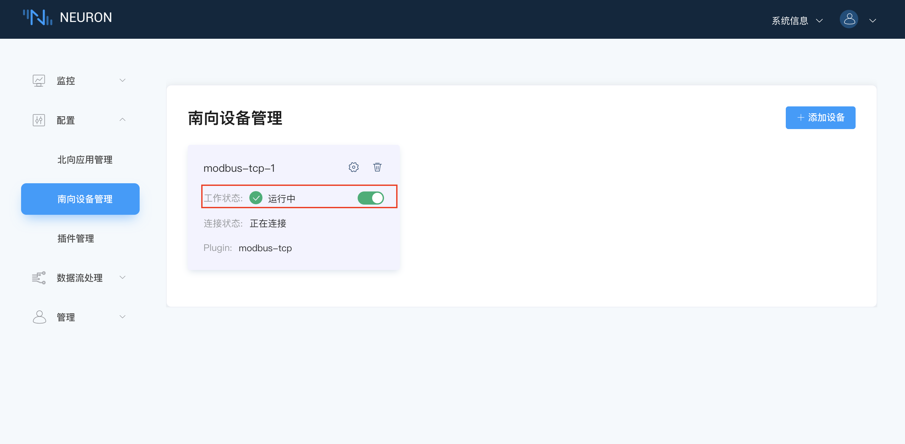
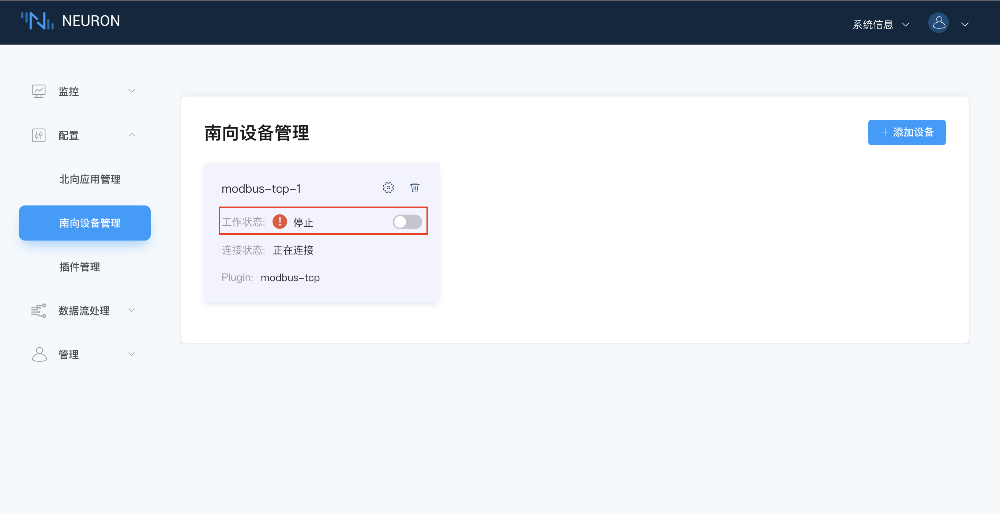
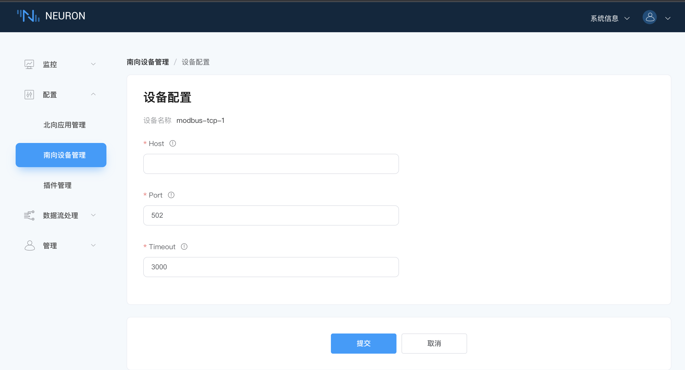

# Modbus 插件开发示例

南向驱动开发主要包含以下几个部分，最底层的是协议层开发，最外层的是驱动层开发。
| 模块         | 文件                                       | 说明                                        |
| ----------- | ------------------------------------------ | ------------------------------------------ |
| 协议层开发    | modbus.c modbus.h                          | 插件对接的设备协议报文的组包与解包              |
| 协议栈解析    | modbus_stack.c modbus_stack.h              | 主要用于协议栈的解析                           |
| 点位处理      | modbus_point.c modbus_point.h              | Neuron 中 tag 类型转换为插件所需要的更具体的类型 |
| 驱动层开发    | modbus_tcp.c modbus_req.c modbus_req.h     | 插件主题框架的实现                            |
| 插件设置文件   | modbus-tcp.json                            | 插件设置文件的定义                            |

## 第一步，协议层开发

这部分主要实现的是插件对接的设备协议的组包与解包的实现，还包括一些结构体定义以及相关函数的实现，其中 modbus.h 定义 modbus 协议基本报文，以及对该报文的组包和解包函数，modbus.c 实现组包与解包的函数。

Modbus 协议通过 TCP 方式传输时，读写请求报文格式如下列表格所示。

| 报文格式       | 数据长度    | 说明                                       |
| ------------- | --------- | ------------------------------------------ |
| 报文头         | 6 个字节   | 应用报文头，包含传输标识、协议标识和字节长度      |
| 地址码         | 1 个字节   | 设备地址，也是站点号                          |
| 功能码         | 1 个字节   | 通知执行哪种操作，不同的功能码对应不同的操作      |
| 寄存器起始地址  | 2 个字节   | 指定读取的寄存器开始地址，高字节在前，低字节在后   |
| 寄存器数量      | 2 个字节  | 指定读取的寄存器的数量，高字节在前，低字节在后     |
| 数据域         | N 个字节   | 在写指令中用到，需要写入寄存器的值              |

### 枚举说明

| 枚举             | 说明               |
| --------------- | ----------------- |
| modbus_function | Modbus 不同的功能码 |
| modbus_area     | 不同寄存器类型       |

### modbus_header

这部分包含了报文头的组包函数 modbus_header_wrap 和对应的解包函数 modbus_header_unwrap。

### modbus_code

这部分包含了地址码和功能码的组包函数 modbus_code_wrap 和对应的的解包函数 modbus_code_unwrap。

### modbus_address

这部分包含了寄存器的初始地址和寄存器的数量的组包函数 modbus_address_wrap 和对应的解包函数 modbus_address_unwrap。

### modbus_data

这部分主要包含了需要写入寄存器数值的组包函数 modbus_data_wrap 和对应的解包函数 modbus_data_unwrap。

## 第二步，协议栈解析

这部分主要用于协议栈的解析，主要包含协议栈解析的初始化和资源的释放，生成读写请求报文，接收到的读写响应报文的解析及数据处理。

### modbus_stack_create

该函数主要用于协议栈解析的初始化。

### modbus_stack_destroy

该函数主要用于释放协议栈解析资源。

### modbus_stack_recv

该函数主要用于向协议栈解析器中传递从 tcp/udp/serial port 中接收到的数据，并对数据进行处理分析。

### modbus_stack_read

该函数主要用于通过协议解析器，生成要读取点位的协议报文。

### modbus_stack_write

该函数主要用于通过协议解析器，生成要写入点位值的协议报文。

## 第三步，点位处理

这部分主要用于将 Neuron 中设置的 tag 信息转换为所需要的更具体的信息。

* Neuron 中点位配置的地址可以进一步解析成设备地址 Slave ID，寄存器类型和寄存器起始地址，并能校验该地址是否符合插件规范。
* 不同的寄存器支持的数据类型不同，这里可以根据解析出来的寄存器类型及 Neuron 中配置的属性进行判断配置的地址是否支持该属性。
* Modbus 支持批量读取数据，Neuron 可以把用户配置的点位进行聚合分类，根据分类的结果，可实现批量读取数据的功能。

### modbus_tag_to_point

该函数实现的是将 Neuron 中设置的 tag 信息转换为所需要的更具体的信息，neu_datatag_t 是 Neuron 中配置的点位信息，modbus_point_t 存放的是转换之后的 tag 信息，参数说明如下。

| 参数                | 说明            |
| ------------------ | --------------- |
| slave_id           | 设备地址，即站点号 |
| area               | 寄存器类型        |
| start_address      | 寄存器起始地址     |
| n_register         | 寄存器数量        |
| type               | 数据类型          |
| option             | 字节顺序的选择     |
| name               | tag 名称         |

### modbus_tag_sort

modbus_tag_sort 主要用于将用户配置的点位进行聚合分类，根据分类结果，可实现批量读取。对应的 modbus_tag_sort_free 函数用于释放 modbus_tag_sort 创建的资源。

## 第四步，驱动层开发

modbus_req.c 和 modbus_req.h 文件定义 modbus_tcp.c 文件中使用的具体函数实现及结构体。modbus_tcp.c 文件主要是插件导出的接口，由 neuron 中的 plugin.h 定义，plugin_intf_funs 说明如下。

### open

调用 driver_open 函数，基于 plugin 创建 node 时 neuron 第一个调用的函数，创建插件自己定义的结构体 struct neu_plugin。该结构体在 modbus_req.h 中定义，需要注意的是结构体中的第一个成员一定是 neu_plugin_common_t common，其他成员可根据驱动的具体实现增加。

### close

调用 driver_close 函数，删除 node 时，neuron 调用的最后一个函数，用于释放由 open 创建的 neu_plugin_t

### init

调用 driver_init 函数，在创建 node 时，neuron 调用完 open 后，紧接着调用的函数。此函数主要做插件内需要初始化的一些资源，modbus 插件中主要初始化 modbus 协议栈解析。其中的回调函数都在 modbus_req 文件中实现。

* modbus_send_msg 回调函数用来在 tcp 连接上发送数据；
* modbus_value_handle 回调函数用于收到数据时将其更新到 adapter 中；
* modbus_write_resp 回调函数用于在对设备的点位写值时返回的错误码。

### uninit

调用 driver_uninit 函数，删除 node 时，neuron 首先调用的函数，此函数主要释放一些在 init 中申请以及初始化的资源。

### start

调用 driver_start 函数，用户在 neuron node 页面，点击开始时，neuron 会调用此函数，start 不做任何处理，只返回 0，通知插件开始运行，以及开始连接设备等，连接状态的处理放在 tcp 连接的异步回调函数中处理。

### stop

调用 driver_stop 函数，用户在 neuron node 页面，点击停止时，neuron 会调用此函数，stop 通知插件停止运行，关闭与设备之间的连接，并且 driver.group_timer 将不会再触发。

### setting

调用 driver_config 函数，用户在 neuron node 设置页面进行设置时使用，node 设置的参数将通过 json 方式呈现，neuron 将通过此函数通知插件进行设置。driver_config 函数首先会解析并保存配置信息，然后建立 tcp 连接。modbus_conn_connected 和 modbus_conn_disconnected 两个回调函数会分别在 tcp 建立和关闭连接时被调用，相应的这两个函数会更新插件的连接状态。

### request

调用 driver_request 函数，此函数在南向 driver 中暂未使用到。

### driver.validate_tag

调用 driver_validate_tag 函数，在向 node 中添加 tag 或更新 tag 时，neuron 会把 tag 相关参数使用此函数通知到插件，插件根据各自实现检查此 tag 参数是否符合插件要求，该函数返回 0，代表成功。

### driver.group_timer

调用 driver_group_timer 函数，在 node 中添加 group，将 node 状态置为 running 后，此函数将以 group 的 interval 参数定时调用，主要用于与设备的交互，读取设备数据。

neu_plugin_group_t 结构体参数说明。

| 参数            | 说明                                        |
| -------------- | ------------------------------------------- |
| group_name     | 触发 timer 的 group 名称                      |
| tags           | neu_datatag_t 类型的数组                      |
| user_data      | 用户自定义的信息                               |
| group_free     | 当删除此 group 时，释放用户自定义信息使用的回调函数 |

### driver.write_tag

调用 driver_write 函数，当使用 write api 时，neuron 将调用此函数，通知插件，向点位 tag 写入特定的值。

## 第五步，插件设置文件

modbus-tcp.json 文件配置插件设置，其中 tag_type 和 timeout 是必填项，其他参数可根据插件配置自行添加，参数说明如下表所示。

| 参数       | 说明                   |
| --------- | ---------------------- |
| tag_type  | 驱动点位支持的数据类型     |
| tag_regex | 不同数据类型地址配置正则   |
| host      | IP 地址                 |
| port      | 端口号                  |
| timeout   | 接收数据超时时间          |
