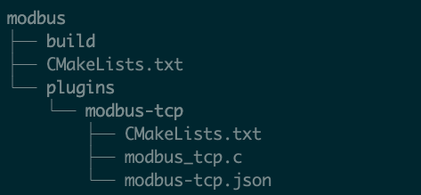

# 基于 SDK 的驱动开发

本文主要介绍如何基于 SDK 包开发一个新的驱动插件并应用到 Neuron 中的步骤。

## 第一步，下载安装 SDK

下载链接：[https://github.com/emqx/neuron/releases](https://github.com/emqx/neuron/releases)

根据不同的开发系统，下载对应的 sdk tar.gz 包（ 例如，neuron-sdk-2.1.3-linux-amd64.tar.gz ）到相应的开发系统中并解压得到 neuron-sdk-x.x.x，其中 x.x.x 代表的的是版本号，执行以下指令。

```bash
# take version 2.1.3 as an example
$ cd neuron-sdk-2.1.3
# install sdk
$ sudo ./sdk-install.sh
```

脚本执行完成后，需要注意以下路径的用法。

| 路径                         | 说明            |
| --------------------------- | ------------------------------------------------------------------------- |
| /usr/local/include/neuron   | 存放 Neuron 的头文件，应用于 CMakeLists.txt 编译文件中的 include_directories    |
| /usr/local/lib/neuron       | 存放 Neuron 依赖库文件，应用于 CMakeLists.txt 编译文件中的 link_directories     |
| /usr/local/bin/neuron       | 存放运行 Neuron 所需的文件                                                   |

## 第二步，驱动开发

在开发环境中新建一个目录文件用于存放开发驱动所需要的文件，在该目录文件下新建一个编译配置文件 CMakeLists.txt，一个 build 目录文件用于存放编译后的文件和一个 plugins 目录文件用于存放所有需要开发的驱动文件，每一个驱动都需要有一个独立的目录来存放驱动开发的所需的文件，以开发 modbus-tcp 驱动插件为例，目录层级如下图所示。



### CMakeLists.txt 范例

最主要的是 include_directories，link_directories 和 add_subdirectory 要配置正确。

```shell
cmake_minimum_required(VERSION 3.12)

enable_language(C)
set(CMAKE_C_STANDARD 99)

find_package(Threads)

# add the path to the neuron header
include_directories(/usr/local/include /usr/local/include/neuron)
# add the path to the neuron library
link_directories(/usr/local/lib /usr/local/lib/neuron)

# add driver submodule
add_subdirectory(plugins/modbus)
```

### plugins/modbus

驱动开发文件中主要包含编译配置文件 CMakeLists.txt 和 驱动配置的 json 文件和驱动代码文件。

#### CMakeLists.txt 示例

```shell
set(LIBRARY_OUTPUT_PATH "${CMAKE_BINARY_DIR}/plugins")

set(CMAKE_BUILD_RPATH ./)
# set plugin name
set(MODBUS_TCP_PLUGIN plugin-modbus-tcp)
# set the driver development code file
set(MODBUS_TCP_PLUGIN_SOURCES  modbus_tcp.c)
add_library(${MODBUS_RTU_PLUGIN} SHARED)
target_sources(${MODBUS_RTU_PLUGIN} PRIVATE ${MODBUS_RTU_PLUGIN_SOURCES})
target_link_libraries(${MODBUS_RTU_PLUGIN} neuron-base)
```

#### modbus_tcp.c

驱动插件的接口文件，具体的驱动开发示例，请参考 [modbus-tcp 插件开发示例](./modbus_example.md)

#### modbus-tcp.json

驱动配置文件，在 [modbus-tcp 插件开发示例](./modbus_example.md) 中有详细的说明。

### build

驱动开发代码完成之后，在该目录下执行编译。

```bash
$ cmake ..
$ make
```

## 第三步，插件应用于 Neuron

### 拷贝驱动 .so 文件

编译完成后，进入 modbus/build/plugins 中将生成的驱动 .so 文件（例如，libplugin-modbus-tcp.so ） 拷贝到 /usr/local/bin/neuron/plugins 目录下。

### 拷贝驱动配置 .json 文件

将 modbus/modbus-tcp.json 文件拷贝到 /usr/local/bin/neuron/plugins/schema 目录下。

### 修改 plugins.json 文件

打开 /usr/local/bin/neuron/persistence 目录下的 plugins.json 文件，将新添加的驱动 .so 文件名称添加进去。

### 启动 Neuron 验证驱动

回到 /usr/local/bin/neuron 目录下，执行以下指令，运行 Neuron。

```bash
$ sudo ./neuron --log
```

在网页打开 Neuron 查看添加的插件及其使用。
