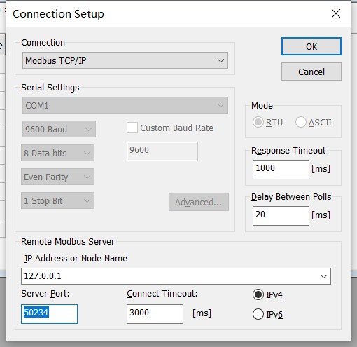

# Modbus Poll 连接示例

## 下载安装 Modbus Poll 模拟器
Modbus Poll 是一款 Modbus 主机模拟器，主要用于帮助 Modbus 从设备开发者或其他想要测试和模拟 Modbus 协议的开发者使用。

Modbus Poll 支持以下方式读写设备数据：
* 在 RS232 或者 RS485 串口网络上使用 Modbus RTU, ASCII 通讯。（USB/RS232/485 转换器）
* Modbus TCP/IP。
* Modbus Over TCP/IP。（Modbus RTU/ASCII 封装于 TCP 报文）
* Modbus UDP/IP。
* Modbus Over UDP/IP。（Modbus RTU/ASCII 封装于 UDP 报文）
  
安装 Modbus Poll 软件，安装包可从 [modbus tool 下载](https://www.modbustools.com/download.html) 页面，根据运行环境选择对应的安装包下载。软件提供30天的免费使用时长。免费时长阶段，连接10分钟会断开一次，断开之后需要重启软件。
  
## 如何连接作为 Server 的 Neuron？

本节主要介绍 Neuron 作为 Server，Modbus Poll 作为 Client 时， Neuron 与 Modbus Poll 的相关配置。

Modbus Poll 作为 Client，主动向 Neuron 发起连接请求，用户需要保证 Modbus Poll -> Neuron 的网络连通性。这种连接方式通常可用于以下场景中，在某些设备使用 4G 上网时，因为 Neuron 无法主动连接到设备，所以，Neuron 只能选择 Server 模式，由设备主动连接到 Neuron。

### 配置 Neuron 南向驱动 Server

在南向驱动管理中建立插件为 modbus-tcp-server 的节点，并进行驱动配置，如下图所示。

* 连接模式选择 server；
* Host，填写 0.0.0.0；
* Port，填写监听端口；

### 配置 Modbus Poll Client

* 安装完成后，运行 Modbus Poll。
* 进入菜单 **Connection -> Connect**，根据实际情况选择连接方式（本示例为 Modbus TCP/IP），设置连接参数(Neuron 运行设备的 IP 地址和设置的 Port)，然后点击 **OK** 完成配置，如下图所示。

* 进入菜单 **Setup -> Read/Write Definition** 或者点击工具栏  配置读写。根据读写需求设置地址参数信息，点击 **OK** 完成配置。
* 主界面独立文档窗口就可以看到读写配置相关的数据信息显示。如果想要配置多个读写定义，点击 **File -> New** 新建文档窗口，重复上一步读写配置即可。在独立文档窗口双击表头为地址的表格项目，输入站点号，地址，和值，即可对从机对应数据进行修改。
* 如果需要同时连接多个从设备，运行 Modbus Poll 多个实例，重复上述步骤即可。