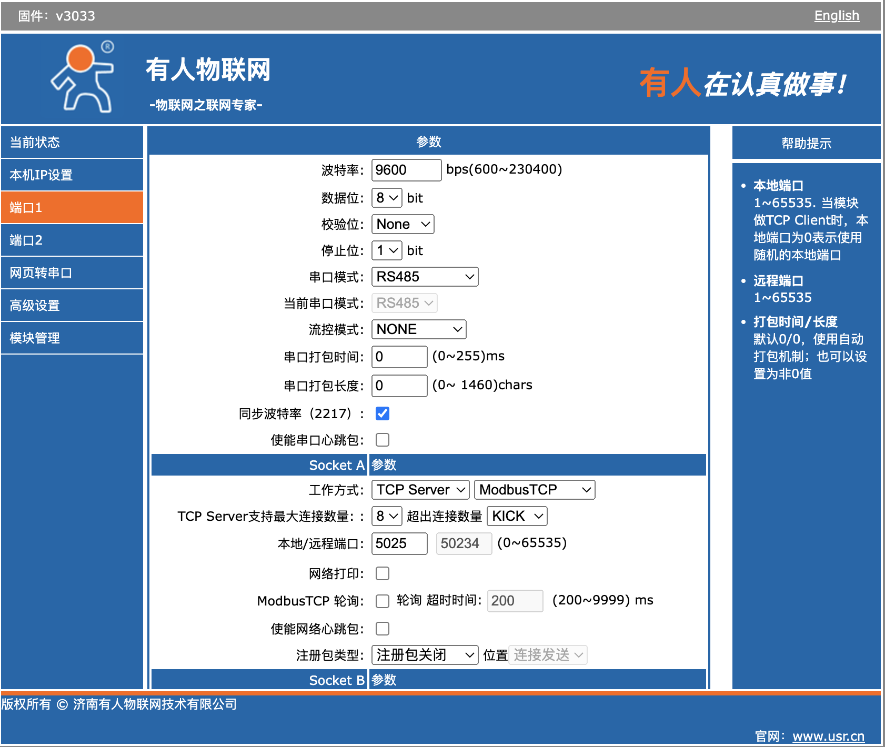

# DTU 连接示例

本文将以使用 Modbus RTU 协议的设备通过有人云 DTU 透传模块连接到 Neuron 为例，介绍如何将串口数据转换为网络数据。连接示意图如下图所示。


:::tip
Modbus RTU 虽转为网络传输，但仍然是 Modbus RTU 报文格式。若 DTU 将 Modbus RTU 转为 Modbus TCP，此时需要使用 Modbus TCP 驱动模块。
:::

DTU 支持数据的双向转换，支持将 RS232、RS485、RS422 等常见的串口数据与 TCP/IP 数据进行相互转换，并通过无线通信网络进行传输。DTU 一般采用的通信方式有 2/3/4G、NB-IoT、LoRaWAN、WIFI 等。

## 什么是 client/server 模式？

Client/Server 又称客户/伺服器模式，简称 C/S 模式，是一种网络通讯架构，用以将通讯建立连接的双方以客户端（Clent）与服务器（Server）的身份区分开来。

在 TCP 协议中，客户端属于请求的发起者，主动给服务器发送连接请求，服务端被动等待来自客户端的请求。

Client 和 Server 建立连接的工作流程如下图所示。


## 如何连接作为 Client 的 Neuron？

本节主要介绍 Neuron 作为 Client，DTU 作为 Server 时，Neuron 与 DTU 的相关配置。

Neuron 作为 Client，主动向 DTU 发起连接请求，用户需要保证 Neuron -> DTU 的网络连通性。

### 配置 DTU Server

首先，需要配置 DTU 与串口连接的参数，其次，需要配置 DTU 与 Neuron 建立连接的 Socket 参数，如下图所示。


* 工作方式，TCP Server，Modbus TCP；
* 填写未被使用的本地端口，无需填写远程端口；
* 下面参数作为可选项。

:::tip
当 DTU 的工作方式为 Modbus TCP 时，因为 DTU 将 modbus rtu 串口协议转换为 modbus tcp 协议，所以，应使用 Neuron 中的 modbus-plus-tcp 驱动。

当 DTU 的工作方式为透传模式时，此时应当使用 Neuron 中的 modbus-rtu 驱动。
:::

### 查看 DTU IP

在配置 Neuron 南向驱动时需要作为 Server 端的 DTU 的 IP，如下图所示。


### 配置 Neuron 南向驱动 Client

在南向驱动管理中建立插件为 modbus-plus-tcp 的节点，并进行驱动配置，如下图所示。


* 连接模式选择 client；
* Host 填写 DTU 的 IP 地址；
* Port 填写 DTU 配置的端口；

## 如何连接作为 Server 的 Neuron？

本节主要介绍 Neuron 作为 Server，DTU 作为 Client 时， Neuron 与 DTU 的相关配置。

DTU 作为 Client，主动向 Neuron 发起连接请求，用户需要保证 DTU -> Neuron 的网络连通性。这种连接方式通常可用于以下场景中，在某些 DTU 使用 4G 上网时，因为 Neuron 无法主动连接到 DTU，所以，Neuron 只能选择 Server 模式，由 DTU 主动连接到 Neuron。

### 配置 DTU Client

首先，需要配置 DTU 与串口连接的参数，其次，需要配置 DTU 与 Neuron 建立连接的 Socket 参数，如下图所示。


* 远程服务器地址，填写作为 Server 端运行 Neuron 的 IP 地址；
* 本地端口，默认不填写；
* 远程端口，由于 每个 TCP Server 端口都会在客户端指定的端口上监听传入的 TCP 流量，因此，需要用户自定一个未被占用的端口，用以客户端与服务端之间进行握手建立连接。

:::tip
可在 Server 端的终端执行以下指令，确定监听端口是否被占用。

```bash
# 查看端口范围
$ cat /proc/sys/net/ipv4/ip_local_port_range
# 确认端口是否占用
$ telnet <ip> <port>
```

:::

### 配置 Neuron 南向驱动 Server

在南向驱动管理中建立插件为 modbus-plus-tcp 的节点，并进行驱动配置，如下图所示。


* 连接模式选择 server；
* Host，填写 0.0.0.0；
* Port，填写监听端口；

## 补充说明

当 Neuron 与 DTU 不在同一局域网内时，可以将 Neuron 运行环境的局域网 IP 及端口映射到公网，并将 Neuron 作为 Server 端，DTU 作为 Client 端，配置方式同上文所述。
