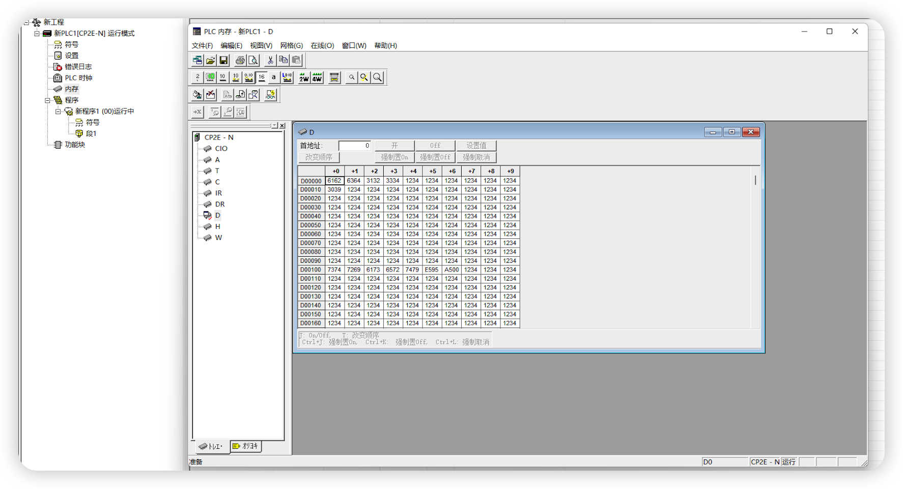

# 连接欧姆龙 CP2E PLC 示例

本文将使用 Omron FINS TCP 插件连接欧姆龙 CP2E PLC，实现读写 PLC 中的点位值。

Omron FINS TCP 插件可以通过本地局域网或者 Intenet 连接到欧姆龙 PLC，但是需要注意的是，如果 PLC 与 Neuron 服务器不在同一局域网，需要在 PLC 上配置端口转发。

## 欧姆龙 CP2E PLC 点位

本文假定已能使用欧姆龙编程软件 CX-Programmer 连接到 CP2E PLC，可以查看 PLC 中的点位。

* 左侧菜单栏选择 **设置** 打开 PLC 设定窗口，找到 **内置以太网** 选项卡，
为 PLC 配置 IP 地址、子网掩码等。
* 左侧菜单选择 **内存** 打开 PLC 内存窗口，可以查看到 PLC 支持的数据区域以及地址范围，如下图所示，此 PLC 存在多个数据区域，包括 CIO、A、W 等。

## Neuron 配置节点连接 CP2E PLC
* 在南向设备中，点击 `添加设备`，选择插件 `Omron FINS TCP` 来创建一个连接 CP2E PLC 的节点。
* 创建好节点后，点击 `设备配置` 进入设备配置页面，根据实际情况配置节点信息，
	* `PLC IP 地址`：PLC 的 IP 地址
	* `PLC 端口`：PLC 的端口，默认为 9600
* 在创建好的南向设备节点中，创建组，并在组下创建点位。
* 进入 Neuron **监控页面** 选择对应设备与组，查看采集的数据点。