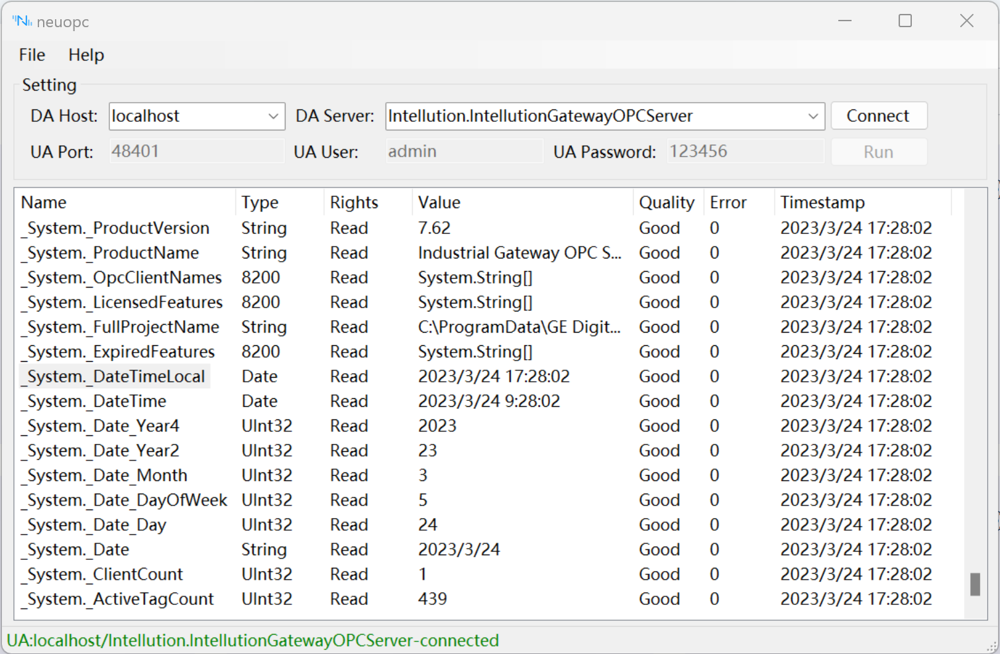

# 连接 NeuOPC

## NeuOPC 设置

1. 填写 DA Host，可以填写 IP 或 Hostname，不填写则默认为本机；

2. 尝试点击 DA Server 的下拉按钮，可以尝试获取目标 Host 的 DA Server 列表，如果下拉为空则说明检测不到任何目标主机上的 DA Server；

3. 点击 Connect 按钮，服务器连接成功后会显示当前 DA Server 的所有可获取的测点信息，状态栏会出现当前服务器的连接信息；

4. 设置 UA Port；

5. 设置 UA User；

6. 设置 UA Password；

7. 点击 Run 按钮，UA 服务器启动后，所有列表中的测点都会被映射到 UA Server 的 NeuOPC 目录下，所有测点的 UA namespace 为2，此时 UA 的相关设置项目会变为不可设置状态；

8. 通过鼠标双击 neuopc 测点列表的 Name 列可将对应的测点名称复制到剪贴板中，然后在 neuron 的 tag 表单中粘贴。

## Neuron OPC UA 设置

1. 在 neuron 南向设备管理中添加一个 opcua 设备；

2. 在设备配置中修改 endpoint url 为 neuopc 的 UA Server 地址；

3. 在设备配置中填写 Username，与 neuopc 中设置的一致；

4. 在设备配置中填写 Password，与 neuopc 中设置的一致；

5. 无需填写 Cert 和 Key，直接提交设置表单。

### 测试点位

| 名称                    | 地址                      | 属性 | 类型   |
| ----------------------- | ------------------------- | ---- | ------ |
| _System._ProductVersion | 2!_System._ProductVersion | Read | STRING |
| _System._ProductName    | 2!_System._ProductName    | Read | STRING |
| _System._DateTimeLocal  | 2!_System._DateTimeLocal  | Read | UINT32 |

