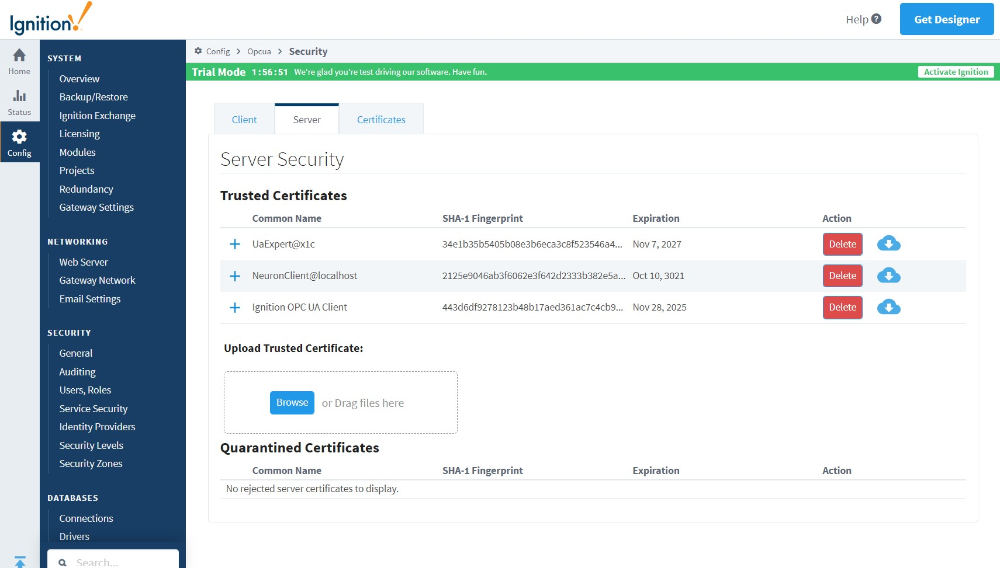

# 连接 Ignition 

## 用户名/密码登录

1. 打开 Ignition 的管理界面 **Config** -> **OPC UA** -> **Server Setting**，添加可被其他主机访问的 IP 地址到 `Bind Addresses`，保存配置；

2. Neuron 新增南向 OPC UA 设备，打开 **设备配置**，填写目标 Ignition 的 `端点 URL`——`opc.tcp://192.168.10.195:62541/discovery`，`用户名`——`opcuauser`（Ignition 默认），`密码`——`password`（Igniton 默认），无需添加证书/密钥, 启动设备连接。

3. 打开 Ignition 的管理界面 **Config** -> **OPC UA** -> **Security** -> **Server**，将 `Quarantined Certificates` 列表中的 NeuronClient 证书设置为信任；

## 证书/密钥 + 用户名/密码登录

1. 参考[连接策略](./policy.md)生成或转换证书/密钥；

2. 打开 Ignition 的管理界面 **Config** -> **OPC UA** -> **Security** -> **Server**，上传客户端证书并设置为信任；

3. Neuron 新增南向 OPC UA 设备，打开 **设备配置**，填写目标 Ignition 的 `端点 URL`——`opc.tcp://192.168.10.195:62541/discovery`，`用户名`——`opcuauser`（Ignition 默认），`密码`——`password`（Igniton 默认），添加证书/密钥, 启动设备连接。

## 测试点位

| 名称             | 地址   | 属性 | 类型   |
| ---------------- | ------ | ---- | ------ |
| BuildDate        | 0!2266 | Read | UINT32 |
| BuildNumber      | 0!2265 | Read | STRING |
| ManufacturerName | 0!2263 | Read | STRING |
| ProductName      | 0!2261 | Read | STRING |
| ProductUri       | 0!2262 | Read | STRING |
| SoftwareVersion  | 0!2264 | Read | STRING |

