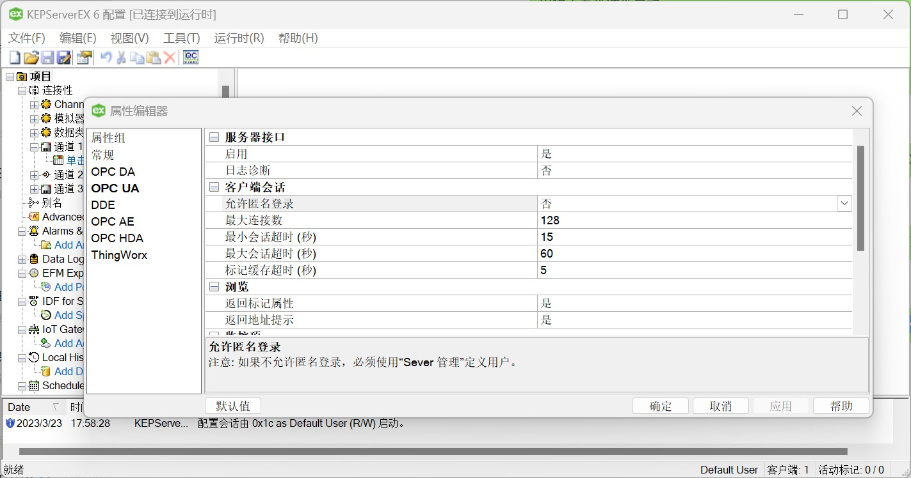

# 连接 KEPServerEX

## 用户名/密码登录

1. 右键点击系统托盘中的 KEPServerEX 图标，在菜单中选择“设置”，打开“KEPServerEX 设置”，切换到“用户管理器”卡片，在 Administrators 组下新建用户，设置用户名/密码;

2. 双击系统托盘中的 KEPServerEX 图标，在主界面中打开“项目”的“属性编辑器”，将 OPC UA - “允许匿名登录”设置为“否”;

3. 右键点击系统托盘中的 KEPServerEX 图标，在菜单中选择“OPC UA 配置”，切换到“服务器端点”，双击端点条目，勾选所有安全策略。

4. 右键点击系统托盘中的 KEPServerEX 图标，在菜单中选择“重新初始化”；

5. Neuron 新增南向 OPC UA 设备，打开“设备配置”，填写目标 Server 的“端点 URL”，填写用户名/密码，无需添加证书/密钥，启动设备连接；

6. 右键点击系统托盘中的 KEPServerEX 图标，在菜单中选择“OPC UA 配置”，切换到“受信任的客户端”，将 NeuronClient 证书设置为信任。

7. 右键点击系统托盘中的 KEPServerEX 图标，在菜单中选择“重新初始化”；

## 证书/密钥 + 用户名/密码登录

1. 按照上文设置用户名/密码；

2. 参考[连接策略](./policy.md)生成或转换证书/密钥；

3. 右键点击系统托盘中的 KEPServerEX 图标，在菜单中选择“OPC UA 配置”，切换到“受信任的客户端”，将 DER 格式的客户端证书导入列表；

4. 右键点击系统托盘中的 KEPServerEX 图标，在菜单中选择“重新初始化”；

5. Neuron 新增南向 OPC UA 设备，打开“设备配置”，填写目标 Server 的“端点 URL”，填写用户名/密码，添加证书/密钥，启动设备连接；

## 测试点位

| 名称     | 地址                                       | 属性       | 类型   |
| -------- | ------------------------------------------ | ---------- | ------ |
| Boolean1 | 2!数据类型示例.16 位设备.R 寄存器.Boolean1 | Read Write | BOOL   |
| DWord1   | 2!数据类型示例.16 位设备.R 寄存器.DWord1   | Read Write | UINT32 |
| Double1  | 2!数据类型示例.16 位设备.R 寄存器.Double1  | Read Write | DOUBLE |
| Float1   | 2!数据类型示例.16 位设备.R 寄存器.Float1   | Read Write | FLOAT  |
| LLong1   | 2!数据类型示例.16 位设备.R 寄存器.LLong1   | Read Write | INT64  |
| Long1    | 2!数据类型示例.16 位设备.R 寄存器.Long1    | Read Write | INT32  |
| QWord1   | 2!数据类型示例.16 位设备.R 寄存器.QWord1   | Read Write | UINT64 |
| Short1   | 2!数据类型示例.16 位设备.R 寄存器.Short1   | Read Write | INT16  |
| Word1    | 2!数据类型示例.16 位设备.R 寄存器.Word1    | Read Write | UINT16 |
| String1  | 2!数据类型示例.16 位设备.S 寄存器.String1  | Read Write | STRING |

