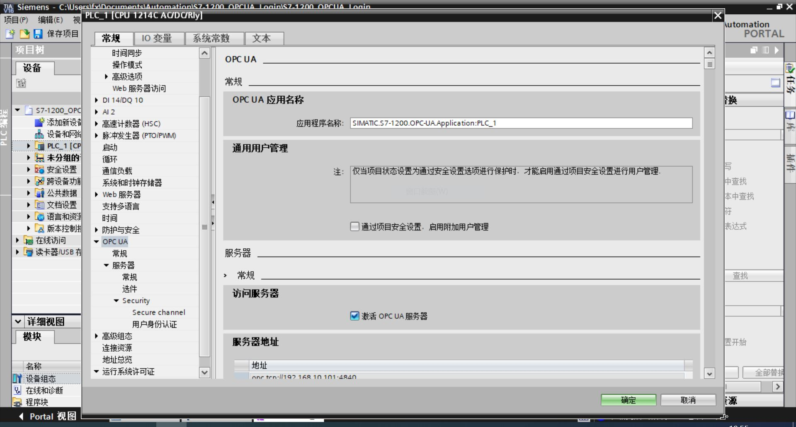

# 连接 Siemens S7-1200

## 用户名/密码登录

1. 在 TIA V16 编程软件中选择目标 PLC，右键打开 **属性** -> **常规** -> **OPC UA**；

2. 打开 **访问服务器** 的 `激活 OPC UA 服务器` 选项；

3. 在 **服务器上可用的安全策略** 列表中勾选需要的安全策略，如果安全需求不是特别高，可以只勾选 `无安全设置`，这样读写请求的速度会快一些；

4. 在 **可信客户端** 部分勾选 `运行过程中自动接受客户端证书`；

5. 在 **访客认证** 部分关闭 `启用访客认证`；

6. 在 **用户名和密码认证** 部分勾选 `启用用户名和密码认证`；

7. 在 **用户管理** 列表中添加用户名和密码；

8. 下载程序到 PLC；

9. Neuron 新增南向 OPC UA 设备，打开 **设备配置**，填写目标 PLC 的 `端点 URL`，用户名/密码，无需添加证书/密钥。

## 测试点位

| 名称                | 地址                  | 属性 | 类型   |
| ------------------- | --------------------- | ---- | ------ |
| DeviceManual        | 3!DeviceManual        | Read | STRING |
| DeviceRevision      | 3!DeviceRevision      | Read | STRING |
| EngineeringRevision | 3!EngineeringRevision | Read | STRING |
| HardwareRevision    | 3!HardwareRevision    | Read | STRING |
| OperatingMode       | 3!OperatingMode       | Read | INT32  |
| OrderNumber         | 3!OrderNumber         | Read | STRING |
| RevisionCounter     | 3!RevisionCounter     | Read | INT32  |
| SerialNumber        | 3!SerialNumber        | Read | STRING |
| SoftwareRevision    | 3!SoftwareRevision    | Read | STRING |

