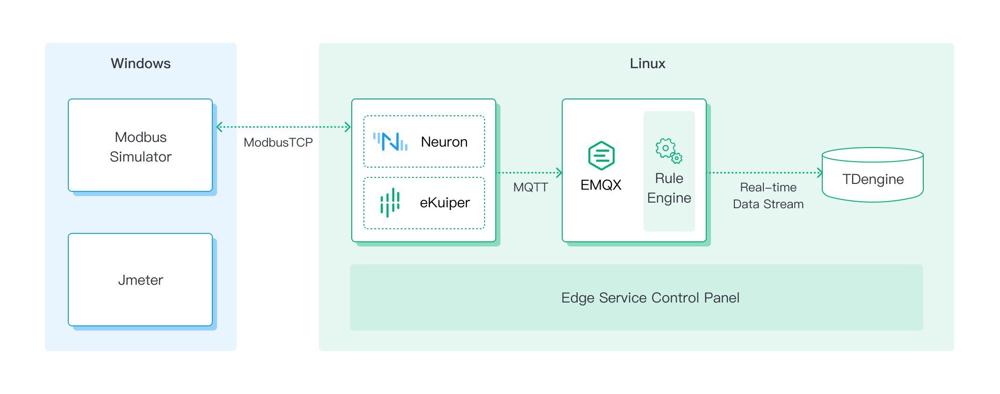
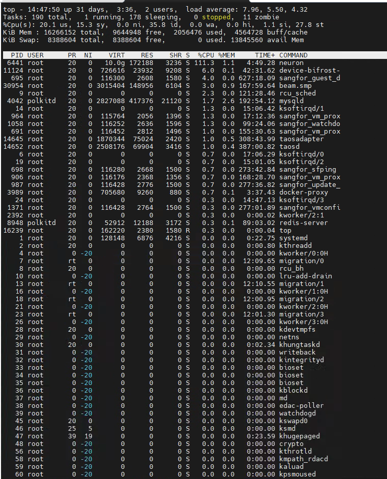
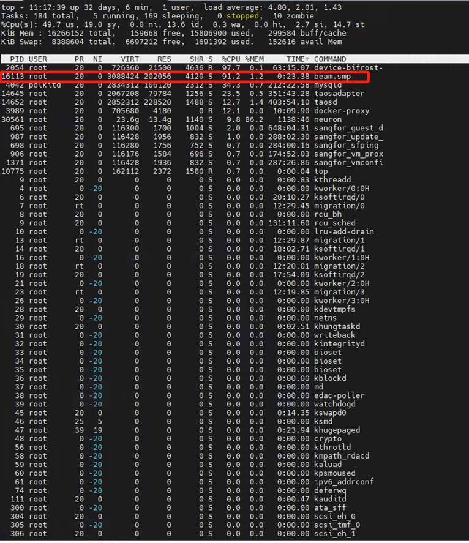

# 性能测试

性能验证包括  Neuron 数据采集性能测试、Neuron 数据下发性能测试及采集数据的存储性能测试等；在测试过程中同步进行功能验证，包括规则引擎、边缘计算及云边协同监控等功能；在测试过程中持续监控设备连接数，连接稳定性，消息的成功率，CPU，网络 IO，内存情况等，详细测试场景如下。

## 测试场景

根据客户实际需求，规划了以下测试场景：

1. Neuron 数据采集测试一

| 模拟设备数量 | 每个设备数据标签数量 | 采集频率 | 总数据标签数 |
| ------------ | --------- | ---------- | --------- |
| 500 | 30 | 1s | 15000 |

Neuron 通过 ModbusTCP 协议，模拟连接 500 台设备，每台设备采集 30 个数据标签，采集频率为 1 秒一次，总计Neuron 每秒采集 15000 个数据标签。

2. Neuron数据采集测试二

| 模拟设备数量 | 每个设备数据标签数量 | 采集频率 | 总数据标签数 |
| ------------ | --------- | ---------- | --------- |
| 500 | 30 | 0.5s | 15000 |

Neuron 通过 ModbusTCP 协议，模拟连接 500 台设备，每台设备采集 30 个数据标签，采集频率为 0.5 秒一次，总计 Neuron 每 0.5 秒采集 15000 个数据标签位。

3. Neuron数据下发测试一

| 设备数量 | 单设备下发数据标签数 | 总计下发数据标签数 | 下发方式 |
| ------------ | --------- | ---------- | --------- |
| 1 | 50 | 50 | Neuron API |

Neuron 通过 ModbusTCP 协议，模拟连接 1 台设备，通过 Neuron API 接口向设备写入 50 个数据标签，测试完成数据下发总计时间。

4. Neuron 数据下发测试二

| 设备数量 | 单设备下发数据标签数 | 总计下发数据标签数 | 下发方式 |
| ------------ | --------- | ---------- | --------- |
| 4 | 50 | 200 | Neuron API |

Neuron 通过 ModbusTCP 协议，模拟连接 4 台设备，通过 Neuron API 接口向设备总计写入 200 个数据标签，测试完成数据下发总计时间。

5. Neuron 采集数据批量写入 TDengine 测试

模拟 Neuron 采集 100 个设备的数据，每个设备包含 100 个数据标签，每秒上报共 10000 个数据标签到 EMQX 企业版，通过 EMQX 内置规则引擎将以上数据实时写入 TDengine。

## 测试架构

1. 测试资源

Modbus 模拟器模拟现场 PLC 设备，Neuron 通过 Modbus TCP 连接模拟器，Neuron 采集到数据后通过 MQTT 协议发送至 EMQX 企业版，数据通过 EMQX 内置规则引擎写入 TDengine。

所使用 Neuron EMQX 企业版、Modbus 模拟器资源如下：

服务1: 笔记本电脑
* Modbus 模拟器
* JMeter 软件

服务2: Linux 服务器 4C/16G
* Neuron V2.2.1
* EMQX 企业版
* TDengine 数据库
* 云边协同管理软件

2. 测试架构图

3. 测试工具介绍

<b>Modbus 模拟器</b>

[PeakHMI Modbus TCP slave simulator](https://www.hmisys.com)，是一款功能齐全、性能优秀的 Modbus 模拟器。

<b>性能测试工具 JMeter</b>

性能测试工具 JMeter 是一款基于 Java 的压力测试工具。它可以用于对服务器、网络或对象模拟繁重的负载来测试它们的强度或分析不同压力类型下的整体性能。

## 测试结论及报告

1. Neuron 数据采集测试一

Neuron 通过 ModbusTCP 协议，模拟连接 500 台设备，每台设备采集 30 个数据标签，采集频率为 1 秒一次，总计Neuron 每秒采集 15000 个数据标签。
* Neuron 采集程序 CPU 使用率约为 124.3%，内存使用率约为 0.6%
* 服务器资源 CPU 空闲在 55% 左右，内存空闲在 9.8G 左右。

 

2. Neuron 数据采集测试二

Neuron 通过 ModbusTC P协议，模拟连接 500 台设备，每台设备采集 30 个数据标签，采集频率为 0.5 秒一次，总计 Neuron 每 0.5 秒采集 15000 个数据标签。
* Neuron 采集程序 CPU 使用率约为111.3%，内存使用率约为 1.1%
* 服务器资源 CPU 空闲在 35% 左右，内存空闲在 9.5G 左右。

3. Neuron 数据下发测试一

Neuron 通过 ModbusTCP 协议，模拟连接 1 台设备，通过 Neuron API 接口向设备写入 50 个数据标签，测试完成数据下发总计时间。
Neuron 对 1 个设备下发50个数据标签，最大响应时间 159 毫秒，最小响应时间 3 毫秒，平均响应时间 91 毫秒，总计耗时 159 毫秒。

4. Neuron 数据下发测试二

Neuron 通过 ModbusTCP 协议，模拟连接 4 台设备，通过 Neuron API 接口向设备总计写入 200 个数据标签，测试完成数据下发总计时间。
Neuron 对 4 个设备下发共计 200 个数据标签，最大响应时间 107 毫秒，最小响应时间 3 毫秒，平均响应时间 52 毫秒，总计耗时 107 毫秒。

5. Neuron 采集数据批量写入 TDengine 测试

模拟 Neuron 采集 100 个设备的数据，每个设备包含 100 个数据标签，每秒上报共 10000 个数据标签到 EMQX 企业版，通过 EMQX 内置规则引擎将以上数据实时写入 TDengine。
* EMQX 软件 CPU 使用率约为 91.2%，内存使用率约为 1.2%
* 服务器资源 CPU 空闲在 13% 左右，内存空闲在 156M 左右。

	 

