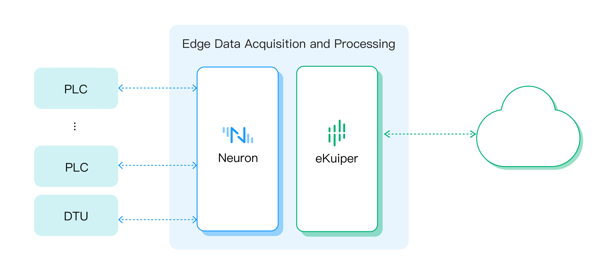

# 边缘处理

使用 Neuron 和 eKuiper 进行边缘处理允许在网络边缘进行数据处理和分析，更接近数据源。 这显着减少了与将数据发送到集中式云进行处理相关的延迟。 可以更快地获得实时洞察和行动，从而加快关键应用程序的响应时间。

通过在边缘处理数据，Neuron 和 eKuiper 可以在将数据发送到云端或中央服务器之前过滤和聚合数据。 这减少了需要通过网络传输的数据量，优化了带宽使用并降低了与传输大量数据相关的成本。

利用 Neuron 作为工业网关，利用 eKuiper 作为边缘处理的流处理引擎，带来了诸如减少延迟、优化带宽使用、提高可靠性、增强安全性和隐私等优势。

