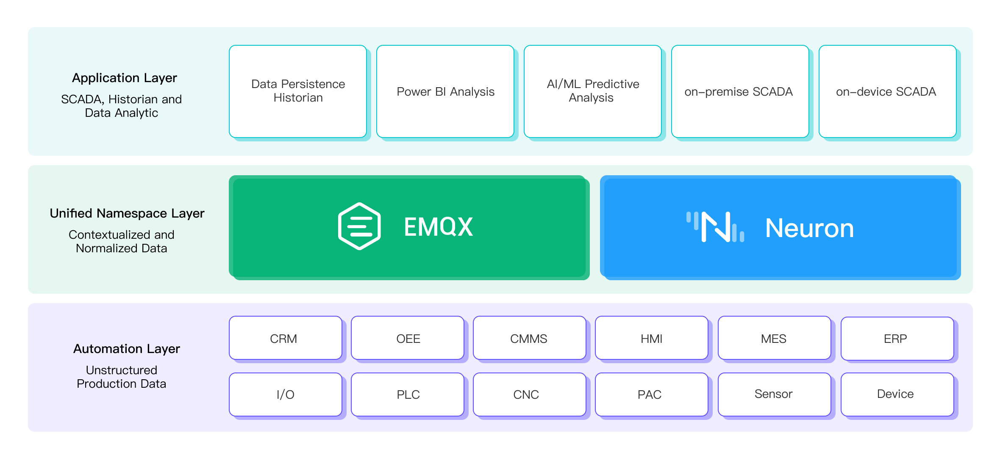

# 统一命名空间

统一命名空间（Unified Namespace，简称 UNS）是一套融合了 EMQX Broker 和 Neuron 强大功能的全面软件方案，目标在于建立上下文数据的中心存储库。这样，所有的应用或设备都能针对自身需求在此平台上发布或订阅数据。通过提供一致的命名空间和通信接口，UNS 极大简化了大规模数据的管理，实现了各种工业应用之间的无缝交互。

在此解决方案中，EMQX Broker 作为各工业应用间的通信桥梁，既担任数据生产者的角色，同时也是数据消费者。Neuron 作为连接各种工业物联网（IIoT）设备的接口，负责生成上下文信息，并将其转发到 EMQX Broker。所有工业应用，包括 SCADA 工具、BI 分析软件、MES 和 ERP 系统，都可以通过单一的 MQTT 连接来访问并可视化这些数据。

## UNS 架构

UNS 采用三层架构设计。底层是产生工业自动化数据的数据生产者；顶层是分析应用程序和 AI/ML 软件，作为数据消费者层；位于两者之间的中间层则是由 EMQX 和 Neuron 构建的上下文数据的中心存储库，用以促进数据生产者和消费者之间的数据交换。

**集成的简化**：借助 EMQX Broker，我们促进了各种工业应用间的通信，使其既可以作为数据生产者，同时也能作为数据消费者，实现不同应用间的数据交换，信息共享和协作环境的统一。该方案能有效减少多点集成和对复杂数据映射的依赖，简化集成过程，节省开发时间和精力。

**便捷的设备添加**：通过 Neuron组件，用户能轻松连接各种工业物联网（IIoT）设备，并收集数据。借助这种强大的组合，该解决方案可以生成符合不同应用需求的上下文数据，并将这些情境化数据转发到 EMQX Broker，所有工业应用都可以通过单一的 MQTT 连接来访问。

**统一的数据展示**：UNS 可以收集所有来自设备现场的非结构化数据，并对其添加上下文信息。数据的规范化和情境化，使得我们可以将不同来源的数据汇集成一个带有时间戳的单一信息源。用户可以通过一种一致且标准的方式组织或访问这些数据，快速基于这些数据进行决策、优化现有流程，提升企业运行效率和盈利能力。

**数据质量的提升**：通过为 AI/ML 模型提供情境化的数据，能够有效提升数据质量。通过添加额外的背景信息和元数据，AI/ML 模型可以更为准确地理解和解释这些数据，从而提高解读的准确性和预测能力。
