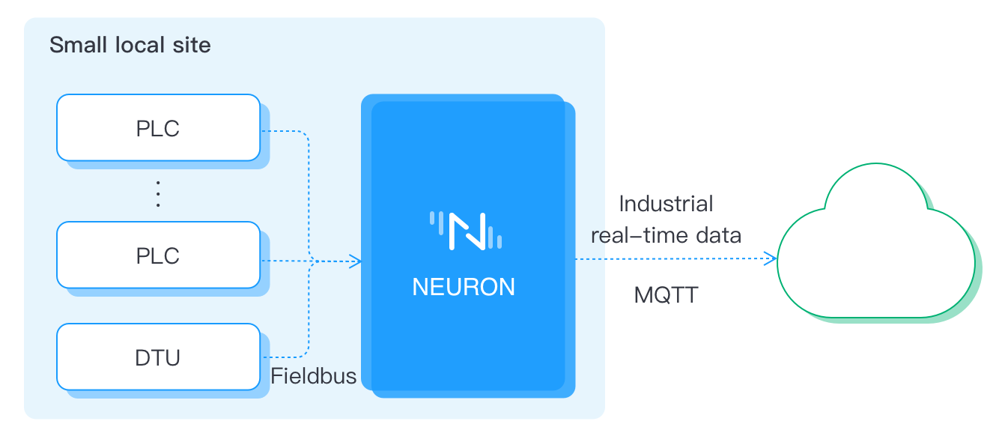
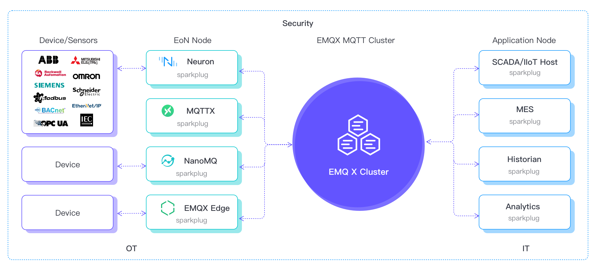

# 应用场景

Neuron 是一种工业物联网连接解决方案，能够满足离散和流程制造商的多个数据采集和操作用例的要求。

## 工业设备连接
Neuron 通常用于工厂数字化改造，将不同的原生协议设备连接到支持 MQTT 或 API 的多个工业信息应用，如 MES、ERP、SCADA、IIoT 平台和分析系统。Neuron 还允许这些工业应用发回命令来监控、管理和控制现场设备。

多个 Neuron 可以部署在地区站点的边缘一侧，用于实时收集各种设备的数据。一些设备是直接连接的，其他的可能是通过 DTU 连接。实时数据通过 EMQX Broker 报告给数据中心。通过规则引擎过滤后，数据被存储或转发到相关的分析系统和应用程序。

单个 Neuron 可以部署在小型本地站点的边缘一侧。

Neuron 可以支持多达数千台设备的连接，并将信息转发给数百个工业应用。每个应用都可以在与 EMQX 代理的单点连接中访问所有设备信息。

由于 Neuron 可能包含多达上万个数据标签，必须提供工具来加速部署。因此，Neuron 提供了 Excel 文件配置功能，用户可以导出和导入来定义数据标签。Neuron 还为应用程序提供 API 配置来管理数据标签。

## MQTT SparkplugB 解决方案
Sparkplug B 是一个基于 MQTT 的扩展开放互操作性协议。它使设备和应用程序能够以一种有状态的方式通过 MQTT 发送和接收消息。MQTT 并不能确保设备或应用程序收到的所有消息都是有效的和最新的。Sparkplug 通过使用 "最后意愿 "机制来确保消息是有效和最新的，从而得到改善。这使得在工业环境中使用 MQTT 成为可能。

MQTT SparkplugB 具有以下优势。
* 即插即用的 IIoT 解决方案
* 高可扩展性
* 统一的基础设施

Neuron 是 Sparkplug 解决方案的基础设施中的 EoN 节点。它的作用是实现 EoN 节点网关，将各种不同的工业数据转换为 Sparkplug 消息，并通过 EMQX Broker or Cluster 传递给工业应用。在 Sparkplug 解决方案中使用 Neuron 的第二个原因是协助一些 "数据轮询 "设备变得更聪明，并以异步方式报告数据。

## 统一命名空间
统一命名空间是一套软件解决方案（EMQX + Neuron），作为中央存储库，任何应用程序和设备都可以发布或订阅特定需求的背景数据。这简化了大规模的数据操作，因为它可以使用相同的命名空间和通信接口与不同的工业应用进行交互。这使得你的工业信息系统可以轻松地扩大规模。

统一名称空间解决方案具有以下优势。
* 集成简化
* 轻松添加设备

EMQX Broker or Cluster 允许各种工业应用之间的通信，这些工业应用同时是数据生产者和数据消费者。Neuron 将连接到各种 IIoT 设备，并将收到的数据送到 eKuiper 流处理引擎中处理，以产生情境化数据。这种情境化数据将发报到 EMQX 代理，所有工业应用如 SCADA 工具、BI 分析软件、MES、ERP，都可以看到数据。

EMQX Broker or Cluster 和 Neuron 一起可以形成一个统一命名空间，用于各种工业应用，利用统一命名空间的好处。例如，消除了大规模的点对点连接，最大限度地减少了数据传输的负荷。
