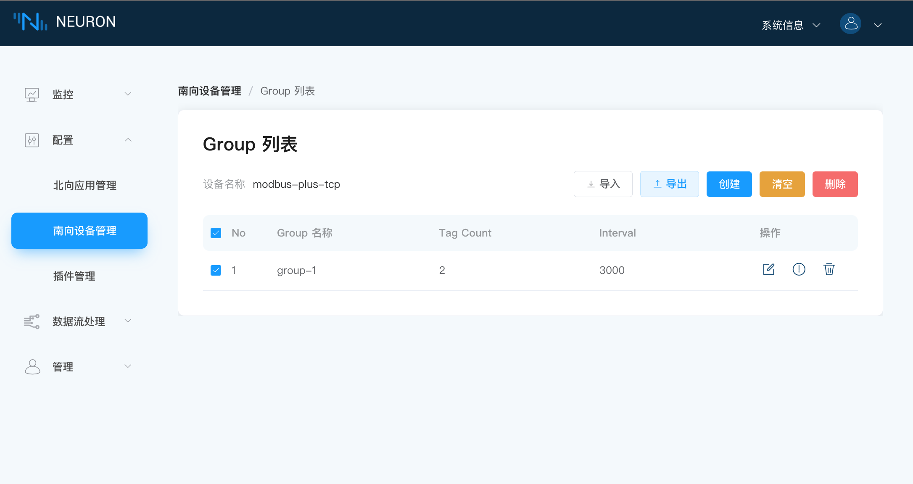

# 点位配置导入/导出

Neuron 提供标签配置信息以 Excel 表格方式批量导入和导出的功能，能够加速数据标签的配置，并且能够便捷地导出创建的数据标签信息到外部存储中。

## 配置导入

### 第一步，下载模版

将鼠标悬浮在`导入`上方，会出现`下载模版`的按键，如下图所示。

单击`下载模版`按键，下载 Excel 表格。

### 第二步，填写 Excel 表格

按照表格格式，填写相应的信息，如下图所示。

* 填写 Group 名称，当填写的组的名称不存在时，会以这个组的名称自动新建一个组；
* 填写 Tag 名称；
* 填写 Tag 的地址；
* 下拉框选择属性；
* 下拉框选择数据类型；
* 填写描述，可为空；
* 选填，用于设置读到数值的乘数，可为空；
* 选填，当数据类型为 float 或 double 时，用于设置精度；

### 第三步，导入 Excel 表格

单击`导入`按键，选择需要导入的 Excel 文件。

## 配置导出

1. 选择需要导出的组，可以一键全选；
2. 单击`导出`按键，组中信息包括组下的标签信息都将导出到一张 Excel 表格中。
