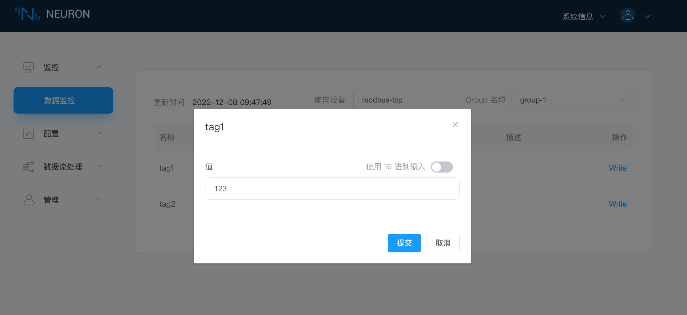
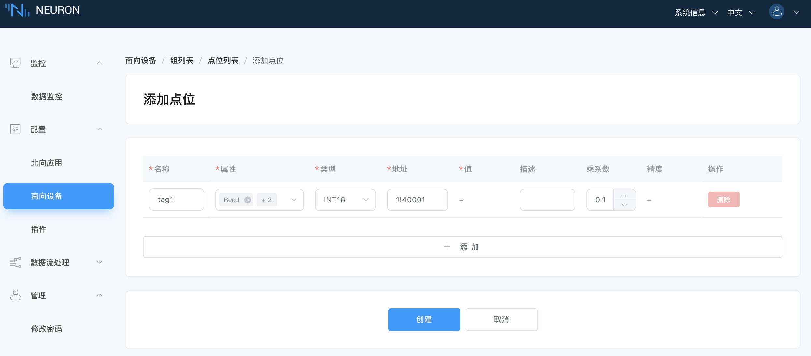

# 反控设备

## 第一步，界面更改值

当 Tag 设置了写属性时，数据监控界面的 Tag 会有一个写操作，点击 `Write` 可以实现反控设备，例如，修改具有写属性的 1!40001 点位地址的值，如下图所示。

1. 单击要改值的标签末尾的`写`按键；
2. 选择是否以十六进制方式输入，不选择；
3. 输入标签新值，例如，123；
4. 单击`提交`按键提交新的值。

::: tip
设备中该点位也必须具有可写属性，否则无法写成功。
:::

## 第二步，查看设备点位值是否修改成功

打开 Modbus 模拟器，查看点位值是否变化，如下图所示。

## 补充说明

乘系数的用法：

设备值 * 乘系数 = 显示值

在点位配置乘系数时，写属性支持乘系数的写入，例如。

点位乘系数值为 0.1，在页面写入显示值，例如 23.4，则页面显示值为 23.4，写入到设备中的值则为 234，如下图所示。

* tag1 为配置乘系数 0.1 的显示值；
* tag2 为未配置乘系数的显示值（即设备值）；

:::tip
若配置的乘系数为 0.1，输入值超过一位小数，则自动取舍。例如，输入 23.56，则显示 23.6，写入设备值为 236。
:::
