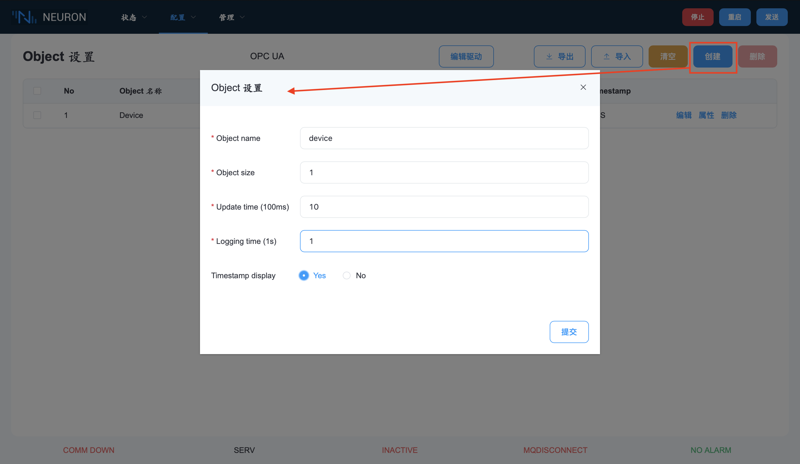
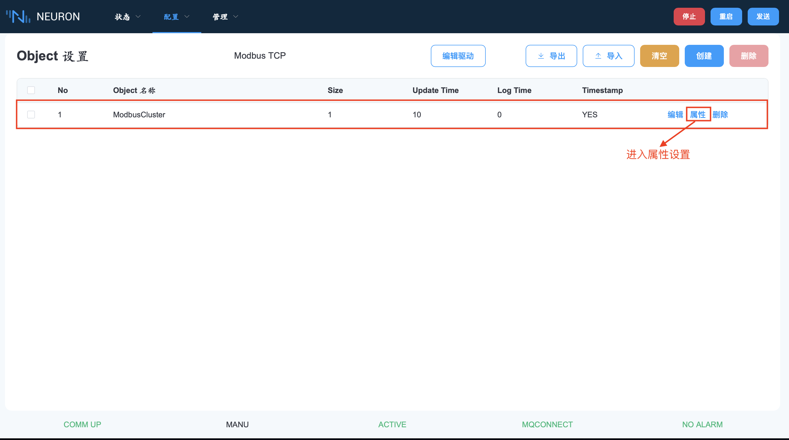
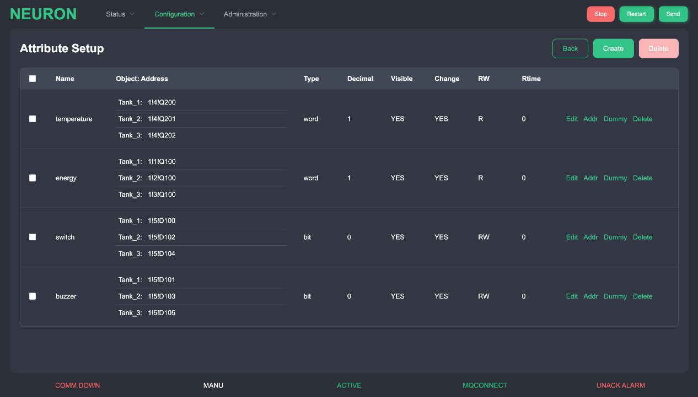
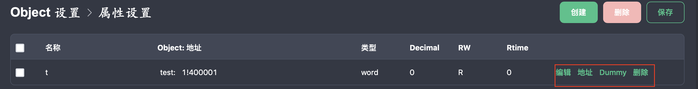
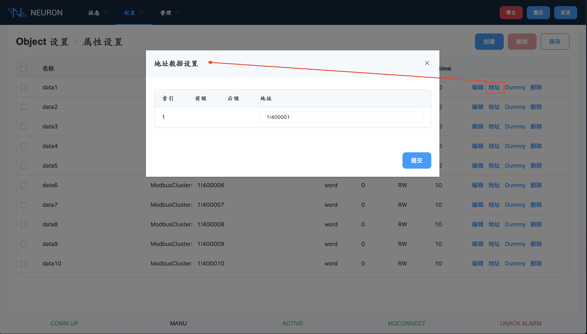
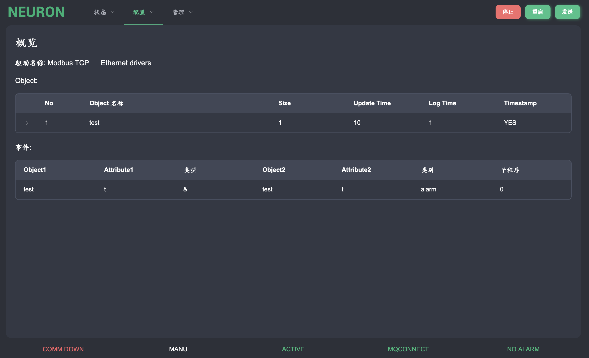

# 配置设置

这些功能用于设置通道、对象、属性和标签地址方面的协议通信细节，以便与机器进行数据交换。事件和报警也在配置中定义为高级功能。

## object设置

在配置菜单下选择object设置选项，这一选项包含通道、对象、属性和标签地址方面的协议通信细节的设置。

### 通道设置

在页面上选择 "新建驱动" 按钮，有两种通道，硬件通信通道和云平台通信通道，如图所示。

驱动程序通信用于设置硬件设备或 PLC 通信的细节。云通讯用于设置与云平台的通讯。MQTT 是目前唯一的选择。但是，在列表框中，这两个通道都有自己特定的通信参数。

对于驱动通信，有两种类型的通信驱动。

| 类型         | 描述                                            |
| ------------ | -----------------------------------------------|
| 以太网驱动   | IP 地址/主机名和端口号                           |
| 串行驱动程序 | 设备文件位置、波特率、数据位、停止位和奇偶校验位 |

以下是一些关于北向协议的具体参数的说明
| 变量/参数      | 说明              | 约束          |
| :------------| :---------------- |:--------------|
| TOPPICHEADER | MQTT订阅主题前缀名  |字母、数字、-、/，长度不超过20个字符|
| USERNAME     | MQTT用户名        |无校验，长度不超过14个字符          |
| PASSWORD     | MQTT密码          |无校验，长度不超过20个字符         |
| CLIENTID     | UUID             |字母数字开头，字母，数字，-，长度36  |
| TOPIC        | MQTT订阅主题      |字母、数字、-、/，长度不超过120个字符|
| CERTIFICATE  | 证书文件路径       |/开头，字母、数字、/，长度不超过254个字符  |
| KEYFILE      | 密钥文件路径       |/开头，字母、数字、/，长度不超过254个字符  |

以下是一些关于南向驱动程序的具体参数的说明

| 变量/参数             | 说明                       | 约束                  ｜
| :------------------- | :------------------------- |:---------------------|
| DLYCSCLOSE=5         | 创建串口连接的等待时间，单位ms |0-max(int),不超过65535  |
| TIMEOUT=20           | 连接串口超时时间，单位为ms    |0-max(int)，不超过65535  |
| SRC_ABKG             | 源地址                     |0，8  |
| PROC3964R            | 块校验字符                  |0,1  |
| BYTEORDER=1          | 字节顺序，四种情况：0 -> BE4321,1 -> BE3412,2 -> LE1234,3 -> LE2143  | 0，1，2，3       |
| DLYCRESOCKAFTCLOSE=50| 创建网口连接等待时间,单位是ms | 0-max(int)，不超过65535 |
| TORECEIVETCP=0       | 接收数据超时时间，单位ms     | 0-max(int)，不超过65535 |
| NAPTIMEREAD=10       | 读数据前等待时间，单位ms     |0-max(int)，不超过65535  |
| NAPTIMEWRITE=10      | 写数据前等待时间，单位为ms    | 0-max(int)，不超过65535 |
| S7P_SRCTSAP          | 源槽位号                   | 16进制数                |
| S7P_DSTTSAP          | 目的槽位号                  | 16进制数               |
| USERNAME             | 用户名（opc协议中）          | 字符长度不超过254        |
| PASSWORD             | 密码（opc协议中）            | 字符长度不超过254        |
| CERTIFICATE          | 证书路径                    | 字符长度不超过254        |
| KEYFILE              | 密钥路径                    | 字符长度不超过254        |
| ADDRSUFFIX           | NODEID                     | 字符长度不超过254        |
| TCPSERVER            | TCP服务号                   | 0，1                   |

### 对象设置

完成 Channel 的设置后，开始设置对象的详细信息。

要将对象添加到列表中，按右侧的 "创建" 按钮。将会出现一个对象设置对话框。

| 栏目        | 说明                                       |
| :----------- | :------------------------------------------|
| 名称        | 对象名称 (30 个字符)                       |
| 尺寸        | 具有相同属性和特征的对象的数量             |
| 时间        | 数据传输速率的时间间隔 (单位：100毫秒)          |
| 日志时间    | 在磁盘上记录数据的时间间隔 (单位：秒)      |
| 时间戳      | 一个标志，表示是否传输时间戳与数据 (是/否) |

设置完成后，如下图所示。

### 属性设置

完成对象设置后，按"属性"按钮进入属性设置。
按 "创建" 按钮，将显示一个属性设置的输入对话框，如下图所示。可设置名称、属性类型和细节，点击提交完成设置。还可以通过 "编辑" 按钮进行修改。修改后，按 "提交" 键保存修改内容。

| 栏目     | 说明                                                |
| :-------------------- | :-------------------------------------|
| 名称     | 属性名称                                             |
| 类型     | 属性的数据类型。包括： word - 2 个字节的整数 uword - 2 个字节的无符号整数 dword - 4 个字节的整数 udword - 4 个字节的无符号整数 bit - 布尔型（Y/N） datetime - Unix 时间戳值 float - IEEE 浮动值 double - IEEE 双浮动值 |
| 小数点     | 这是数据类型的小数点，只适用于 word、uword、dword、udword。其他数据类型将显示 '-'                                  |
| R/W方向   | PLC 的读/写方向，这代表了 PLC 的读或写方向，或同时读/写的方向       |
| Rtime    | 这是 PLC 在读取 RW 时的读取轮询时间间隔，也是 RW 的读取时间间隔     |

设置完成后如下图所示。

然后再根据提示设置地址，点击 "地址" 按钮后，会提示一个对话框。在此对话框中设置硬件地址。请参考地址设置文档，了解各驱动程序的地址字符串详情。如果没有指定地址或者是虚地址，请用 "-" 来表示，在该字段中会显示 '-'。

## 报警/事件信息设置

在配置菜单下选择事件设置选项，进行报警/事件设置。一些对象属性值可以设置为通过检查其状态或将其自身的值与其他预设值进行比较来触发报警或事件。

| 栏目   | 描述                                                 |
| ------ | ----------------------------------------------------|
| 对象1 | 消息的第一个对象                                        |
| 属性1 | 消息的第一个属性                                        |
| 类型  | 消息的操作类型，表示报警的位操作、值操作或文本操作           |
| 对象2 | 消息的第二个属性                                        |
| 属性2 | 如果该字段有 Tag 类型，则存储该标签在运行模式下发生变化时被调用的子程序编号 |
| 类别  | 该栏用于区分每个报警的重要程度，如报警、警告、事件、日志、命令等 |
| 子程序| 如果该字段有 Tag 类型，则存储该标签在运行模式下发生变化时被调用的子程序编号 |

## 配置概述

配置概览页面仅用于整体配置检查。

## 保存新配置

完成配置设置后，按 "发送" 按钮，传输配置设置，Neuron 系统会进行检查，如果通过检查，会重新启动系统，启动新的配置。如果通过检查，则重新启动系统，启动新的配置。系统重启后，Web 界面将被强制注销。
