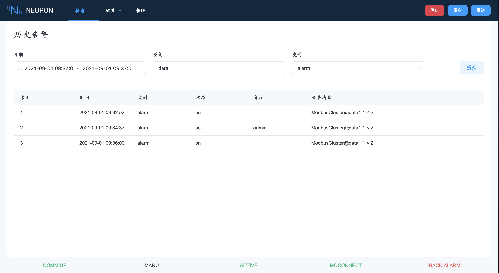

# 事件/报警信息 
该事件/报警信息用于查看当前活动的报警点。警报是根据警报的性质进行排序的。这是为了便于确定报警的重要性。警报的数量取决于应用程序。

## 事件/警报当前状态 
该功能用于查看当前活动的报警点。根据报警的性质，报警最多可分为 6 个不同的类别。这是为了便于确定报警的重要性。

在下拉框中有六种不同的显示模式。ACTIVE ENABLED 显示所有当前处于开启状态或未确认的启用的报警。ACTIVE UNACK 显示所有未确认的报警。ACTIVE ALL 显示所有当前开启或未确认的报警（包括禁用的报警）。ALL ALARMS 显示系统中的所有警报，无论它们是打开还是关闭。ALL ENABLED 显示系统中所有未禁用的报警，无论它们是开还是关。ALL DISABLED 显示系统中所有被禁用的报警，无论它们是开还是关。

所有显示模式都能实时显示状态。此外，所有功能都可以在所有不同的显示模式下执行。

当发生报警时，摘要报警指示灯被激活。逐个按确认键，即可确认汇总报警。

| 栏目 | 描述                             |
| ---- | -------------------------------- |
| 时间 | 闹钟启动时间                     |
| 类别 | 报警类别                         |
| 状态 | 状态（ON 或 OFF）                |
| 备注 | 警报条件（取消确认，禁用或空白） |
| 注释 | 报警文本，包括动态值             |

## 事件/报警日志 
此功能用于查看报警历史记录。每当警报开启或关闭或 ACK 时，该事件都会被记录到警报日志文件中。

该报告包含日期和时间、类别、状态开启或关闭以及报警文本，包括动态值。对于状态为关闭的报警事件，动态值将为 0。报告按时间顺序显示报警事件。

