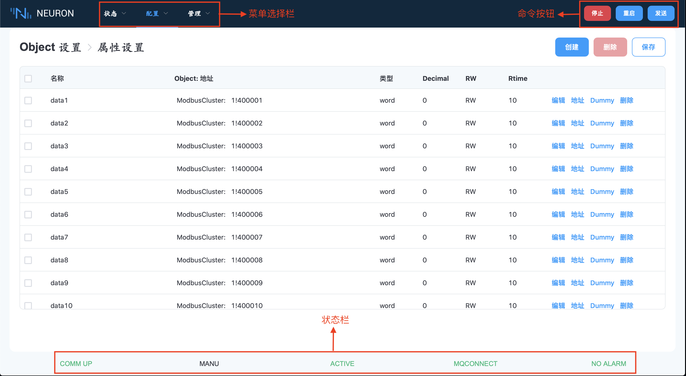
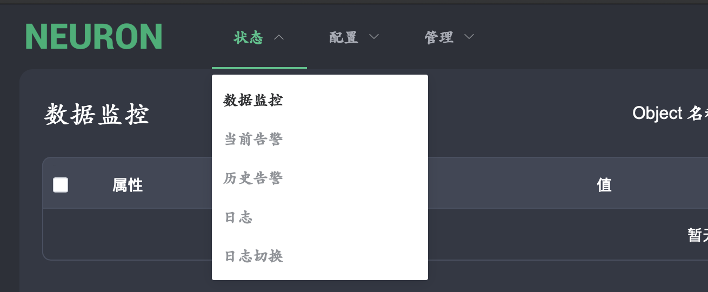
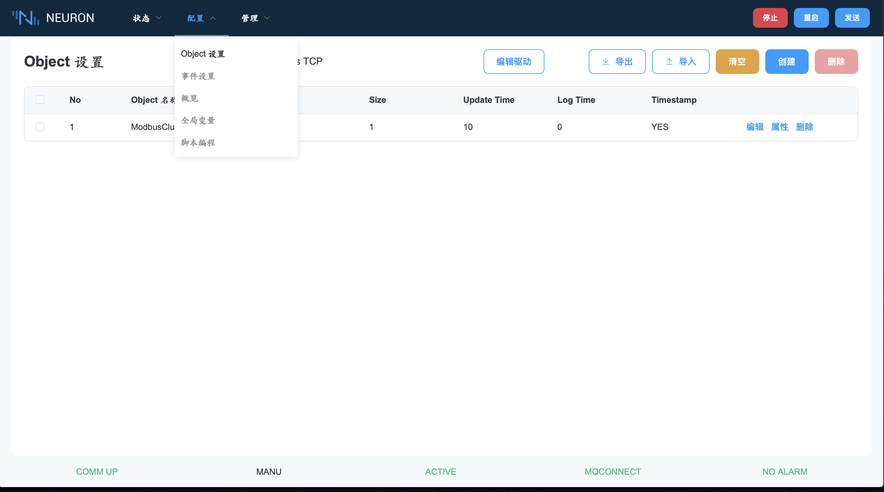
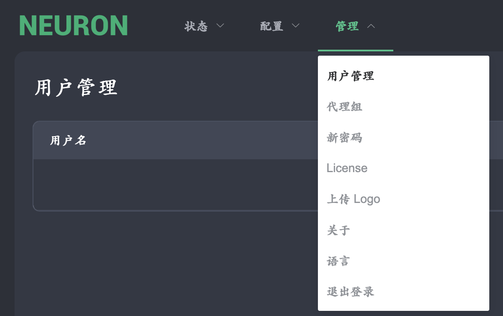

# 整体布局

进入 Neuron 后显示的第一个画面如下图所示。最上面第一栏左边为菜单选择栏，其中包含 3 种功能。第一个是状态菜单，其中包含数据监控、事件告警、日志等功能。第二个是配置菜单，用于设置 PLC 或设备的通信细节。最后一个是管理菜单。最上面第一栏右边为控制Neuron系统的三个命令按钮。最下方一栏为状态栏，用于显示 Neuron 当前状态。

## 菜单选择

**状态菜单**

**配置菜单**

**管理菜单**

## 命令按钮

右上角有 3 个命令按钮来控制 Neuron。

<table>
  <tr>
    <td>启动/停止</td>
    <td>这是一个启动/停止按钮，可以暂时暂停 Neuron。当 Neuron 暂停时。系统状态将转为待机模式，不会发送遥测数据。</td>
  </tr>
  <tr>
    <td>重启</td>
    <td>此按钮用于重新启动 Neuron 系统。</td>
  </tr>
  <tr>
    <td>发送</td>
    <td>该按钮用于完成设置配置数据后，将配置数据发送至 Neuron 系统。</td>
  </tr>
</table>

## 状态栏

Neuron 中的系统状态有五种。

| 状态                                  | 描述                                          |
| ------------------------------------- | ------------------------------------------------------------------------------------------------------------ |
| COMM UP COMM DOWN                  | PLC/设备通讯向上  PLC 设备通讯中断       |
| MANU AUTO SERV                  | 手动模式下的 MANU 机器 自动模式下的 AUTO 机器 伺服机处于服务模式                                       |
| ACTIVE INACTIVE STANDBY SEMI | Neuron 系统处于活动模式 Neuron 系统处于非活动模式 Neuron 系统处于待机模式 Neuron 系统处于半主动模式     |
| MQCONNECT MQDISCONNECT             | MQ 服务器已连接 MQ 服务器已断开连接     |
| NO ALARM ALARM UNACK ALARM      | 没有发现警报 警报  未确认的警报       |
