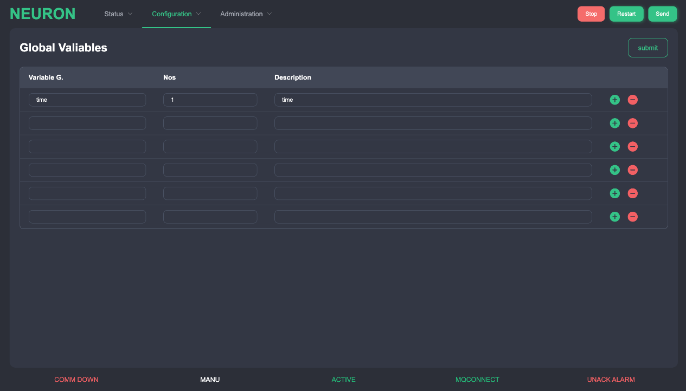
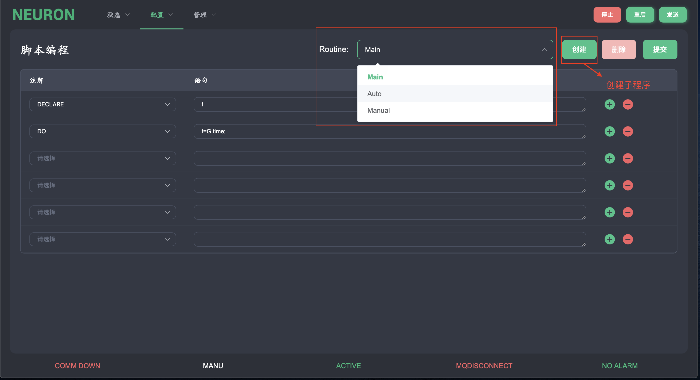

# 脚本编程 
Neuron 有一种自己的编程语言--Neuron 脚本编程。它包含一个脚本解析器，可以读取高级的类似 c 的语法语句来处理机器的特殊控制需求。

在机器运行的过程中，可以对脚本进行所有的修改。当然，如果进行错误的修改，可能会产生一些副作用。

脚本编程是一种先进的力量，可以在不改变程序代码的情况下，对机器进行控制逻辑或公式化。它与底层编程完全隔离，实现客户逻辑。

## 全局变量 
在本页面中添加全局变量，完成后按 "提交"。

| 栏目   | 描述                                                                                                                                                                  |
| ------ | --------------------------------------------------------------------------------------------------------------------------------------------------------------------- |
| 变量 G | 全局变量名（不含前缀 G）                                                                                                                                              |
| Nos    | 数组中的字数。例如，在每个索引应为站号的站点上使用 一个带有一个单词的数组变量，为索引 0 添加一个额外的单词（例如，第一个站点为 1 的 36 个站点应为变量保留 37 个单词） |
| 描述   | 变量的描述。在变量 G 和 Nos 为空白的情况下，可以写一个描述（头部）                                                                                                    |

## 脚本编辑 
顶部有一个下拉框 "Routine"。里面会有 3 个基本程序，分别是主程序、自动程序和手动程序。按 "新建" 按钮可以创建子程序，这时会出现一个对话框，需要输入名称和子程序编号。这时会出现一个对话框，需要输入名称和子程序编号。如果创建成功，该子程序将显示在下拉框中。

所有在下拉框中创建的无用的子程序都可以按 "删除" 按钮删除。制作完所需的脚本后，按 "提交" 按钮将脚本保存到系统中。

